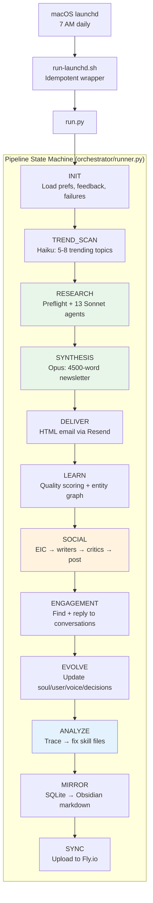
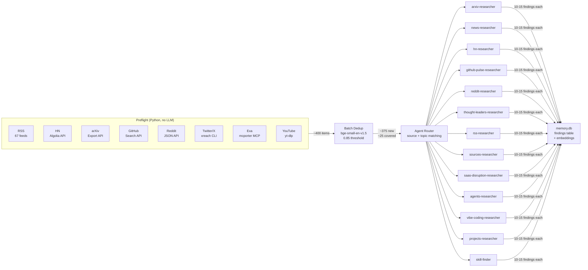
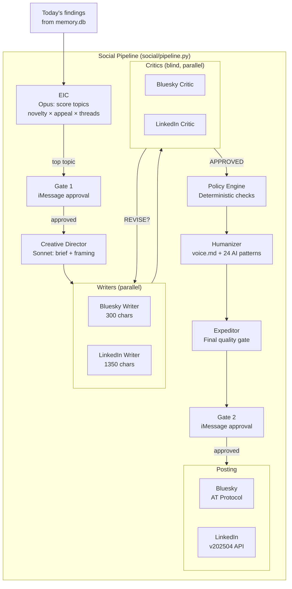
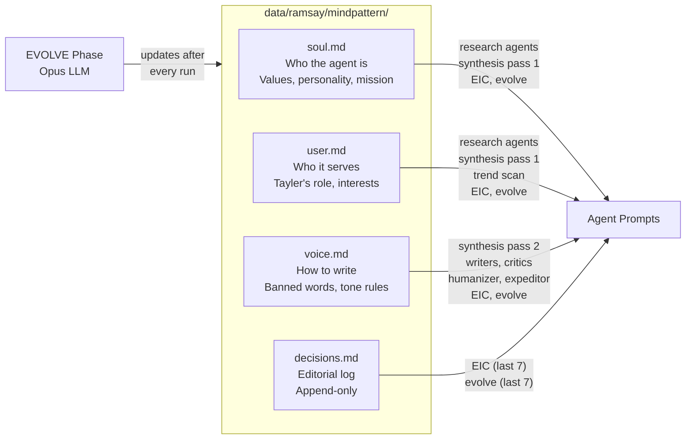
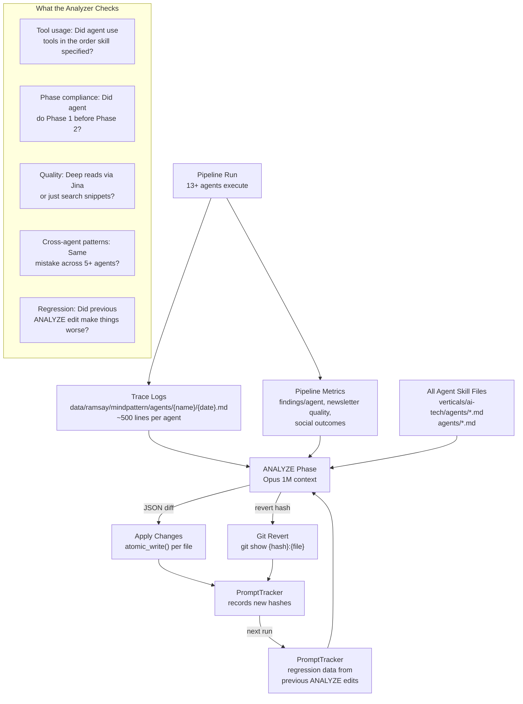
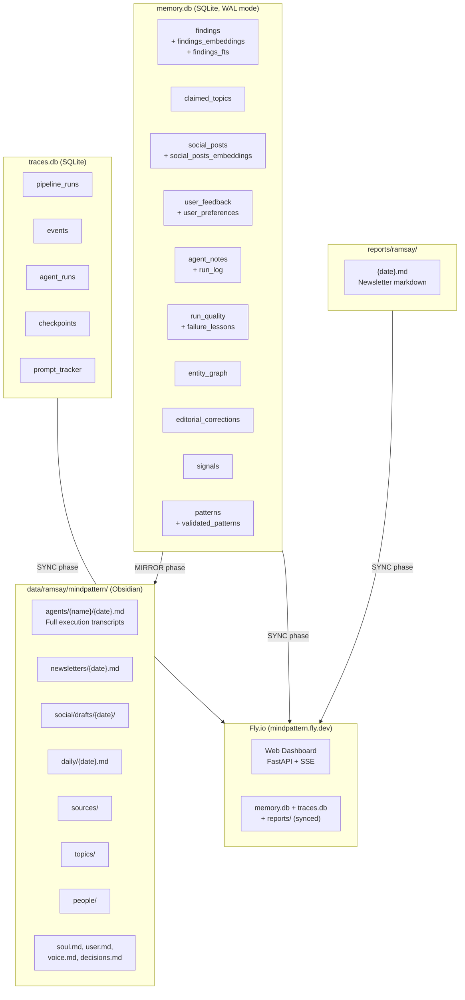
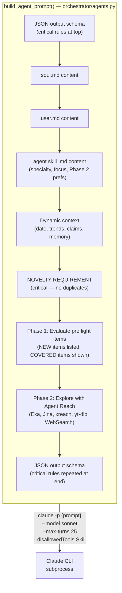
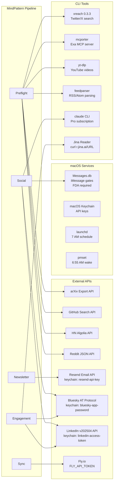
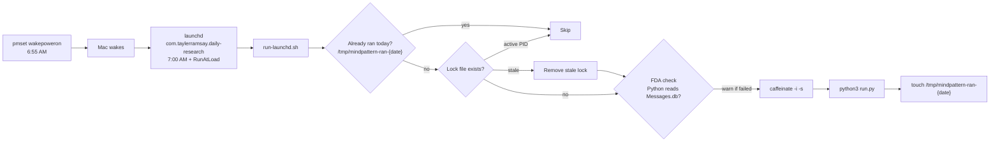

# MindPattern v3 — System Architecture

> Autonomous AI research pipeline. Runs daily at 7 AM. Gathers data from 8 sources, dispatches 13 research agents, writes a newsletter, posts to social media, and improves itself after every run.

---

## Pipeline Overview



**Critical phases** (pipeline fails if they fail): RESEARCH, SYNTHESIS
**Skippable phases** (logged as warning, pipeline continues): everything else

---

## Research Phase Detail



Each agent receives:
1. JSON output schema (bookended)
2. soul.md + user.md (identity)
3. Agent skill .md file (specialty + Phase 2 preferences)
4. Preflight items tagged NEW / ALREADY_COVERED
5. Phase 1: evaluate preflight items (floor)
6. Phase 2: explore with Agent Reach tools (ceiling)

---

## Social Pipeline Detail



---

## Identity System



### Identity File → Agent Mapping

| Agent | soul.md | user.md | voice.md | decisions.md |
|-------|---------|---------|----------|-------------|
| Research agents (13x) | yes | yes | no | no |
| Synthesis pass 1 (selector) | yes | yes | no | no |
| Synthesis pass 2 (writer) | yes | no | yes | no |
| Trend scanner | no | yes | no | no |
| EIC | yes | yes | yes | last 7 entries |
| Writers / Critics / Expeditor | no | no | yes | no |
| Humanizer | no | no | yes | no |
| Evolve | yes | yes | yes | last 7 entries |

---

## Self-Optimization Loop (ANALYZE Phase)



**The kaizen loop:** Run → trace → analyze deviations → fix skills → next run uses improved skills → trace again → repeat.

---

## Data Storage



---

## Prompt Assembly



**Three dispatch functions in agents.py:**

| Function | Used By | Mechanism |
|----------|---------|-----------|
| `run_single_agent()` | Research agents | `-p {prompt}` with inline identity |
| `run_agent_with_files()` | EIC, writers, critics | `-p {prompt} --append-system-prompt-file agents/{name}.md` |
| `run_claude_prompt()` | Synthesis, trend scan, learnings, humanizer, analyzer | `-p {prompt} --append-system-prompt-file agents/{name}.md` |

All pipeline agents have `--disallowedTools Skill` to prevent 87 global skills from polluting context.

---

## External Services



---

## File Structure

```
mindpattern-v3/
├── orchestrator/               # Pipeline state machine & execution
│   ├── runner.py               # Main pipeline loop (12 phases)
│   ├── agents.py               # Claude CLI dispatch (3 functions)
│   ├── analyzer.py             # Self-optimization (trace → fix skills)
│   ├── pipeline.py             # Phase enum, state transitions
│   ├── router.py               # Model routing (haiku/sonnet/opus)
│   ├── checkpoint.py           # Resume from crashes
│   ├── evaluator.py            # Newsletter quality scoring
│   ├── newsletter.py           # HTML conversion + Resend email
│   ├── observability.py        # Metrics collection
│   ├── prompt_tracker.py       # Prompt hash tracking + regression
│   ├── sync.py                 # Fly.io upload
│   └── traces_db.py            # Traces DB schema
│
├── preflight/                  # Data collection (8 sources)
│   ├── run_all.py              # Parallel orchestrator + dedup
│   ├── rss.py                  # 67 RSS feeds
│   ├── arxiv.py                # arXiv papers
│   ├── github.py               # GitHub trending repos
│   ├── hn.py                   # Hacker News stories
│   ├── reddit.py               # Reddit posts (10 subreddits)
│   ├── twitter.py              # X/Twitter via xreach
│   ├── exa.py                  # Exa semantic search via mcporter
│   └── youtube.py              # YouTube videos via yt-dlp
│
├── memory/                     # Vector DB + identity evolution
│   ├── db.py                   # SQLite connection + schema
│   ├── embeddings.py           # BAAI/bge-small-en-v1.5 (384-dim)
│   ├── findings.py             # Finding storage + semantic search
│   ├── identity_evolve.py      # LLM updates to soul/user/voice
│   ├── vault.py                # Atomic markdown read/write
│   ├── mirror.py               # SQLite → Obsidian sync
│   ├── feedback.py             # Resend reply ingestion
│   ├── claims.py               # Cross-agent topic dedup
│   ├── corrections.py          # Editorial corrections
│   ├── failures.py             # Failure lessons
│   ├── patterns.py             # Pattern consolidation
│   ├── signals.py              # Cross-pipeline signals
│   ├── social.py               # Social post tracking
│   ├── graph.py                # Entity relationships
│   └── evolution.py            # Agent spawn/retire
│
├── social/                     # Social media pipeline
│   ├── pipeline.py             # Main orchestrator
│   ├── eic.py                  # Editor-in-Chief topic selection
│   ├── writers.py              # Per-platform writing + humanizer
│   ├── critics.py              # Blind validation + expeditor
│   ├── posting.py              # Bluesky/LinkedIn/X clients
│   ├── engagement.py           # Reply discovery + drafting
│   ├── approval.py             # iMessage + dashboard gates
│   └── art.py                  # Art pipeline (director → illustrator)
│
├── verticals/ai-tech/
│   ├── agents/                 # 13 research agent skill files
│   │   ├── arxiv-researcher.md
│   │   ├── news-researcher.md
│   │   ├── hn-researcher.md
│   │   ├── github-pulse-researcher.md
│   │   ├── reddit-researcher.md
│   │   ├── thought-leaders-researcher.md
│   │   ├── rss-researcher.md
│   │   ├── sources-researcher.md
│   │   ├── saas-disruption-researcher.md
│   │   ├── agents-researcher.md
│   │   ├── vibe-coding-researcher.md
│   │   ├── projects-researcher.md
│   │   └── skill-finder.md
│   └── rss-feeds.json          # 67 curated RSS feeds
│
├── agents/                     # Social + synthesis agent files
│   ├── eic.md                  # Editor-in-Chief
│   ├── creative-director.md    # Creative brief
│   ├── bluesky-writer.md       # Bluesky post writer
│   ├── bluesky-critic.md       # Bluesky blind validator
│   ├── linkedin-writer.md      # LinkedIn post writer
│   ├── linkedin-critic.md      # LinkedIn blind validator
│   ├── expeditor.md            # Final quality gate
│   ├── humanizer.md            # AI pattern removal + voice.md
│   ├── synthesis-selector.md   # Story selection (pass 1)
│   ├── synthesis-writer.md     # Newsletter writing (pass 2)
│   ├── trend-scanner.md        # Trending topic identification
│   ├── learnings-updater.md    # Learnings regeneration
│   ├── engagement-finder.md    # Conversation discovery
│   ├── engagement-writer.md    # Reply drafting
│   ├── art-director.md         # Visual direction
│   ├── illustrator.md          # Image generation
│   └── references/
│       └── ai-writing-patterns.md  # 24 AI writing anti-patterns
│
├── hooks/
│   └── session-transcript.py   # SessionEnd: capture agent traces
│
├── tools/                      # Data fetch scripts
│   ├── arxiv-fetch.py
│   ├── github-fetch.py
│   ├── hn-fetch.py
│   ├── reddit-fetch.py
│   ├── rss-fetch.py
│   ├── scraper.py
│   ├── image-gen.py
│   └── linkedin-verify.py
│
├── policies/
│   ├── engine.py               # Deterministic policy checks
│   └── social.json             # Brand safety rules
│
├── data/ramsay/
│   ├── memory.db               # Main database (17+ tables)
│   ├── traces.db               # Observability database
│   └── mindpattern/            # Obsidian vault
│       ├── soul.md             # Agent identity (evolved)
│       ├── user.md             # User profile (evolved)
│       ├── voice.md            # Writing voice (evolved)
│       ├── decisions.md        # Editorial log (append-only)
│       └── agents/             # Agent transcripts
│
├── .claude/
│   ├── skills/
│   │   └── mindpattern-eval/   # Pipeline evaluation skill
│   └── handoffs/               # Session handoff documents
│
├── tests/                      # 58+ tests across 7 files
├── config.json                 # Global config
├── users.json                  # User definitions
├── social-config.json          # Social pipeline config
├── run.py                      # Entry point
└── run-launchd.sh              # macOS launchd wrapper
```

---

## Model Routing

| Task | Model | Max Turns | Timeout | Cost Tier |
|------|-------|-----------|---------|-----------|
| Trend scan | Haiku | 5 | 60s | Low |
| Research agents (13x) | Sonnet | 25 | 1800s | Medium |
| Synthesis pass 1 | Opus 1M | 10 | 600s | High |
| Synthesis pass 2 | Opus 1M | 30 | 900s | High |
| EIC | Opus 1M | 15 | 600s | High |
| Writers / Critics | Sonnet | 15 / 5 | 300s / 120s | Medium |
| Humanizer / Expeditor | Sonnet | 5 | 120s | Medium |
| Analyzer | Opus 1M | 10 | 600s | High |
| Learnings | Sonnet | 5 | 120s | Medium |
| Engagement | Sonnet | 10 / 5 | 300s / 120s | Medium |

---

## Authentication

All sensitive credentials stored in macOS Keychain:

| Service | Keychain Key | Used By |
|---------|-------------|---------|
| Resend (email) | `resend-api-key` | newsletter.py, feedback.py |
| Bluesky | `bluesky-app-password` | posting.py |
| LinkedIn | `linkedin-access-token` | posting.py (60-day expiry) |

Additional requirements:
- **Full Disk Access**: `/bin/bash` and `python3.14` must have FDA for Messages.db access
- **Claude Pro subscription**: CLI authenticates via account (no API key needed)
- **pmset wakepoweron**: Mac wakes at 6:55 AM for 7 AM pipeline run

---

## Scheduling



---

## Key Design Principles

1. **Python controls, LLM judges** — Python orchestrates phases, calls tools, parses results. LLMs search, read, filter, score, and write.

2. **Deterministic state machine** — phases execute in fixed order. The LLM never decides what comes next. Critical phases fail the pipeline; skippable phases log warnings and continue.

3. **Preflight + Phase 1/Phase 2** — Python gathers structured data BEFORE agents run (guaranteed floor). Agents evaluate preflight data, then explore for what's missing (agentic ceiling).

4. **Identity files are the source of truth** — soul.md, user.md, voice.md, decisions.md define who the agent is, who it serves, and how it writes. EVOLVE updates them after every run.

5. **Self-optimization via trace analysis** — ANALYZE phase reads execution traces, compares against skill file instructions, and fixes deviations. The loop self-corrects bad edits via regression detection.

6. **Two approval gates** — iMessage gates before topic selection (Gate 1) and before publishing (Gate 2). Human stays in the loop for editorial decisions.

7. **Everything visible in Obsidian** — findings, transcripts, social drafts, newsletters, identity files all mirrored as markdown. Human can review and understand the system's reasoning.

8. **Pipeline agents see zero global skills** — `--disallowedTools Skill` prevents 87 personal/plugin skills from polluting autonomous agent context. Agent prompts are loaded deterministically via `--append-system-prompt-file`.
