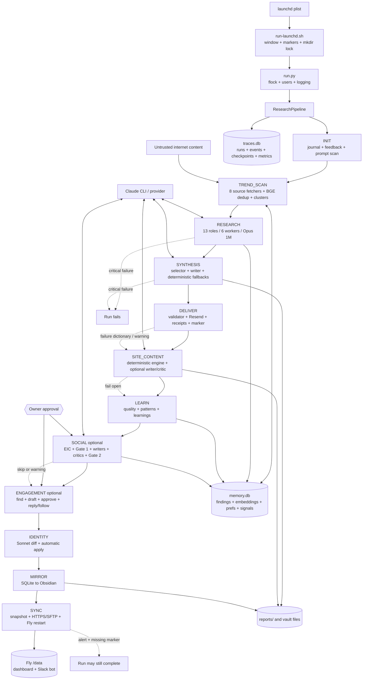
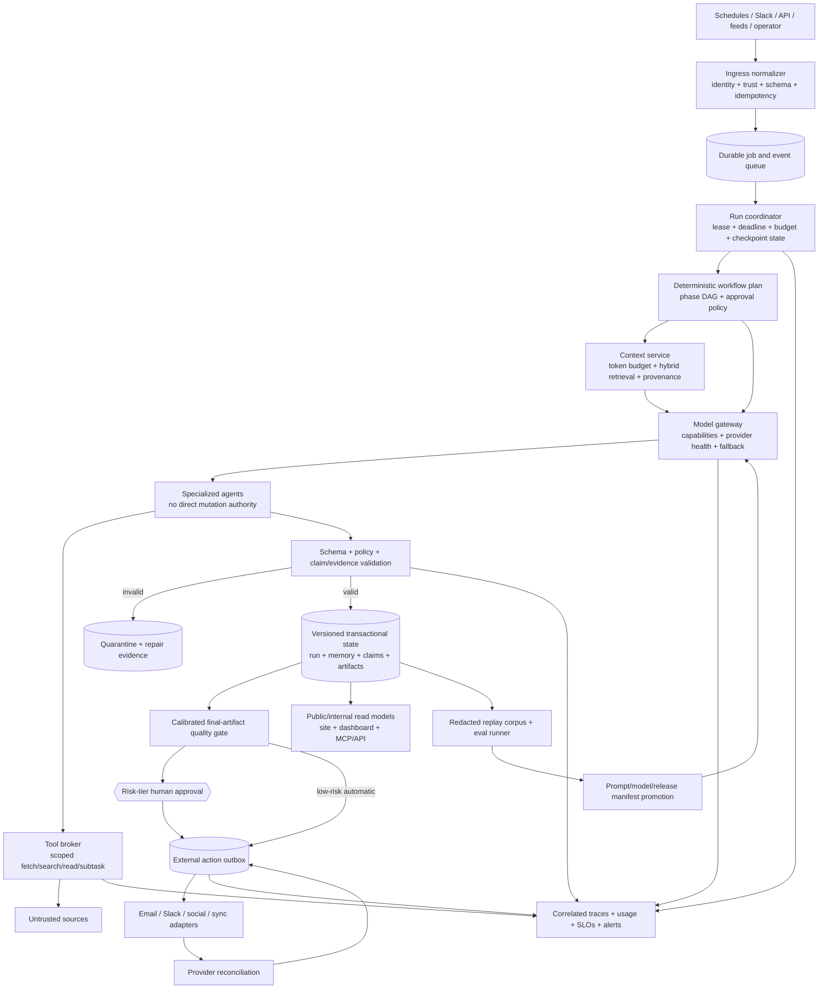

# AI Pipeline Evaluation

> Final audit date: 2026-07-09
> Evaluated checkout: audit began at `0703bba`; final HEAD `8b08c67` (six local commits ahead of `origin/main`)
> Scope: architecture, implementation, reliability, security, evaluation, operations, cost, and product opportunity
> Change scope at audit time: this report only; none of the recommendations were implemented during the audit itself
> **Remediation update 2026-07-10:** the quick-win findings were fixed on `main` in commits `524dfdf..031b246` — see "Remediation status" below

## Remediation status (2026-07-10)

Applied on `main` the day after the audit, scoped per the owner's constraint
that nothing may limit research volume or newsletter writing. All 1,537 tests
pass (15 added). Verified against the 2026-07-10 production run.

| Audit finding | Fix | Commit |
|---|---|---|
| §5.1/§7.2 — `check_quality_regression` averaged ALL history (`LIMIT` after `AVG`) | Both window queries select the latest 7 runs in a subquery; regression tests added (`tests/test_observability.py`) | `524dfdf` |
| §7.2/I-12 — PromptTracker `INSERT OR IGNORE` dropped LEARN's same-hash quality score | Ignored insert now updates the existing row's NULL `quality_snapshot` (first score after a change wins) | `6762f93` |
| I-03 — prompt asked 20-25 findings vs policy cap 15; findings stored before validation; warnings only | Policy cap raised to 25 (prompt target NOT lowered); `FINDINGS_TARGET_MIN/MAX` constants + contract test bind prompt to policy; 11 role files' Markdown-vs-JSON conflict fixed; new `PolicyEngine.validate_finding()` gates each finding BEFORE `store_finding` (missing fields, bad URLs, injection, banned entities — count/summary length stay warnings) | `a385bf8` |
| I-01 (resume slice) — new trace row before resume discovery; `traces_run_id` never swapped; no state hydration | Resumed runs adopt the prior run's identity (fresh row deleted), rehydrate trends/eval scores from checkpoints + newsletter from disk, and back up to TREND_SCAN when resume would land on RESEARCH (preflight isn't checkpointed; no-preflight research is degraded) | `740648e` |
| I-08 (first stage) — failed delivery ended `completed` with exit 0 | Confirmed owner-send failure now ends `completed_degraded` with exit 1; ran-marker retry contract unchanged | `740648e` |
| §5.3/I-20 — stale CI exclusions (deleted test file, two passing `-k` exclusions) | Removed | `031b246` |
| §7.2 — `_sanitize_external_text` docstring falsely claims injection stripping | Docstring corrected; tool fences deliberately NOT added (owner constraint + commit `351b993` history). The injection defense is the new pre-store policy gate | `a385bf8` |

Production verification (run `research-2026-07-10-b062ec`): one run ID across
trace row/checkpoints/events; zero "Too many findings" violations (previously
guaranteed daily); zero findings dropped by the pre-store gate (152 stored —
volume unaffected); newsletter delivered (Resend confirmed) with marker written.

Not addressed (unchanged from the audit): the strategic platform items
(I-04/05/06/07/11/13/14…) — deferred to the v4 design per owner decision. The
KG population branch received a separate review + fixes; see
`docs/runbooks/2026-07-10-kg-review-fixes.md` on `feature/kg-population`.

## Audit progress

| Checkpoint | Status | Inspected and verified | Remaining / blocker |
|---|---|---|---|
| 1. Instructions, repository, and history | Complete | Root/nested instructions; `CLAUDE.md`; architecture/spec/runbook documents; dependency, CI, scheduler, deployment, prompt, test, and Git inventories; dirty-worktree baseline; concurrent final commit `8b08c67` inspected | None |
| 2. Runtime and data-flow trace | Complete | Main 12-phase executable flow; model/tool boundaries; handoffs; SQLite/filesystem state; retries, failure paths, approvals, sync, and all discoverable adjacent AI entrypoints | External service behavior remains unverified |
| 3. Twenty-axis evaluation | Complete | Quality, agent design, orchestration, contracts, prompts, context, memory, routing, tools, concurrency, recovery, degraded operation, evals, observability, cost, caching, security, approvals, delivery, and maintainability | Production outcome quality cannot be measured with current telemetry |
| 4. Safe validation | Complete with caveats | 1,522 tests collected; CI-equivalent and targeted suites; syntax, plist, dependency-consistency, diff, and knowledge-graph checks | Live providers, Docker build, Fly, promptfoo, and canonical `run.py` intentionally not exercised |
| 5. Recommendation and opportunity synthesis | Complete | Exactly 20 existing-system improvements and exactly 20 net-new features, each ranked with dependencies and measurable acceptance criteria | None |
| 6. Consistency and adversarial review | Complete | Mechanical count/field checks plus fresh-context adversarial review; reported baseline, dependency, symbol, validation-scope, and wording defects were corrected | Cross-model review was not run because it requires an additional external/billable model action not authorized for this audit |

### Scope caveat

The audit was designed to avoid production data and all external mutations. The CI-equivalent suite was later found to contain FastAPI tests that resolve the default `data/ramsay` path; those tests performed reads, not writes. A delegated architecture pass also used a narrow, read-only query of local trace metadata and local scheduler logs to validate a resume defect. It did not inspect story bodies, feedback bodies, subscriber data, credentials, or remote systems, and it made no canonical-data changes. Both exceptions are disclosed because they crossed the intended strict isolation boundary. No model, Resend, social-platform, Slack, Fly, deployment, or production-write action was triggered.

## 1. Executive summary

MindPattern is a substantial, working AI-assisted intelligence system rather than a thin prompt wrapper. Its main control plane is deterministic Python: a daily per-user run collects eight preflight source classes, fans work out to thirteen specialist research agents, synthesizes and sends a newsletter, builds Rabbit Hole site artifacts, learns from the run, optionally creates and posts social content, updates identity and memory artifacts, and synchronizes a snapshot to Fly.io. Separate but related paths serve Slack-initiated research and posts, compile durable knowledge, backfill the story archive, and autonomously prepare code changes.

The strongest design choice is the fixed state machine: the LLM does not decide what phase runs next. Other strengths include a real outbound kill switch, process-group timeouts, source-health isolation, local semantic deduplication, deterministic synthesis fallbacks, deterministic site/social lints, explicit owner-only social approvals, receipt-backed duplicate suppression on the primary newsletter/social paths, SQLite snapshotting, and verified sync fallbacks. The local Python test corpus is unusually large and fast: 1,522 tests collect, and the CI-equivalent subset completed with 1,428 passing tests.

The system is nevertheless not yet reliable enough to justify its own strongest documentation claims. Four findings dominate the risk profile:

1. **Resume is state-incorrect and trace-incorrect.** `ResearchPipeline.__init__()` creates a new trace run, then `run()` may adopt only an older `pipeline.run_id`; it does not restore checkpoint state and does not replace `traces_run_id`. A resume can therefore duplicate work, operate with empty in-memory outputs, and split one logical execution across two trace IDs.
2. **Untrusted web content reaches highly privileged agents.** Research prompts include scraped preflight text after only control-character stripping, while research agents have no tool allowlist or denylist. Output policy is applied after findings have already been stored and violations are warnings.
3. **Success, delivery, and cost telemetry are not truthful enough.** A failed delivery is non-critical and can still end as `completed`; one-bit receipts can conflate claimed, delivered, and uncertain outcomes; token/model/cost fields exist but production call sites leave them at zero or null; the supposed seven-day regression query can average all history.
4. **AI contracts and evaluations are mostly aspirational.** Prompt instructions conflict with policy and with each other, parsers accept structurally invalid output, prompt tracking cannot attach the later quality score to an already inserted hash, the advertised prompt eval calls Anthropic despite being described as local, and it is absent from CI.

The recommended destination is a durable workflow around a typed event envelope, one transactional run lease, a capability-brokered tool layer, a token-budgeted context service, a single model gateway, schema/evidence validation before persistence, a stateful outbox for every external mutation, calibrated offline replay evals, and end-to-end traces with actual usage and cost. The first 30 days should stop false success and unsafe input propagation; days 31-60 should establish the shared contracts, gateway, context, and eval foundations; days 61-90 should migrate the remaining adjacent paths and introduce controlled canaries.

### Five highest-value quick wins

- **I-03:** reconcile the 20-25-findings prompt with the 15-finding policy and reject/quarantine invalid output before storage.
- **I-08:** stop marking failed delivery as a completed success while the durable outbox is built.
- **I-10:** remove the duplicated social critic loop, fail closed on critic/expeditor exceptions, and revalidate human edits.
- **I-12:** repair prompt-version quality updates and make runtime prompt identity visible in traces.
- **I-20:** remove stale CI exclusions, fix the failing documentation graph, and generate phase/model tables from executable registries.

### Five highest-leverage strategic investments

- **I-01:** one durable run lease and correct checkpoint/resume semantics.
- **I-04:** versioned typed contracts at every model, agent, tool, and persistence boundary.
- **I-05:** a capability broker that treats fetched content as untrusted data.
- **I-07:** one model/provider gateway with budgets, fallbacks, deadlines, and health-aware routing.
- **I-13:** archived-input replay evaluations with groundedness, safety, and human-calibrated regression gates.

## 2. Current pipeline purpose and capabilities

The current product turns a configured user's interests and identity into a recurring intelligence package. It collects fresh source material, delegates research by specialty, deduplicates against memory, selects and writes a newsletter, delivers it, derives public Rabbit Hole stories and dossiers, records run learnings, and publishes synchronized read models for the dashboard/site. When enabled, it also proposes social topics and drafts, requests two human approvals, posts to supported networks, and performs engagement.

Confirmed capabilities include:

- Eight-class preflight collection with per-source degradation and local embedding-based duplicate annotation.
- Thirteen filesystem-defined AI research roles, with up to six concurrent Claude CLI processes and optional Claude subagents/tools.
- Two-pass newsletter synthesis with deterministic selection and deterministic newsletter fallbacks.
- Deterministic newsletter scoring, source-balance floors, safe HTML conversion, Resend delivery, audience broadcast, and duplicate-send receipts.
- Deterministic Rabbit Hole content extraction, optional AI writer/critic, public-safe linting, story/dossier/graph artifacts, and archive backfill.
- Local SQLite memory for findings, embeddings, trends, preferences, patterns, skills, social history, signals, receipts, and an entity graph.
- Social EIC, creative brief, platform writers/critics, policy checks, humanizer, expeditor, owner-only Slack approval gates, and supported platform clients.
- Engagement search/ranking/reply drafting and approval.
- Daily identity-file mutation, SQLite-to-Obsidian mirrors, and local-to-Fly snapshot synchronization.
- Owner-only Slack commands for follow-up research, post generation, skills/tips, social-angle packages, video-script packages, and direct engagement actions.
- A manual knowledge compiler plus Claude session hooks, a story backfill operator, and an autonomous code-change harness.

Important scheduling distinction: `run-launchd.sh` defaults `MP_LAUNCHD_SKIP_SOCIAL=1`, so the normal scheduled run skips `SOCIAL` and `ENGAGEMENT` unless the environment overrides that default. These are implemented capabilities, but they are not confirmed daily scheduled behavior.

## 3. As-is architecture and end-to-end execution flow

### 3.1 Control and data flow



### 3.2 Primary runtime trace

1. **Schedule and startup.** `deploy/com.mindpattern.pipeline.plist` documents hourly triggers from 07:00-11:00. `run-launchd.sh` applies a 06:00-11:59 execution window, delivery/sync markers, a directory/PID lock, an optional `git pull --ff-only`, and default social suppression. `run.py:main` adds an `flock`, logging, active-user iteration, and per-user `ResearchPipeline` construction. Two older/different launchd definitions remain discoverable, so the installed schedule is an evidence gap.
2. **INIT.** The runner loads preferences, failure lessons, journal activity, Resend feedback, and prompt hashes. Pending feedback text can be sent to a Sonnet feedback processor, whose loosely parsed response mutates preferences; all selected feedback IDs are then marked processed.
3. **TREND_SCAN.** `preflight.run_all.run_all` (imported in the runner as `run_preflight`) concurrently calls RSS, arXiv, GitHub, Hacker News, Reddit, Twitter, Exa, and YouTube adapters. Failures are recorded per source. Content is normalized, locally embedded, compared with recent findings, assigned to roles, and clustered into trends. This phase is deterministic Python; the router's Haiku `trend_scan` entry is not the active implementation.
4. **RESEARCH.** `dispatch_research_agents` loads all thirteen `verticals/ai-tech/agents/*.md` definitions, constructs identity + memory + signal + preflight prompts, and submits at most six Claude processes concurrently. Research routes to `claude-opus-4-8[1m]`, permits the inherited Claude Code tool surface, and can create subagents. Transient 429/529/5xx errors retry the same model up to three times. Parsed findings are cross-agent deduplicated, checked against 180 days of memory, embedded, and stored. Only afterward does `PolicyEngine` log validation errors.
5. **SYNTHESIS.** The runner reads candidates from SQLite, balances sources, asks an Opus-1M selector for five stories, then asks an Opus-1M writer for the newsletter. Each stage can attempt three calls and has a deterministic fallback. A lexical/structural `NewsletterEvaluator` scores the draft, and a quality floor can prepend or replace content with degraded deterministic output. The actual final fallback is not always re-evaluated.
6. **DELIVER.** Markdown is validated/cleaned and rendered as escaped HTML. The owner's Resend request uses a pre-send receipt; confirmed self-delivery creates the daily marker. Audience delivery uses per-recipient receipts. Failure returns a result dictionary rather than raising, and DELIVER is non-critical, so the logical run can continue and finish while the scheduler relies on the missing marker to retry later.
7. **SITE_CONTENT.** A deterministic corpus engine builds story candidates, graph relationships, and public-safe contracts. Optional AI copy uses `site_writer` plus `site_critic`; daily issue stories use three concurrent writer pipelines. Hard lint is useful, but critic unavailability or some low-scoring revision failures still permit a mechanically valid draft. Artifacts feed the Rabbit Hole public APIs.
8. **LEARN.** The runner scores run quality, records failure lessons, checks prompt regressions, creates heuristic entity relationships, backfills trend outcomes, consolidates/promotes/prunes patterns, and asks Sonnet to update learnings with a deterministic fallback.
9. **SOCIAL and ENGAGEMENT.** If enabled, an EIC selects a topic, Slack Gate 1 asks the owner, writers draft per platform, critics and deterministic policy iterate, a humanizer rewrites, an expeditor reviews, policy runs again, and Slack Gate 2 asks the owner before receipt-protected posting. A second outer critic loop duplicates a loop already inside `social/writers.py`; exception handling is not consistently fail-closed. Engagement independently searches, drafts, approves, replies, and follows.
10. **IDENTITY, MIRROR, and SYNC.** Sonnet proposes bounded identity diffs that are automatically applied without human review. Mirrors render SQLite into the Obsidian vault. Sync takes SQLite snapshots, bundles data/reports, prefers a secret-authenticated HTTPS upload, verifies hashes/sizes/members, falls back to chunked SFTP, removes stale WAL sidecars, restarts Fly, and writes a sync marker only after restart success.

### 3.3 Resume, retry, and failure semantics

- Python owns forward phase transitions; only RESEARCH and SYNTHESIS are critical. Every other phase is in `SKIPPABLE_PHASES`.
- Claude processes run in new process groups and are killed as groups on timeout. Research has targeted transient retry; many other model calls do not share the same classification, backoff, deadline, or fallback policy.
- `Checkpoint.save` stores phase result JSON, but `ResearchPipeline.run` never calls `Checkpoint.load` to hydrate state. It replaces only `pipeline.run_id/current_phase`; `traces_run_id` remains the newly created ID.
- Primary newsletter and main social posting use pre-action receipts. Some Slack direct-post and engagement paths bypass the shared receipt/outbound guard. A one-bit receipt cannot represent “reserved,” “provider accepted,” “confirmed,” “failed,” and “uncertain.”
- Delivery, site, learning, social, engagement, identity, mirror, and sync can fail without failing the overall run. This protects newsletter continuity but makes `completed` semantically ambiguous.
- Backfill uses exclusive claim files, a three-hour TTL, bounded workers, an append-only notebook, and failure/usage circuit breakers. Claims have no heartbeat; a large claim can outlive its TTL.

### 3.4 Human approval points

| Path | Approval behavior | Confirmed boundary |
|---|---|---|
| Newsletter research, synthesis, and send | No daily human approval | Automatic once scheduled |
| Public site story generation | No per-story approval | Deterministic lint and optional critic only |
| Social topic | Explicit owner-only Slack Gate 1; timeout fails closed | `social/approval.py` |
| Social final drafts | Explicit owner-only Slack Gate 2; timeout fails closed | `social/approval.py` |
| Engagement replies/follows | Candidate/action approval | `social/engagement.py` and Slack handlers |
| Identity changes | No approval | Sanitized diff automatically applied |
| Follow-up research actions | Owner chooses cover, archive, ignore, or draft | `orchestrator/followup.py` |
| Archive backfill | Operator starts/monitors batches; no per-story approval | Root backfill runbook + `site_backfill.py` |
| Autonomous code harness | Branch can be pushed before review; human merge remains final | `harness/run.sh` |

## 4. Components, agents, tools, models, schemas, and dependencies

### 4.1 Component inventory

| Component | Responsibility | Inputs / outputs / state | Runtime status |
|---|---|---|---|
| `run.py`, `run-launchd.sh`, launchd plists | Scheduling, locks, users, logging, catch-up | `users.json`, environment, `/tmp` markers, JSONL logs | Active primary entrypoint; installed plist unconfirmed |
| `orchestrator/pipeline.py`, `runner.py`, `checkpoint.py` | State machine and phase orchestration | Phase results, `traces.db`, in-memory run fields | Active; resume state defect confirmed |
| `preflight/*` | Eight-source collection, normalization, dedup, assignment, trends | Network responses -> normalized dictionaries | Active; content remains untrusted |
| `orchestrator/agents.py`, vertical agent files | Prompt construction, Claude processes, research fanout, parsing | Identity/memory/preflight -> findings | Active; weak schemas and broad tools |
| `router.py`, `core/claude_cli.py`, `core/llm.py` | Model aliases, timeouts, process boundary, small JSON helper | Prompt -> CLI stdout/stderr | Fragmented; main path mostly bypasses `core/llm.py` |
| `memory/*` | Findings, embeddings, retrieval, preferences, learning, graph, mirror | `memory.db`, 384-dimensional BGE vectors | Active; full-scan search and partial transaction discipline |
| `policies/*` | Research and social deterministic validation | Parsed dictionaries/text -> violations | Active, but research enforcement is post-persistence |
| `evaluator.py`, `newsletter.py` | Newsletter scoring, quality floor, render/delivery | Findings/draft -> report, email, receipt | Active; structural rather than factual evaluation |
| `site_content*`, `site_writer.py`, `site_critic.py` | Rabbit Hole artifacts, AI copy, deterministic lint/critic | Reports/DB/evidence -> JSON/Markdown artifacts | Active; scheduled daily and backfill paths |
| `social/*` | EIC, approvals, drafts, critics, policy, posting, engagement | Memory/config/Slack -> platform APIs + history | Implemented; scheduled off by default |
| `traces_db.py`, `observability.py`, `prompt_tracker.py` | Runs, events, checkpoints, metrics, quality, prompt versions | `traces.db` and dashboard read models | Active schemas; usage/cost and rollback largely unwired |
| `sync.py`, dashboard, Slack bot | Snapshot transport, serving, owner commands | Local DB/reports -> Fly `/data`; Slack events | Active deployment path; external state unverified |
| `orchestrator/followup.py` | Four-role scoped follow-up research and owner actions | Slack query -> artifact/findings/draft | Active adjacent AI path |
| `knowledge/*`, Claude hooks | Session context injection, transcript capture, durable concept compilation | Vault/transcripts/DB -> knowledge Markdown/JSON | Hook/manual path; compiler scheduling unconfirmed |
| `site_backfill.py` | Historical story claims, writer/critic batches, notebook | Canonical reports -> story artifacts | Active operator path |
| `harness/*` | Scout/research/fix/test/review/PR automation | Repository + tickets -> worktree/branch/PR | Separate Mac-only autonomous pipeline |

### 4.2 Agents and model routing

The research fleet contains thirteen roles: agents, arXiv, GitHub pulse, Hacker News, news, projects, Reddit, RSS, SaaS disruption, skills, sources, thought leaders, and vibe coding. Social uses EIC, creative/art roles, platform writers and critics, humanizer, expeditor, and engagement roles. Synthesis, feedback, learnings, identity, site writing/critique, follow-up roles, knowledge flush/compile, and harness agents add further model boundaries.

| Task family | Confirmed route | Tool profile / notes |
|---|---|---|
| Research agent and follow-up research | `claude-opus-4-8[1m]`, 35 turns, 1,800-second attempt timeout | Research allow/deny lists are both `None`; prompts encourage tools and subagents |
| Synthesis selector/writer | Opus 1M, 10/30 turns, 600/900 seconds | Read-only prompt agents; raw output parsing differs by call site |
| EIC | Opus 1M | File-producing agent, Bash/Write available |
| Social writer/critic/expeditor/humanizer | Sonnet aliases | Multiple file and stdout boundaries; duplicated critic flow |
| Feedback, learnings, identity | Defaults/Sonnet | `feedback_processor` is not a router key and silently gets defaults |
| Site writer and critic | Defaults to `claude-sonnet-5` with environment overrides | Writer may use Claude, Codex, or `cmd:`; separate from central router |
| Knowledge flush | Direct `claude-sonnet-4-6` subprocess | Separate model/process/tool policy |
| Knowledge compile | `task_type="synthesis"`, which is not a router key | Silently defaults to Sonnet |
| Promptfoo | Anthropic API `claude-sonnet-4-20250514` | Stale, external/billable, not CI |

The hard-coded router has no provider health, model fallback, budget, pricing table, or config-schema validation. Unknown task names silently receive Sonnet/10 turns/300 seconds. `config.json` contains model settings that the active runner loads but does not use as routing authority.

### 4.3 Handoff and schema maturity

Strong typed boundaries are the exception: `Phase`, `PipelineRun`, `ClaudeProcessResult`, selected site artifact contracts, and database schemas are explicit. Most AI handoffs are unversioned dictionaries or files. `_parse_findings` finds JSON-shaped material but does not enforce required keys, types, URL form, enums, count, or unknown-field behavior. The synthesis selector's “exactly five JSON stories” contract is treated as satisfied by any nonempty stdout. `core.llm.ask` validates only a shallow schema subset and is not the main gateway. File-producing agents rely on shared filenames and existence rather than a versioned envelope.

### 4.4 Datastores and external dependencies

- **Local state:** per-user `memory.db`; `traces.db`; reports/site JSON/Markdown; social draft files; Obsidian identity/vault files; logs; `/tmp` locks and completion markers; backfill claims/notebook.
- **Remote/runtime state:** Fly volume `/data`, dashboard process, Slack Socket Mode process, Resend delivery state, social-platform state, and provider-side Claude sessions.
- **Model/tool dependencies:** Claude CLI and authentication, FastEmbed/BAAI `bge-small-en-v1.5`, optional Codex/custom site writer, and Claude Code's inherited tools. The read-only memory MCP server exists, but repository MCP configuration proves only Exa; connection of the memory server is unconfirmed.
- **Content/network dependencies:** RSS feeds, arXiv, GitHub, Hacker News, Reddit, Twitter, Exa, YouTube, Jina in some Slack flows, Resend, Slack, Bluesky, LinkedIn, X, and Fly.io.
- **Build dependencies:** ranged `requirements.txt`, Python 3.11 Docker runtime, Python 3.14 prerelease CI, unpinned Claude install script, and an embedding-model download during image build. No lockfile or hashes exist.

## 5. Testing and evaluation results

### 5.1 Commands run and outcomes

All completed commands below were local and made no intended or observed external model/API call. The suite has no network-deny fixture, so this is based on inspected test behavior and execution output rather than a socket-level guarantee.

| Command | Outcome |
|---|---|
| `.venv/bin/python3 -m pytest --collect-only -q` | **1,522 tests collected** in 0.67s; one Starlette/httpx deprecation warning |
| CI-equivalent command shown below | **1,428 passed, 3 deselected**, one warning, 98.64s |
| `.venv/bin/python3 -m pytest -q --tb=short tests/test_runner.py::TestPhaseTrendScan tests/test_runner.py::TestPhaseResearch tests/test_runner.py::TestPhaseSynthesis tests/test_runner.py::TestPhaseSocial -p no:cacheprovider` | **24 passed** in 0.36s |
| `.venv/bin/python3 -m pytest -q --tb=short tests/test_backfill_claims.py tests/test_backfill_cli.py tests/test_backfill_prompt_contract.py tests/test_site_writer.py tests/test_site_critic.py -p no:cacheprovider` | **41 passed** in 1.67s |
| `.venv/bin/python3 -m pytest tests/test_runner.py -q --tb=short -p no:cacheprovider` | **77 passed** in 0.57s |
| `.venv/bin/python3 -m pytest tests/test_cors.py -q --tb=short -p no:cacheprovider` | **5 passed** in 0.21s; same warning |
| `.venv/bin/python3 -m pytest tests/test_policies.py -k test_blocked_when_at_limit -q --tb=short -p no:cacheprovider` | **1 passed, 30 deselected** in 0.06s; CI exclusion is stale |
| `.venv/bin/python3 -m pytest tests/test_orchestrator.py -k 'test_blocked_when_at_limit or test_get_model_research_agent' -q --tb=short -p no:cacheprovider` | **2 passed, 113 deselected** in 0.07s; CI exclusions are stale |
| `UV_CACHE_DIR=/tmp/mindpattern-uv-cache uv pip check --python .venv/bin/python3` | **70 installed packages compatible** in 28ms |
| `.venv/bin/python3 -m harness.knowledge_graph check` | **Failed:** 134/134 links valid; five overlong section leads, two missing index entries, three unresolved code refs (two scanner false positives, one fixture) |
| `git diff --check` | Passed for tracked workspace changes; the report is untracked, so it is checked separately below |
| `git diff --no-index --check /dev/null docs/ai-pipeline-evaluation.md` | No whitespace diagnostics; exit 1 is expected because the untracked report differs from `/dev/null` |
| `bash -n start.sh run-launchd.sh harness/run.sh && plutil -lint deploy/com.mindpattern.pipeline.plist deploy/com.mindpattern.slackbot.plist launchd/com.taylerramsay.daily-research.plist` | Shell syntax passed; all three plists reported `OK` |
| Read-only tracked-file `ast.parse` command shown below | **246 tracked Python files parsed** at final HEAD |

CI-equivalent command:

```bash
.venv/bin/python3 -m pytest tests/ -q --tb=short \
  --ignore=tests/test_cors.py \
  --ignore=tests/test_engagement_linkedin.py \
  --ignore=tests/test_memory_cli.py \
  --ignore=tests/test_runner.py \
  -k "not test_blocked_when_at_limit and not test_get_model_research_agent" \
  -p no:cacheprovider
```

Read-only Python syntax command:

```bash
.venv/bin/python3 -c "import ast,pathlib,subprocess; fs=[pathlib.Path(p) for p in subprocess.check_output(['git','ls-files','*.py'],text=True).splitlines()]; [ast.parse(p.read_text(),filename=str(p)) for p in fs]; print(f'parsed={len(fs)}')"
```

Additional pure local probes confirmed that 20 otherwise valid-shaped findings violate the configured policy maximum of 15, the preflight sanitizer preserves role-reset/prompt-injection language, a same-hash PromptTracker update leaves `quality_snapshot` null, and `PipelineMonitor.check_quality_regression()` can return `None` when the latest seven prior scores should trigger a regression.

### 5.2 Commands not run and evidence still required

| Command/path | Why it was not run | Evidence still required |
|---|---|---|
| Documented `.venv/bin/python3 -m pytest tests/ -x -q` | A duplicate run was started, then terminated after discovering canonical-path reads. The CI-equivalent and targeted suites above provide the usable result. | Make every test root injectable, block network, then run all 1,522 in an empty temporary data root |
| `tests/test_memory_cli.py` | Explicitly invokes the default canonical data path | Refactor CLI/test to accept a temporary DB and rerun |
| `python run.py --dry-run` | Root instructions forbid `run.py`; construction writes canonical trace/report/checkpoint state even when outbound calls are disabled | Isolated `MP_DATA_DIR`, reports, config, trace, marker, and cache roots; then a full sample run |
| `npx promptfoo eval --no-share` | Config invokes a live Anthropic model and may download unpinned npm tooling; cost/network approval not granted | Pin tooling/provider, create an offline replay provider, or approve a budgeted live eval |
| Knowledge compile/backfill live runs | They read/write canonical archive/memory and may invoke paid providers | Disposable fixture corpus and fake provider |
| Docker build | Downloads remote installer/model and requires network | Pinned, hashed build in CI plus SBOM and vulnerability result |
| Fly/Slack/Resend/social smoke | Would access production infrastructure or send external actions | Staging environment, test accounts, synthetic data, and explicit approval |
| Vulnerability/type/coverage scans | Ruff, mypy/pyright, pip-audit/Bandit, and configured coverage gates are absent | Add pinned tools and CI baselines |

### 5.3 Test/eval interpretation

The test quantity is a real strength, but “all tests are offline” is not currently enforceable. CI excludes an entire runner module in its main job, runs only four runner classes separately, names a deleted `tests/test_engagement_linkedin.py`, and carries stale `-k` exclusions. It has no network-deny fixture, lint, type, coverage, dependency/security, container, migration-from-empty, concurrency/chaos, or AI-behavior regression gate. Promptfoo covers stale/dead prompts, removed X behavior, and an old provider model; its README's “no cloud” statement is false for the checked-in configuration.

## 6. Strengths worth preserving

- **Deterministic control plane.** `orchestrator/pipeline.py` fixes phase order and criticality in Python.
- **Safe local disable path.** `--dry-run` sets both model/outbound kill switches; `core.receipts.outbound_allowed` is tested.
- **Killable provider processes.** `core/claude_cli.py` uses a new process group and terminates descendants on timeout.
- **Source and agent specialization.** Eight preflight adapters and thirteen research roles give breadth and isolate source outages.
- **Local semantic memory.** BGE embeddings, cross-run duplicate checks, trends, signals, preferences, and patterns provide useful continuity without a hosted vector service.
- **Deterministic fallbacks.** Synthesis and site content can preserve a useful artifact when a model fails.
- **Defense-in-depth on public copy.** Site copy has deterministic lint, bounded shared evidence, URL allowlisting, and public/private artifact separation.
- **Strong approval primitives.** Social approvals are owner-only, explicit, thread-scoped, show full drafts, and fail closed on timeout.
- **Meaningful idempotency on primary sends/posts.** Newsletter and main social paths use content/date-scoped receipts and release them on several known pre-send failures.
- **Resilient snapshot transport.** SQLite backup snapshots, archive member validation, SHA/size verification, chunked fallback, stale-sidecar removal, and marker semantics address observed sync failure modes.
- **Backfill operational discipline.** Exclusive claims, bounded workers, notebook audit trail, critic rejection, and failure/usage circuit breakers are stronger than an ad hoc batch script.
- **Fast regression feedback.** More than 1,500 tests collect in under a second and the broad CI-equivalent suite completes in under two minutes locally.
- **Recent read-path hardening.** Commits `f7960ca`, `92a143d`, `748b729`, `bc6bead`, `0703bba`, and the concurrent finalization commit `8b08c67` add timeouts, bounded enrichment, off-event-loop work, and durable parsing/caching for public story endpoints.

## 7. Risks, bottlenecks, failure modes, and technical debt

### 7.1 Evaluation across the required axes

| Axis | Evidence-based assessment | Principal risk |
|---|---|---|
| Output quality/correctness | Specialized roles, deterministic fallbacks, site lint, and structural newsletter scoring are useful; factual entailment and claim support are not measured | Fluent but unsupported content can pass; degraded content can be delivered without calibrated evidence |
| Agent separation | Research roles are clear; social and model boundaries are duplicated; direct Slack handlers bypass shared services | Inconsistent safety, cost, and behavior across entrypoints |
| Orchestration/workflow | Fixed phase order is strong | Resume does not restore state, trace IDs split, and noncritical failure is recorded as completion |
| Typed schemas/handoffs | A few enums/dataclasses/site contracts exist | Most AI/file/dict boundaries are unversioned and weakly parsed |
| Prompt design/versioning | Rich identity/role prompts and bookended JSON instructions | Role files conflict with JSON/count policy; dead prompts are tracked; rollback is unwired |
| Context construction/window | Identity, memory, signals, and preflight provide rich context | No token budget, trust labels, selection explanation, or deterministic truncation; signals can be duplicated |
| Memory/retrieval/grounding | Local embeddings, recency, signals, patterns, and graph | Full O(N) scans, no embedding version metadata or keyword FTS, same-batch blind spot, partial transactions |
| Model selection/fallback | Task-specific aliases and deterministic synthesis fallback | Single hard-coded provider, silent task defaults, fragmented site/knowledge routes, no health/budget-aware fallback |
| Tool selection/results | Research breadth was intentionally restored after a prior loss | Untrusted text reaches full tools; tool effects/results lack a brokered policy and schema validation |
| Parallelism/queues/concurrency | Preflight, research, site writers, Slack workers improve throughput | Completion-order nondeterminism, shared files, dead Slack mutex, nonrenewed claims, no global lease |
| Retry/timeout/idempotency | Process timeout, transient research jitter, receipts, markers, and sync retries exist | No run deadline/cancellation; inconsistent retry taxonomy; one-bit receipts; uncovered direct mutations |
| Error/degraded operation | Many phases fail open to preserve a daily artifact | `completed` can mean undelivered, unsynced, unreviewed, or degraded; monitoring cannot distinguish them reliably |
| Eval/regression | Large deterministic unit/contract suite | No representative groundedness corpus, stale live promptfoo, false regression query, no final-output replay |
| Observability/debugging | Runs/events/checkpoints/phase tables and JSONL logs exist | Tokens, model, cost, spans, alerts, and retention are unwired or inconsistent; two trace schemas compete |
| Latency/tokens/cost | Six-way fanout and local batching help | Thirteen Opus-1M agents, up to three 30-minute attempts, duplicated social loops, no real cost/SLA controls |
| Caching/duplicate prevention | Cross-run semantic dedup, receipts, site API caches, and source health exist | Concurrent agents cannot see same-batch work; full archive sync/retrieval repeats work; output ordering is unstable |
| Security/secrets/injection | Keychain/secrets, fail-closed dashboard auth, owner-only Slack, and outbound switch are solid | Prompt injection + broad tools, direct-path guard bypasses, historical sensitive files, unbounded transcript/log retention, unpinned installer |
| Human intervention | Social/engagement approvals are explicit | Newsletter/site/identity risk tiers have no approval policy; auto identity mutation has no review/rollback UI |
| Testing/CI/deploy/rollback | Fast pytest and robust sync checks | CI/runtime mismatch, no lock/SBOM/static gates, health semantics and sync swap concerns, no tested release rollback |
| Developer experience/maintainability | Modular packages, many tests, generated graph report | Docs/config/prompts and executable reality drift; root instructions are backfill-only; repeated model/process abstractions |

### 7.2 Highest-risk confirmed failure modes

- A crash and restart can create a new trace row, resume an old checkpoint under another ID, skip prior work without hydrating its data, and repeat downstream side effects or expensive generation.
- A research source can embed instruction-like text into the agent prompt; the receiving Opus agent has inherited Bash/write/Agent/Web capabilities. Static evidence confirms exposure; a successful exploit was not attempted.
- The research prompt requests 20-25 findings while `policies/research.json` caps output at 15. Findings are stored before the policy result is logged.
- A newsletter receipt can remain claimed across ambiguous/known failures, and the caller may treat a duplicate receipt as a successful skip. The outer phase is noncritical, so terminal status can be a false success.
- Slack Posts/Skills/Tips/Engagement paths do not all share the primary receipt, rate-limit, policy, or kill-switch service. The direct engagement handler call signature appears incompatible with `BlueskyClient.reply`; this is source-confirmed but not live-executed.
- PromptTracker's `(file_path, content_hash)` uniqueness plus `INSERT OR IGNORE` prevents LEARN from attaching quality to the hash recorded during INIT. Runtime uses prompts that the tracker/eval does not consistently watch.
- `PipelineMonitor.check_quality_regression` aggregates before `LIMIT 7`, so its “seven-day” comparison can miss a recent regression.
- Knowledge compilation is manual/unconfirmed in scheduling, lacks the documented incremental state, and can repeatedly compile/count the same lookback material.
- The backfill's three-hour claim TTL can expire while a worst-case 50-story claim is still running; artifact writes are not uniformly atomic.
- The autonomous code harness documents a Plan stage and three specialist reviewers that the executable script does not run, and worktree attribution relies on newest-directory heuristics under parallel slots.

### 7.3 Documentation-only or inferred behavior

- `docs/ARCHITECTURE.md`, `docs/SYSTEM-OVERVIEW.md`, and `CLAUDE.md` describe EVOLVE/ANALYZE and omit or misplace SITE_CONTENT; executable phase definitions are authoritative.
- Whether the old single-run or newer hourly launchd plist is installed is unknown.
- Effective inherited Claude CLI tool permissions when no allowlist is passed were not live-probed; risk is inferred from command construction, prompts, tests, and the commit that deliberately restored access.
- Model aliases, current provider availability, provider token reporting, and external API idempotency behavior were not verified live.
- The audio provider is adapter-only in discoverable code; the memory MCP server exists but configured connection is not proven; `v4/` is proposal material, not current implementation.

---

## 8. Exactly 20 prioritized improvements to the existing pipeline

### I-01 — Make one durable run lease and correct checkpoint/resume semantics

- **Priority:** 1 of 20; foundation for all safe retries and scheduled concurrency.
- **Current problem:** Construction creates a new trace run before resume discovery. Resume replaces only `pipeline.run_id/current_phase`, leaves `traces_run_id` pointing at the new row, and never hydrates saved `state_data`. Wrapper, direct runner, Slack, and backfill/harness locks also do not share one lease model.
- **Repository evidence:** `orchestrator/runner.py:ResearchPipeline.__init__`, `run`, and `_execute_from`; `orchestrator/checkpoint.py:Checkpoint.load/resume_from`; `run.py:acquire_lock`; `run-launchd.sh`; resume tests in `tests/test_runner.py`. Narrow local trace metadata corroborated split IDs and repeated downstream phases.
- **Root cause:** Checkpointing was added around a process-local state machine without defining a durable run aggregate, state serialization contract, or single ownership lease.
- **Proposed change:** Discover/claim the logical run before creating telemetry; persist a versioned `RunState` containing every downstream-required field; atomically renew a lease with owner, generation, and expiry; restore and validate state before dispatch; use one logical/run-attempt relationship in traces; make every phase declare replay/idempotency behavior.
- **Expected benefit:** No duplicate expensive work or side effects after crash/wake; coherent traces; predictable operator recovery.
- **Impact:** critical.
- **Effort:** large.
- **Confidence level:** high.
- **Risks and tradeoffs:** State migrations add complexity; an overly strict lease could delay recovery after a dead process. Use fencing generations and a tested expiry/steal protocol.
- **Dependencies:** I-04 typed contracts and I-02 transaction discipline; migrate before broadening event-driven execution.
- **Verification method and measurable acceptance criteria:** Fault-inject a crash after every phase and at each external boundary; every resume must produce the same final artifact hashes as an uninterrupted fixture run, one logical run ID, zero duplicated mutation receipts, restored phase inputs, and at most one active fenced owner. Add a two-process race test and a stale-lease recovery test.

### I-02 — Converge on transactional state, migrations, and atomic artifact publication

- **Priority:** 2 of 20; protects the system of record underneath every agent.
- **Current problem:** `memory.store_finding` inserts a finding before embedding and commits only after both; an embedding exception can leave an uncommitted orphan that a later commit persists. `memory/db.py` bypasses `core/db.py`'s transaction discipline, and trace schemas have competing old/new representations. Site/backfill and sync publication are not uniformly staged and atomically swapped.
- **Repository evidence:** `memory/findings.py:store_finding`; `memory/db.py`; `core/db.py`; `orchestrator/traces_db.py`; `orchestrator/observability.py:_ensure_tables`; `orchestrator/site_content_engine.py`; `orchestrator/site_backfill.py`; `dashboard/routes/sync_upload.py`.
- **Root cause:** Persistence evolved independently in memory, traces, filesystem artifacts, and remote sync without one unit-of-work or migration standard.
- **Proposed change:** Route SQLite connections through one configured factory; use explicit `with conn:` transactions and rollback tests for every multi-write operation; consolidate trace migrations under `PRAGMA user_version`; stage files/directories with fsync + atomic replace; make sync validate a staged generation before swapping a versioned pointer and retaining one rollback generation.
- **Expected benefit:** No orphan rows, half-published artifacts, schema drift, or partial remote data generations.
- **Impact:** critical.
- **Effort:** large.
- **Confidence level:** high.
- **Risks and tradeoffs:** Migration and fsync can briefly increase latency and disk use; remote atomicity must respect SQLite readers. Roll out with backups and integrity checks.
- **Dependencies:** I-01 run state and a versioned storage manifest; coordinate with I-17 backfill leases.
- **Verification method and measurable acceptance criteria:** Inject failures after every statement/file step; `PRAGMA foreign_key_check` and `integrity_check` remain clean, no base row lacks its embedding, readers observe either generation N or N+1 but never a mixture, fresh-install and upgrade migrations converge to one schema, and rollback restores the prior serving generation within five minutes.

### I-03 — Reconcile the research contract and enforce it before persistence

- **Priority:** 3 of 20 and a quick win.
- **Current problem:** The assembled research prompt asks for 20-25 total findings while `policies/research.json` caps 15. Eleven role files ask for a Markdown structured list while the orchestrator requires JSON. `_parse_findings` accepts weak shapes, and the runner stores them before policy validation; violations only generate warnings.
- **Repository evidence:** `orchestrator/agents.py:build_agent_prompt` and `_parse_findings`; `verticals/ai-tech/agents/*.md`; `policies/research.json`; `orchestrator/runner.py:_phase_research`. A local policy probe rejected 20 valid-shaped findings as “maximum 15.”
- **Root cause:** Prompt, parser, and policy evolved as separate contracts, and quality validation was attached as observational logging rather than an ingest gate.
- **Proposed change:** Choose one per-agent count envelope based on coverage/cost goals; update every role template; validate required fields, enums, URL schemes, lengths, count, injection markers, and source dates immediately after parse; retry repairable output once; quarantine invalid batches with trace evidence; only validated records enter dedup/storage.
- **Expected benefit:** Predictable research volume, lower downstream parser errors, and no known-invalid memory contamination.
- **Impact:** critical.
- **Effort:** small.
- **Confidence level:** high.
- **Risks and tradeoffs:** A strict gate can reduce coverage during rollout. Introduce warn-only telemetry for one fixture cycle, then enforce; retain quarantined payload hashes for debugging, not raw secrets.
- **Dependencies:** Can ship before I-04, then migrate to its schema registry.
- **Verification method and measurable acceptance criteria:** CI fixtures for under/over-count, missing keys, wrong types, invalid URL/date/importance, Markdown, injection strings, and unknown fields; 100% of invalid fixtures rejected before any `findings` insert; prompt/policy count values generated from one constant; valid-batch acceptance at least 99% on a labeled replay corpus.

### I-04 — Introduce versioned typed envelopes at every AI and handoff boundary

- **Priority:** 4 of 20; strategic foundation.
- **Current problem:** Research, selector, writer, feedback, social, identity, follow-up, knowledge, and file-agent handoffs are largely unversioned dictionaries or raw text. The selector accepts any nonempty output despite an exactly-five JSON contract, and `core.llm.ask` provides only shallow validation in a disconnected path.
- **Repository evidence:** `orchestrator/agents.py:_parse_findings/run_agent_with_files/run_claude_prompt`; `orchestrator/runner.py:_phase_synthesis`; `core/llm.py:_validate`; `social/critics.py`; `orchestrator/followup.py`; `knowledge/compile.py`; tests in `tests/test_runner.py` that accept plain selector text.
- **Root cause:** Each feature built a local prompt/parser contract without a shared schema registry, version negotiation, or validation/error taxonomy.
- **Proposed change:** Define a small set of Pydantic/dataclass/JSON-Schema envelopes: `ModelRequest`, `ToolResult`, `FindingBatch`, `StorySelection`, `NewsletterDraft`, `CriticVerdict`, `ApprovalDecision`, `IdentityProposal`, and `RunEvent`. Include `schema_version`, IDs, provenance, sensitivity/trust, model/prompt versions, and validation errors. Generate JSON schemas and prompt examples from code; reject unknown incompatible versions.
- **Expected benefit:** Safer composition, reliable retries, clearer ownership, easier tests, and backward-compatible evolution.
- **Impact:** critical.
- **Effort:** extra-large.
- **Confidence level:** high.
- **Risks and tradeoffs:** Migration touches many call sites and can overconstrain creative output. Keep narrative fields flexible while making control/provenance fields strict; provide adapters and dual-read migration windows.
- **Dependencies:** Start with I-03 and I-01 run state; the gateway in I-07 should consume these envelopes.
- **Verification method and measurable acceptance criteria:** Every production model/tool/file boundary declares a registered schema; contract tests cover valid/invalid/version-mismatch cases; no call site branches on arbitrary raw stdout; schema-validation failures are traceable and never persisted as valid content; compatibility tests support at least the current and immediately previous schema version during migration.

### I-05 — Put research and follow-up tools behind a least-privilege capability broker

- **Priority:** 5 of 20; strategic security investment.
- **Current problem:** Scraped text is only stripped of control characters and then placed in prompts for research/follow-up agents whose allowlist and denylist are both `None`. Prompts encourage Bash, Web, writes, and subagents. Policy checks happen after persistence, and tool results have no common validation or taint model.
- **Repository evidence:** `preflight/__init__.py:_sanitize_external_text/make_entry`; `orchestrator/agents.py:AGENT_ALLOWED_TOOLS`, `RESEARCH_DISALLOWED_TOOLS`, `_build_claude_command`, and `build_agent_prompt`; `orchestrator/followup.py`; commit `351b993` restoring broad research access.
- **Root cause:** Research breadth and agent autonomy were restored at the CLI surface instead of through scoped, observable research capabilities.
- **Proposed change:** Treat all fetched/user text as data with immutable delimiters and trust metadata; expose explicit broker operations such as fetch URL, search, read approved repository paths, and spawn bounded research subtasks; deny arbitrary shell/write by default; enforce domains, methods, size/time limits, workspace roots, secret redaction, and result schemas; require a policy decision before capability elevation.
- **Expected benefit:** Preserve research breadth while materially reducing prompt-injection, data-exfiltration, destructive-tool, and cross-workspace risk.
- **Impact:** critical.
- **Effort:** extra-large.
- **Confidence level:** high on exposure, medium on the best capability mix.
- **Risks and tradeoffs:** Naive restriction can recreate the coverage loss that motivated `351b993`. Instrument denials, supply fit-for-purpose fetch/search tools, and canary by role rather than applying a blanket deny overnight.
- **Dependencies:** I-04 tool/result envelopes and I-09 trace spans; security review of Claude CLI/provider semantics.
- **Verification method and measurable acceptance criteria:** A CI adversarial corpus attempts role reset, secret requests, shell/write commands, indirect injection, oversized content, and malicious tool results; zero fixture can execute an ungranted capability or access outside approved roots; every tool call has request/result/policy trace; research coverage on a fixed benchmark stays within 5% of baseline.

### I-06 — Build a token-budgeted, trust-aware context and retrieval service

- **Priority:** 6 of 20.
- **Current problem:** Prompts concatenate full identity, role skill, memory context, signals, and every assigned preflight item without a token budget or deterministic truncation. Switching to stdin above 100,000 characters only avoids OS argument limits. `get_context` uses fixed row counts and an O(N) embedding scan; embeddings lack model/version metadata; concurrent agents cannot see same-batch coverage.
- **Repository evidence:** `orchestrator/agents.py:build_agent_prompt/run_claude_prompt/dispatch_research_agents`; `memory/findings.py:get_context/search_findings`; `memory/embeddings.py`; `memory/db.py` and `tests/test_memory.py:test_fts5_virtual_table_not_created` confirming no keyword FTS; `preflight/run_all.py` completion-order aggregation.
- **Root cause:** Retrieval, prompt assembly, trust labeling, and parallel work coordination are independent utilities rather than one budgeted context plan.
- **Proposed change:** Create a context planner with per-task token budgets, mandatory/optional sections, trust/sensitivity/provenance labels, deterministic scoring, compression summaries, and omission reasons. Add versioned embeddings, real FTS/hybrid rank, bounded/ANN retrieval when corpus size warrants it, and a same-run claim ledger so agents reserve topics/URLs and reuse canonical fetch/embedding results.
- **Expected benefit:** Lower latency/cost, fewer context overflows and duplicate findings, more explainable grounding, and scalable retrieval.
- **Impact:** high.
- **Effort:** large.
- **Confidence level:** high.
- **Risks and tradeoffs:** Compression can hide important evidence; ANN introduces recall tuning and migration work. Always preserve source refs, measure recall, and log context manifests rather than raw sensitive text.
- **Dependencies:** I-04 provenance envelope, I-05 trust labels, I-09 usage metrics.
- **Verification method and measurable acceptance criteria:** No assembled request exceeds its configured budget; identical inputs yield identical context manifests; benchmark recall@10 does not fall more than 2% while p95 retrieval improves at target corpus size; same-run duplicate URL/topic work falls at least 50%; every output claim can identify included context sources and omitted-section reasons.

### I-07 — Consolidate model calls into a health-, budget-, and deadline-aware gateway

- **Priority:** 7 of 20; strategic cost/reliability investment.
- **Current problem:** The central router is a hard-coded Claude-only alias table with silent defaults and an empty cost section. Site writer/critic, knowledge flush/compile, `core.llm.py`, promptfoo, and harness use divergent models and process policies. Research retries the same model; synthesis retries immediately; there is no auth preflight, run deadline, cancellation propagation, or spend ceiling.
- **Repository evidence:** `orchestrator/router.py`; `orchestrator/agents.py`; `core/llm.py`; `orchestrator/site_writer.py`; `site_critic.py`; `knowledge/flush.py`; `knowledge/compile.py`; `harness/config.json`; `config.json` dead routing fields.
- **Root cause:** Model integration grew per subsystem without one capability catalog, provider adapter, or operational budget contract.
- **Proposed change:** One gateway should resolve task capability requirements to configured provider/model versions, enforce per-call/phase/run deadlines and token/cost budgets, preflight authentication/health, classify failures, apply bounded jitter/retry, select approved fallbacks, support cancellation, and emit a normalized usage result. Unknown task types must fail configuration validation rather than silently default.
- **Expected benefit:** Controlled spend and latency, graceful provider degradation, consistent safety/tool behavior, and reproducible model changes.
- **Impact:** critical.
- **Effort:** extra-large.
- **Confidence level:** high.
- **Risks and tradeoffs:** Provider fallback can change style/quality; some subscription CLIs may not report exact token/cost data. Gate fallbacks by eval scores, record estimates explicitly, and preserve deterministic no-model fallbacks.
- **Dependencies:** I-04 envelopes, I-05 tool broker, I-09 telemetry, I-13 replay evals.
- **Verification method and measurable acceptance criteria:** 100% of production model calls route through the gateway; unknown task/config fails at startup; simulated 401/429/529/timeout/invalid-output cases select the declared recovery path; a run-level deadline cancels remaining work; no budget overrun exceeds one in-flight call; canary fallback quality stays within the approved eval margin.

### I-08 — Replace one-bit delivery receipts with a durable outbox and truthful terminal states

- **Priority:** 8 of 20 and a quick win in two stages.
- **Current problem:** Receipt claim can mean only “key inserted,” not whether Resend accepted, delivery is confirmed, failure is known, or outcome is uncertain. Known/ambiguous failures can strand receipts. DELIVER returns failure dictionaries, is non-critical, and can be checkpointed as completed; the scheduler marker partially compensates but monitoring/exit status can report false success.
- **Repository evidence:** `core/receipts.py`; `orchestrator/newsletter.py:send_newsletter/broadcast_to_subscribers`; `orchestrator/runner.py:_phase_deliver/_execute_from`; `orchestrator/pipeline.py:SKIPPABLE_PHASES`; receipt tests.
- **Root cause:** Duplicate suppression and delivery state were collapsed into one insert-only primitive, while phase completion records handler execution rather than business outcome.
- **Proposed change:** Immediately introduce terminal `completed_degraded`/`action_required` status and make confirmed owner-delivery failure nonzero. Then implement an outbox with `reserved`, `sending`, `provider_accepted`, `confirmed`, `failed_retryable`, `failed_terminal`, and `uncertain`; store provider idempotency/message IDs; reconcile uncertain rows before retry; derive markers and broadcast summaries from confirmed states.
- **Expected benefit:** No silent missed newsletter or unsafe duplicate; accurate scheduler, dashboard, and alert behavior.
- **Impact:** critical.
- **Effort:** medium.
- **Confidence level:** high.
- **Risks and tradeoffs:** Provider APIs may not expose final delivery synchronously; conservative uncertainty can delay retry. Define accepted versus delivered SLAs and an explicit operator override with audit trail.
- **Dependencies:** I-01 run state, I-02 transactions, I-11 shared mutation service.
- **Verification method and measurable acceptance criteria:** Fault tests cover crash before request, 4xx, timeout before/after provider acceptance, process death after acceptance, duplicate scheduler trigger, and audience partial failure; each scenario produces exactly the expected outbox state, no duplicate provider request for a confirmed ID, truthful terminal status/exit code, and marker only from the declared confirmed threshold.

### I-09 — Make observability run-scoped, complete, and operationally actionable

- **Priority:** 9 of 20.
- **Current problem:** Model/token/cost fields exist but call sites record only duration/findings, phase totals remain zero, trace spans and durable alerts are unwired, two metric schemas compete, regression SQL does not actually limit the input rows to seven, daily summaries can mix attempts, and local logs lack rotation/retention.
- **Repository evidence:** `orchestrator/runner.py:_record_agent_trace` and monitor call sites; `orchestrator/traces_db.py`; `orchestrator/observability.py`; `orchestrator/router.py` empty pricing section; `run.py:setup_logging`; dashboard trace routes. A local regression-window probe reproduced a missed alert.
- **Root cause:** Observability tables were designed ahead of normalized gateway results and a clear logical-run/attempt/span data model.
- **Proposed change:** Define logical run, attempt, phase, model call, tool call, external action, and artifact spans with correlation/causation IDs; ingest normalized usage from I-07; calculate actual/estimated cost distinctly; fix window queries; persist alerts and SLO breaches; run stale-run cleanup; rotate/redact logs; publish per-run rather than per-date summaries.
- **Expected benefit:** Evidence for quality/cost decisions, faster incident diagnosis, reliable alerts, and measurable roadmap outcomes.
- **Impact:** high.
- **Effort:** large.
- **Confidence level:** high.
- **Risks and tradeoffs:** Rich traces can capture sensitive prompts or inflate storage. Default to hashes/manifests/redacted excerpts, enforce retention, and restrict raw debug access.
- **Dependencies:** I-01 run identity, I-04 envelopes, I-07 normalized usage, I-19 retention policy.
- **Verification method and measurable acceptance criteria:** Every gateway/tool/mutation call has one correlated span; at least 99% of calls record model, latency, outcome, retry count, and token/cost or an explicit `unavailable` reason; regression tests use exactly the latest seven complete runs; alerts survive process restart; trace/log retention jobs meet configured age/size caps; dashboards never aggregate separate attempts as one run without labeling.

### I-10 — Simplify the social editorial state machine and make every review gate fail closed

- **Priority:** 10 of 20 and a quick win.
- **Current problem:** `social/writers.py` already performs writer-critic-policy iterations, then `social/pipeline.py` wraps a second critic loop whose feedback is not consistently passed back. Critic exceptions can become pass, max rounds can proceed, expeditor exceptions auto-approve, a fixed-path prompt conflicts with a temporary verdict path, approval timeout config is read from the wrong level, candidate retry/edit parsing is incomplete, and human edits are not revalidated before posting.
- **Repository evidence:** `social/writers.py:_write_single_platform`; `social/pipeline.py:run`; `social/critics.py:expedite`; `social/approval.py`; `social-config.json` shape; social tests. Scheduled use is off by default but Slack paths reuse parts of this stack.
- **Root cause:** Review stages accumulated at both writer and pipeline levels, and exception/degraded semantics were not represented as a formal state machine.
- **Proposed change:** Keep one bounded writer -> deterministic policy -> critic -> revision loop with a versioned verdict schema and per-run path; make missing/invalid/exception verdicts explicit fail; configure one maximum; implement Gate 1 candidate retry, correct nested timeout loading, structured inline edit parsing, and mandatory policy/critic revalidation of final edited text; record why a draft stopped.
- **Expected benefit:** Lower model cost/latency, fewer contradictory outcomes, and no post-approval policy bypass.
- **Impact:** high.
- **Effort:** medium.
- **Confidence level:** high.
- **Risks and tradeoffs:** Fail-closed behavior can reduce posting frequency during provider incidents. Preserve approved manual-copy mode and expose clear owner override with reason/audit.
- **Dependencies:** I-04 verdict/approval schemas and I-07 gateway; coordinate I-11 action service.
- **Verification method and measurable acceptance criteria:** A platform uses no more than the configured total iterations; outer/inner duplicate calls are eliminated; every exception/invalid verdict blocks automatic posting; final human edits always rerun deterministic policy and required review; timeout/retry/edit config tests pass; fixed replay cost/model-call count drops at least 30% without lowering labeled editorial acceptance.

### I-11 — Funnel every external mutation through one idempotent action service

- **Priority:** 11 of 20.
- **Current problem:** Primary newsletter and `SocialPipeline` paths use receipts/outbound checks, but Slack Posts/Skills/Tips/Engagement and parts of engagement reply/follow do not consistently share them. Their policy, rate-limit, approval, and journal behavior diverges. Direct Bluesky engagement calls appear to omit the required CID argument.
- **Repository evidence:** `core/receipts.py`; `social/pipeline.py`; `social/engagement.py`; `slack_bot/handlers/posts.py`, `skills.py`, `tips.py`, and `engagement.py`; `social/posting.py:BlueskyClient.reply`; `orchestrator/journal_ingest.py`.
- **Root cause:** User-facing handlers were built as end-to-end scripts instead of clients of a single command/outbox boundary.
- **Proposed change:** Create `ExternalActionService` commands for email, post, reply, follow, Slack message, and sync/deploy. Require validated content/action envelopes, owner/approval context, global kill switch, platform policy, rate/quota check, idempotency key, outbox state, provider adapter, reconciliation, and journal/trace emission. Handlers may prepare/preview but cannot call provider clients directly.
- **Expected benefit:** One safety and idempotency standard regardless of whether work begins in the daily pipeline, Slack, follow-up, or engagement.
- **Impact:** critical.
- **Effort:** large.
- **Confidence level:** high.
- **Risks and tradeoffs:** Centralization creates a high-value dependency and migration risk. Keep provider adapters isolated, make the command log durable, and migrate one action type at a time.
- **Dependencies:** I-02 transactions, I-04 envelopes, I-08 outbox semantics, I-09 spans.
- **Verification method and measurable acceptance criteria:** Static architecture test forbids handler imports of platform clients; every mutation test proves kill-switch, approval, rate, idempotency, and reconciliation behavior; burst/retry/resume fixtures produce exactly one provider action; direct engagement signature contract is covered; 100% of external mutations emit an action ID correlated to the originating run/event.

### I-12 — Compile runtime prompts into a versioned manifest with working canary and rollback

- **Priority:** 12 of 20 and a quick win followed by a broader migration.
- **Current problem:** PromptTracker scans tracked prompt/agent files but not the exact assembled runtime prompt. Several `prompts/*.md` files are dead while important instructions are inline. INIT inserts a hash without quality; LEARN's same-hash `INSERT OR IGNORE` cannot update the snapshot. `auto_rollback` has no production caller, and one overall run score is naively attributed to every changed file.
- **Repository evidence:** `orchestrator/prompt_tracker.py`; `orchestrator/runner.py:_phase_init/_phase_learn`; `orchestrator/agents.py:build_agent_prompt`; `prompts/*.md`; `agents/*.md`; `tests/prompts/promptfoo.yaml`; Git history showing promptfoo unchanged since its initial era.
- **Root cause:** Version tracking is file-oriented while execution is composed/inline, and regression attribution lacks an experiment identity.
- **Proposed change:** Compile every task prompt from named components into a manifest containing component hashes, rendered-template hash, schema version, model/tool/context policies, and release ID. Store that manifest on every call. Change quality records to upsert outcomes by run/experiment, not content hash. Use canary cohorts/replay before promotion and an explicit owner-approved rollback pointer; archive/remove dead prompts.
- **Expected benefit:** Exact reproducibility, credible prompt attribution, safer iteration, and debuggable regressions.
- **Impact:** high.
- **Effort:** large.
- **Confidence level:** high.
- **Risks and tradeoffs:** Capturing rendered prompts can retain sensitive context. Store component identity plus redacted/hash-only context manifests by default, with short-lived protected raw captures only for approved debugging.
- **Dependencies:** I-04 schemas, I-07 gateway, I-09 trace/run identity, I-13 eval corpus.
- **Verification method and measurable acceptance criteria:** Every model span points to one immutable prompt manifest; the INIT/LEARN same-hash case updates quality correctly; dead prompt references are zero; replay can reconstruct system/instruction components without private context; promotion requires passing declared evals; rollback switches the active manifest atomically and is exercised in a test environment within ten minutes.

### I-13 — Replace stale live prompt tests with an isolated archived-input replay evaluation system

- **Priority:** 13 of 20; strategic quality investment.
- **Current problem:** `tests/prompts/promptfoo.yaml` invokes a live outdated Anthropic model despite “no cloud” documentation, tests dead prompts/removed X behavior, has only brittle textual assertions, and is absent from CI. Unit tests do not measure factual support, selection quality, injection resistance, style, or model/prompt regressions on representative inputs. Some tests read canonical data.
- **Repository evidence:** `tests/prompts/README.md`, `promptfoo.yaml`, `.github/workflows/test.yml`, `tests/test_auth_middleware.py`, `tests/test_memory_cli.py`, and the safe validation results in Section 5.
- **Root cause:** Deterministic code tests and experimental live prompt tests were never joined by a versioned, privacy-safe replay corpus and scorer contract.
- **Proposed change:** Curate redacted/versioned fixtures from representative preflight, finding, synthesis, social, site, identity, and adversarial cases. Store expected structural invariants, claim/source labels, human ratings, and failure modes. CI runs deterministic parser/policy/evaluator replays with network denied; budgeted model canaries run separately on demand and compare blindly against a baseline using calibrated human and automated graders.
- **Expected benefit:** Detect quality/safety regressions before deployment and make model/prompt decisions evidence-based.
- **Impact:** critical.
- **Effort:** extra-large.
- **Confidence level:** high.
- **Risks and tradeoffs:** Corpora can leak private content or become stale; model-graded evals can reward their own style. Redact/license fixtures, rotate challenge sets, and keep human adjudication for disputed dimensions.
- **Dependencies:** I-04 contracts, I-12 prompt manifests, and I-20 isolated CI. Start with manually labeled claim/evidence fixtures; consume I-14's production label pipeline after that service exists.
- **Verification method and measurable acceptance criteria:** CI runs with socket/network access blocked and an empty temp data root; at least 200 representative cases cover all AI boundaries and 50 adversarial cases; inter-rater agreement is tracked; release gates specify minimum groundedness/safety/format and maximum regression deltas; a seeded bad prompt/model change fails the gate; no fixture contains detected secrets or subscriber PII.

### I-14 — Enforce claim-level evidence and calibrate the final newsletter/site quality gates

- **Priority:** 14 of 20.
- **Current problem:** Newsletter evaluation relies on keyword overlap, URL presence, phrases, length, and source balance; missing metrics can default favorably. Low score can still deliver, and fallback content is not always re-evaluated. Site `ensure_claim_evidence` can attach a whole title claim to the first source without verifying support; critic unavailability or scores below the documented pass threshold can still publish. Follow-up can coerce raw malformed output into a synthetic-source finding.
- **Repository evidence:** `orchestrator/evaluator.py:NewsletterEvaluator/assess_quality_floor`; `runner.py:_phase_synthesis`; `site_writer.py:ensure_claim_evidence`; `site_critic.py:write_story_with_review/run_critic`; `orchestrator/followup.py` output coercion; relevant site critic tests.
- **Root cause:** Structural availability fallbacks were treated as evidence quality, and no shared claim/source/entailment object exists.
- **Proposed change:** Extract atomic claims with source spans/snapshots and provenance; deterministically verify source URL/domain/date and quoted span existence; use an eval-calibrated support/contradiction reviewer for semantic entailment; distinguish `verified`, `supported`, `attributed`, `uncertain`, and `unsupported`; block or visibly degrade outputs by risk tier; re-evaluate the exact final artifact after every fallback/edit.
- **Expected benefit:** Fewer unsupported claims, defensible public provenance, and quality scores that correspond to editorial risk.
- **Impact:** critical.
- **Effort:** extra-large.
- **Confidence level:** medium-high because semantic verification requires calibration.
- **Risks and tradeoffs:** Source snapshots have copyright/storage implications, and automated entailment has false positives/negatives. Store minimal lawful evidence, retain human override, and expose uncertainty rather than claiming automated truth.
- **Dependencies:** I-04 claim envelope, I-05 trusted fetch broker, I-13 labeled evidence corpus, legal/product decision on snapshot retention.
- **Verification method and measurable acceptance criteria:** A human-labeled set of at least 500 claims establishes precision/recall targets; unsupported-claim escape rate is below 2% for high-risk assertions and 5% overall; every published factual claim has source ID, access time, and support status; exact final newsletters/stories are evaluated; unavailable evaluator produces declared degraded/draft state rather than an unqualified pass.

### I-15 — Turn identity self-modification into a versioned, reviewable proposal workflow

- **Priority:** 15 of 20.
- **Current problem:** The IDENTITY phase asks Sonnet for changes to soul/user/voice/decisions and automatically applies sanitized diffs every run. Shape/size checks limit corruption, but there is no independent evidence requirement, owner approval, explicit snapshot pointer, or measured benefit gate. Historical EVOLVE work was removed for cost/no measurable gain, while docs still imply a different loop.
- **Repository evidence:** `orchestrator/runner.py:_phase_identity`; `memory/identity_evolve.py`; identity tests; commit `cee8be8`; stale architecture documents.
- **Root cause:** Identity learning was modeled as a file mutation rather than a governed configuration change informed by verified feedback.
- **Proposed change:** Produce `IdentityProposal` objects with evidence IDs, rationale, expected effect, risk class, diff, and expiry. Auto-apply only low-risk preference facts from verified signals; queue voice/soul/policy changes for owner review; store immutable versions and an active pointer; evaluate canaries/replays before promotion; support one-click rollback.
- **Expected benefit:** Prevents personality/policy drift and makes learning attributable, reversible, and useful.
- **Impact:** high.
- **Effort:** medium.
- **Confidence level:** high.
- **Risks and tradeoffs:** Review queues can become noisy and slow adaptation. Batch low-value proposals, set evidence thresholds, and auto-expire unreviewed changes.
- **Dependencies:** I-04 proposal schema, I-12 version manifests, I-13 replay eval, product decision on risk tiers.
- **Verification method and measurable acceptance criteria:** No high-risk identity field changes without explicit owner decision; every active version has parent, evidence, approver/policy, and rollback target; seeded malicious/unsupported feedback cannot mutate identity; rollback restores exact prior hashes; accepted changes demonstrate a predefined improvement on labeled voice/preference evals.

### I-16 — Make the knowledge compiler incremental, idempotent, scheduled, and contract-valid

- **Priority:** 16 of 20.
- **Current problem:** The knowledge compiler is a separate manual path, its documented post-pipeline scheduling is not confirmed, `compile.py` re-reads a lookback without the described durable input-state ledger, uses an unregistered `synthesis` task that silently defaults routing, and parses raw JSON without the project-wide contract. `run.sh` conditionally references a missing lint file. Session hooks separately capture/flush sensitive context.
- **Repository evidence:** `knowledge/AGENTS.md`; `knowledge/compile.py`; `knowledge/run.sh`; `knowledge/flush.py`; `.claude/settings.json`; `orchestrator/router.py`; Git-ignored knowledge state/artifacts.
- **Root cause:** Knowledge compilation, agent-session memory, and daily pipeline learning were built as parallel systems without a shared ingestion ledger or lifecycle owner.
- **Proposed change:** Define content-addressed input records and compiler checkpoints; process only new/changed findings; version embedding/model/schema/prompt provenance; validate concepts before atomic publication; schedule via the same durable run service after a confirmed memory generation; unify or clearly separate session-memory retention; make lint mandatory and present; use an explicit router task.
- **Expected benefit:** No double-counting/recompilation, predictable cost, reliable fresh knowledge, and auditable concept provenance.
- **Impact:** high.
- **Effort:** large.
- **Confidence level:** high.
- **Risks and tradeoffs:** Incremental clustering can diverge from a clean full rebuild. Run periodic reconciliations and compare hashes/cluster metrics.
- **Dependencies:** I-02 transactions/artifacts, I-04 concept schema, I-07 gateway, I-19 retention policy.
- **Verification method and measurable acceptance criteria:** Re-running an unchanged fixture performs zero model calls and produces byte-identical output; changed input updates only dependent concepts; every concept lists input hashes and compiler versions; scheduled failure is retryable without duplication; periodic full rebuild matches declared invariants; lint is a blocking gate.

### I-17 — Add renewable, fenced backfill leases and bounded provider work

- **Priority:** 17 of 20.
- **Current problem:** Backfill claims use a fixed three-hour TTL without heartbeat. A 50-story claim with up to multiple 300-second writer/critic calls and two workers can exceed it, allowing reclaim while the original workers still own work. Claims have no fencing generation, so a reaped owner cannot be prevented from publishing later; provider/run budgets are mostly external operator rules.
- **Repository evidence:** root backfill runbook; `orchestrator/site_backfill.py` claim/TTL/worker logic; `site_writer.py`; `site_critic.py`; `site_content_engine.py:write_issue_stories_for_date`; notebook and contract tests.
- **Root cause:** A filesystem claim protocol was sized for expected batches but lacks fencing/renewal and transactional artifact ownership.
- **Proposed change:** Add claim generation tokens and periodic atomic heartbeats; require every story publication to present the current fencing token and use I-02's atomic publisher; use per-story/per-attempt ownership; enforce claim-level wall-time/model-call budgets and graceful partial completion; expose lease age, generation, owner, and remaining budget in status.
- **Expected benefit:** No double writers or stale-owner publication during long archive work, provider slowness, or operator restart.
- **Impact:** high.
- **Effort:** medium.
- **Confidence level:** high.
- **Risks and tradeoffs:** Heartbeats add operational state and can retain abandoned claims longer. Bound renewal and retain safe expiry/reap procedures.
- **Dependencies:** I-02 artifact discipline, I-07 budgets, I-09 spans; preserve the existing notebook/audit contract.
- **Verification method and measurable acceptance criteria:** Fake-clock tests run beyond the old TTL while proving no valid lease is reaped; stale owners are reclaimed after the bounded grace period; stale fencing tokens cannot publish; concurrent attempts leave one valid JSON artifact and no temp residue; interrupted batches resume only unfinished stories; status accurately reports leased/in-progress/completed counts.

### I-18 — Reconcile and harden the autonomous code harness before trusting its reviews

- **Priority:** 18 of 20.
- **Current problem:** Documentation promises a Plan stage and three specialist reviewers; `harness/run.sh` executes neither, disallows subagents in its single review, and can push before review. Parallel slots locate the “newest worktree” by timestamp, gates can inspect the root instead of the fix worktree, the declared review-depth result is not used, shell construction includes agent-influenced branch data, and secret scanning is narrow.
- **Repository evidence:** `harness/CLAUDE.md`; `harness/run.sh`; `harness/gates.py`; `harness/config.json`; harness prompt files; stale harness state/logs; the failing knowledge-graph check.
- **Root cause:** The documented multi-stage design and executable shell pipeline diverged as features were patched in independently.
- **Proposed change:** Make the script emit/capture explicit ticket/worktree/branch/run IDs; execute or remove the Plan contract; run declared specialist reviews in isolated contexts; run every gate against the exact worktree; avoid `shell=True`/string commands for agent-controlled values; scan all changed text with a real secret scanner; review before push or push only to an isolated draft namespace; make human merge and any external mutation explicit.
- **Expected benefit:** Review evidence corresponds to the actual patch, concurrency is safe, and autonomous coding does not create misleading assurance or command-injection risk.
- **Impact:** high.
- **Effort:** large.
- **Confidence level:** high.
- **Risks and tradeoffs:** More reviews increase latency/cost and can duplicate feedback. Route review depth by measured change risk and cache shared patch context.
- **Dependencies:** I-04 review/gate envelopes, I-07 model gateway, I-11 external mutation service for push/PR, I-20 CI/toolchain.
- **Verification method and measurable acceptance criteria:** A two-slot stress fixture never misattributes worktrees; all gates prove their cwd/commit SHA; adversarial branch/ticket strings cannot alter command structure; promised stages equal executable stages; changed non-Python secrets are detected; no branch is pushed before its configured review/gates; review findings include patch SHA and specialist identity.

### I-19 — Remediate sensitive-data history and enforce a bounded privacy/security lifecycle

- **Priority:** 19 of 20.
- **Current problem:** Read-only Git history inspection found prior tracked database/backup and PII configuration paths, an unfinished risk already noted in `docs/spec-v4.md`. Claude hooks can retain prompts, reasoning, tool calls/results, and context; JSONL/launchd/debug logs have no uniform rotation/redaction. Dashboard hardening is incomplete: broad preview CORS, analytics query-token use, anonymous event writes without a clear retention/rate policy, and prefix-style public authorization.
- **Repository evidence:** Git history for `data/memory.db`, `data/ramsay/memory.db.backup-small`, `users.json`, and `social-config.json`; `.gitignore`; `docs/spec-v4.md`; `.claude/settings.json`; `knowledge/flush.py` and transcript hooks; `run.py:setup_logging`; deploy plists; `dashboard/app.py`, `auth.py`, event routes, and `memory/events_db.py`.
- **Root cause:** Data classification, repository history, runtime logging, session memory, and web telemetry lack one explicit retention/access/deletion threat model.
- **Proposed change:** Inventory/classify data and secrets; coordinate a history rewrite and credential rotation; add pre-commit/CI secret and large-binary rules; default-redact model/tool/log payloads; define retention/deletion for traces, transcripts, events, reports, and backups; use exact route/origin rules, headers instead of query tokens, security headers, rate limits, and least-privilege access/audit logs.
- **Expected benefit:** Lower breach/privacy exposure and a defensible lifecycle for increasingly rich AI traces and public telemetry.
- **Impact:** critical.
- **Effort:** large.
- **Confidence level:** high on repository exposure; medium on required legal retention.
- **Risks and tradeoffs:** History rewrite disrupts clones/branches; aggressive redaction/retention can reduce debugging and archive value. Coordinate cutover, preserve encrypted authorized backups, and obtain product/legal decisions.
- **Dependencies:** Human authorization for history rewrite/credential rotation; I-09 trace design; I-20 secret/tooling gates.
- **Verification method and measurable acceptance criteria:** Secret/PII signatures and prohibited paths are absent from all reachable Git objects after approved rewrite; affected credentials are rotated; retention jobs delete/compact on schedule with audit records; logs/traces pass seeded-secret redaction tests; security headers/origins/routes/rate limits have contract tests; deletion request fixture removes every mapped copy within the declared SLA.

### I-20 — Establish one reproducible release contract for tests, build, deploy, config, and documentation

- **Priority:** 20 of 20; several first steps are quick wins.
- **Current problem:** CI uses Python 3.14 prerelease while Docker uses 3.11; requirements have ranges but no lock/hashes; Docker runs an unpinned remote Claude installer/model download as root; CI omits static/type/coverage/security/container/migration checks and has stale exclusions. Docker omits resources used by some bot paths. Health can remain HTTP 200 for an unavailable database, sync swap/rollback is not staged end-to-end, launchd definitions conflict, and architecture/model/phase docs materially drift. Root `AGENTS.md` is a backfill-only operator prompt.
- **Repository evidence:** `requirements.txt`; `.github/workflows/test.yml`; `Dockerfile`; `fly.toml`; `start.sh`; `deploy/*` and `launchd/*`; dashboard health/sync routes; `docs/ARCHITECTURE.md`; `docs/SYSTEM-OVERVIEW.md`; `CLAUDE.md`; root `AGENTS.md`; failing `harness.knowledge_graph check`.
- **Root cause:** Runtime, deployment, documentation, and test configuration are maintained manually from overlapping sources rather than generated/validated from one release manifest.
- **Proposed change:** Declare supported Python/tool/model/OS versions; lock dependencies with hashes and pin image/installer/model artifacts; build non-root with SBOM/signature/vulnerability gates; run all tests in temporary roots with network denied plus lint/type/coverage/secret/dependency/container/fresh-migration/concurrency checks; separate liveness/readiness and test staged sync rollback; validate required Docker resources; generate phase/model/config/tool tables from code; scope backfill instructions away from root and fail CI on doc/config drift.
- **Expected benefit:** Reproducible releases, earlier defect detection, safe rollback, lower onboarding friction, and documentation that can be trusted.
- **Impact:** high.
- **Effort:** extra-large.
- **Confidence level:** high.
- **Risks and tradeoffs:** Locking/updating creates maintenance work and Python-version convergence may expose latent incompatibilities. Use automated dependency PRs, staged images, and a documented exception process.
- **Dependencies:** I-02 migrations/sync generations, I-13 eval gates, I-18 harness gates, I-19 security policy.
- **Verification method and measurable acceptance criteria:** Clean Linux and macOS builds produce the declared dependency graph; image uses pinned digests/non-root and contains every runtime resource; all 1,522+ tests run against empty temp roots with socket blocking; stale exclusions are zero; required static/security/coverage/eval gates block seeded defects; readiness returns 503 for required DB failure while liveness stays process-only; rollback drill restores the prior image/data generation within the SLO; generated docs diff is clean in CI.

### Improvement priority summary

| Rank | ID | Short title | Impact | Effort | Confidence | Dependency role |
|---:|---|---|---|---|---|---|
| 1 | I-01 | Run lease and resume | Critical | Large | High | Core foundation |
| 2 | I-02 | Transactional state | Critical | Large | High | Core foundation |
| 3 | I-03 | Research ingest contract | Critical | Small | High | Immediate gate |
| 4 | I-04 | Typed envelopes | Critical | Extra-large | High | Shared platform |
| 5 | I-05 | Tool capability broker | Critical | Extra-large | High/medium | Depends on I-04 |
| 6 | I-06 | Context/retrieval service | High | Large | High | Depends on I-04/I-05 |
| 7 | I-07 | Model gateway | Critical | Extra-large | High | Depends on I-04/I-09 |
| 8 | I-08 | Delivery outbox/status | Critical | Medium | High | Depends on I-01/I-02 |
| 9 | I-09 | Complete observability | High | Large | High | Cross-cutting |
| 10 | I-10 | Social state machine | High | Medium | High | I-04/I-07 |
| 11 | I-11 | External action service | Critical | Large | High | I-02/I-08/I-09 |
| 12 | I-12 | Prompt manifest/rollback | High | Large | High | I-04/I-09 |
| 13 | I-13 | Replay evaluations | Critical | Extra-large | High | I-04/I-12/I-14 |
| 14 | I-14 | Claim evidence gates | Critical | Extra-large | Medium-high | I-04/I-05/I-13 |
| 15 | I-15 | Identity governance | High | Medium | High | I-04/I-12/I-13 |
| 16 | I-16 | Knowledge compiler lifecycle | High | Large | High | I-02/I-04/I-07 |
| 17 | I-17 | Backfill fenced leases | High | Medium | High | I-02/I-07 |
| 18 | I-18 | Harness correctness/safety | High | Large | High | I-04/I-07/I-20 |
| 19 | I-19 | Privacy/security lifecycle | Critical | Large | High/medium | Governance required |
| 20 | I-20 | Reproducible release contract | High | Extra-large | High | Integrates prior work |

---

## 9. Exactly 20 prioritized net-new feature opportunities

### F-01 — “Ask Rabbit Hole” cited archive Q&A

- **Priority:** 1 of 20.
- **User or operational problem solved:** Readers can browse stories/search, but cannot ask a natural-language question and receive an answer that is explicitly limited to the archive's evidence.
- **Description of the feature:** A public or authenticated conversational Q&A surface retrieves story, finding, entity, arc, and source evidence; answers in bounded prose; attaches citations at claim level; exposes uncertainty/disagreement; and offers related trails.
- **Why genuinely net-new:** Slack follow-up launches new private research for the owner; the memory MCP is local/read-only. Neither is a reader-facing, archive-grounded Q&A product.
- **Expected value:** Higher archive utility, return visits, discoverability, and direct evidence of which research compounds over time.
- **Required architectural changes:** Read-only query API, hybrid retrieval, claim/evidence index, answer gateway profile with no mutation tools, conversation/rate/abuse controls, and Q&A evals.
- **Impacted components:** Rabbit Hole frontend, dashboard API, `memory/findings.py`, site graph/arcs, model gateway, observability.
- **Impact / effort / risk / confidence:** High / large / medium hallucination-abuse-cost risk / high confidence in user value.
- **Dependencies:** I-04, I-05, I-06, I-13, I-14, and a privacy/anonymous-use decision.
- **MVP scope:** Authenticated single-turn questions over public story artifacts only; answer or abstain; maximum five cited claims; no external web search.
- **Measurable acceptance criteria and success metrics:** At least 90% citation correctness and 85% answer support on a 200-question human-labeled set; unsupported high-risk claim rate below 2%; p95 response under 12 seconds; at least 20% of active readers ask a second question within 30 days; abuse and cost caps enforced.

### F-02 — Narrative watchlists with “what changed?” alerts

- **Priority:** 2 of 20.
- **User or operational problem solved:** Readers/owner must manually rediscover whether a continuing narrative changed since the last issue.
- **Description of the feature:** Users subscribe to a narrative arc, entity, claim, or saved query and receive a concise delta: new facts, changed confidence, new sources, contradictions, and links to prior context.
- **Why genuinely net-new:** Narrative arcs and related paths exist as generated artifacts, but there is no user-owned watchlist, durable baseline, delta engine, or alert delivery.
- **Expected value:** Converts the archive from a daily publication into a continuing intelligence service and improves retention.
- **Required architectural changes:** Watchlist store, per-watch baseline/version, change classifier, notification scheduler/outbox, preference UI, and per-alert evidence manifest.
- **Impacted components:** Site/API, arcs/entity graph, memory, newsletter/Slack/email delivery, action service, traces.
- **Impact / effort / risk / confidence:** High / large / medium notification-noise risk / high.
- **Dependencies:** I-08, I-11, I-14; user/subscriber identity and notification consent.
- **MVP scope:** Owner-only watchlists for existing narrative arcs, one daily Slack/email digest, deterministic additions/removals plus cited summary.
- **Measurable acceptance criteria and success metrics:** 95% of alerts contain a real new evidence item; owner marks fewer than 15% as noise after four weeks; no duplicate alert for the same arc generation; median alert latency below one scheduled cycle; 40% four-week watchlist retention.

### F-03 — Prediction and claim-outcome ledger

- **Priority:** 3 of 20.
- **User or operational problem solved:** The pipeline reports expectations and forward-looking claims but does not revisit whether they proved correct, making calibration and accountability impossible.
- **Description of the feature:** Extract explicit predictions with actor, outcome, horizon, confidence, and evidence; schedule resolution checks; record confirmed/refuted/unresolved/ambiguous outcomes; publish calibration and source/agent scorecards.
- **Why genuinely net-new:** Current run quality, trends, and entity relationships do not persist forecast semantics or evaluate future outcomes.
- **Expected value:** Differentiated credibility, better editorial judgment, and a learning signal grounded in outcomes instead of same-day heuristics.
- **Required architectural changes:** Prediction schema, temporal scheduler, resolution evidence workflow, adjudication UI, calibration metrics, and correction integration.
- **Impacted components:** Synthesis/site artifacts, memory schema, scheduler, dashboard, evaluator, public Rabbit Hole pages.
- **Impact / effort / risk / confidence:** High / large / medium ambiguity/reputational risk / medium-high.
- **Dependencies:** I-04, I-13, I-14, identity/editorial policy for confidence language.
- **MVP scope:** Owner-reviewed predictions from newsletters, horizons of 7/30/90 days, manual resolution assisted by cited archive evidence.
- **Measurable acceptance criteria and success metrics:** 95% schema completeness for accepted predictions; at least 80% resolved or explicitly extended by horizon + grace; Brier/calibration metrics reproducible; adjudicator agreement above 0.75; quarterly public calibration report generated without unsupported resolutions.

### F-04 — Cross-source disagreement and counter-evidence explorer

- **Priority:** 4 of 20.
- **User or operational problem solved:** Current source balance shows breadth but does not help a reader understand where credible sources disagree or which evidence would change a conclusion.
- **Description of the feature:** Group claims by proposition, show supporting/contradicting/qualifying sources, distinguish independent from syndicated evidence, surface missing viewpoints, and let readers inspect the exact evidence trail.
- **Why genuinely net-new:** Source dossiers, related stories, and claim refs exist, but there is no proposition-level stance/independence model or disagreement UI.
- **Expected value:** Stronger trust, better analysis of contested topics, and a useful editorial counter-bias tool.
- **Required architectural changes:** Proposition clustering, stance/entailment labels, source-dependence graph, uncertainty model, adjudication/eval set, and interactive visualization.
- **Impacted components:** Claim/evidence layer, entity/source dossiers, graph APIs, site frontend, synthesis context, evals.
- **Impact / effort / risk / confidence:** High / extra-large / high misclassification and defamation risk / medium.
- **Dependencies:** I-06, I-13, I-14, source/legal policy.
- **MVP scope:** Owner-only explorer for one selected story, with human-confirmed stance labels and no public reputation scoring.
- **Measurable acceptance criteria and success metrics:** Stance macro-F1 at least 0.85 on the target corpus; zero public labels without evidence links; independent/syndicated classification precision above 90%; editors report a useful counter-evidence discovery in at least 30% of reviewed contested stories.

### F-05 — Editorial evidence workbench

- **Priority:** 5 of 20.
- **User or operational problem solved:** Evidence, prompts, critic output, policy failures, human edits, and final artifacts are spread across DB rows, trace tables, files, Slack threads, and logs.
- **Description of the feature:** An internal workspace shows one story/newsletter's lineage from source fetch through finding, selection, draft claims, critic/policy decisions, human edits, publication, and later corrections; editors can accept, reject, annotate, or request evidence.
- **Why genuinely net-new:** The dashboard exposes traces and editor routes, but there is no unified lineage-oriented adjudication workbench.
- **Expected value:** Faster review/debugging, higher evidence quality, and structured feedback suitable for evals and learning.
- **Required architectural changes:** Lineage read model, evidence/decision APIs, reviewer roles, annotation schema, redaction, and action audit log.
- **Impacted components:** Dashboard, traces, prompt manifest, claim ledger, approval system, corrections, memory feedback.
- **Impact / effort / risk / confidence:** High / large / medium sensitive-trace exposure risk / high.
- **Dependencies:** I-04, I-09, I-12, I-14, I-19.
- **MVP scope:** Owner-only read/review page for newsletter and site stories; show hashes/redacted prompt metadata, claims/sources, gate results, final diff, and correction action.
- **Measurable acceptance criteria and success metrics:** At least 95% of published fixture artifacts render a complete lineage; median root-cause/review time falls 40%; reviewer annotations export directly into the eval corpus; every mutation records actor, reason, and prior/new version; no unauthorized raw prompt/PII exposure in access tests.

### F-06 — Reader-controlled personalized briefings and subscriptions

- **Priority:** 6 of 20.
- **User or operational problem solved:** The pipeline optimizes one configured user's briefing and broadcasts essentially the same edition; readers cannot choose topics, depth, cadence, exclusions, or delivery mode.
- **Description of the feature:** Subscribers define topic budgets, followed entities/arcs, reading depth, cadence, quiet hours, and channel; the system assembles evidence-preserving personalized editions from approved canonical story units rather than freely regenerating facts.
- **Why genuinely net-new:** `user_preferences` and one owner's config influence the main newsletter, but there is no subscriber self-service profile or per-subscriber edition assembly.
- **Expected value:** Higher relevance, conversion, and retention without multiplying full research cost per subscriber.
- **Required architectural changes:** Subscriber preference/consent service, canonical story-unit catalog, deterministic ranking/assembly, optional bounded summaries, per-edition outbox/receipts, unsubscribe/export/delete controls.
- **Impacted components:** Newsletter/site, audience delivery, memory/preferences, auth/profile UI, observability, privacy lifecycle.
- **Impact / effort / risk / confidence:** High / extra-large / high privacy/delivery-complexity risk / medium-high.
- **Dependencies:** I-08, I-11, I-14, I-19, product decision on accounts and pricing.
- **MVP scope:** Logged-in beta with five topic toggles, daily/weekly cadence, short/standard depth, assembled only from the day's approved canonical stories.
- **Measurable acceptance criteria and success metrics:** 100% unsubscribe/consent correctness; no cross-subscriber data leakage; assembly adds under 20% marginal cost versus one canonical edition; 15% relative lift in four-week active readership or click-through; fewer than 2% duplicate/missing-edition incidents.

### F-07 — Multilingual evidence-preserving editions

- **Priority:** 7 of 20.
- **User or operational problem solved:** All current public/editorial outputs are effectively English-only, limiting reach and requiring manual translation that may detach claims from sources.
- **Description of the feature:** Publish selected newsletters/stories in target languages with preserved claim IDs, citations, proper names, uncertainty, update linkage, and language-specific editorial review.
- **Why genuinely net-new:** No translation/localization pipeline or language-version contract is discoverable.
- **Expected value:** New audiences and distribution partnerships while reusing the same research investment.
- **Required architectural changes:** Locale/version schema, translation gateway profile, terminology memory, language quality/safety evals, localized URLs/metadata, reviewer workflow, and correction propagation.
- **Impacted components:** Reports/site API/frontend, newsletter renderer, model gateway, memory terminology, SEO, corrections.
- **Impact / effort / risk / confidence:** Medium-high / large / high mistranslation and cultural-context risk / medium.
- **Dependencies:** I-04, I-12, I-13, I-14; target-language reviewers and product/legal selection.
- **MVP scope:** One additional language, one weekly curated edition, human review before publication, immutable links between source and translation versions.
- **Measurable acceptance criteria and success metrics:** 100% claim/citation linkage preserved; no untranslated critical UI; human adequacy score at least 4/5 and critical mistranslation below 1%; corrections propagate to all language versions within the declared SLA; target-language reader retention meets the launch target.

### F-08 — Adaptive reading and accessibility modes

- **Priority:** 8 of 20.
- **User or operational problem solved:** A single long-form style does not serve readers needing a plain-language explanation, executive scan, high-context deep dive, screen-reader optimization, or reduced cognitive load.
- **Description of the feature:** Each approved story can expose deterministic executive bullets, plain-language, standard, and deep-context views, with accessible structure, definitions, reading time, high-contrast/reduced-motion support, and evidence links shared across modes.
- **Why genuinely net-new:** The repository has a newsletter, site copy, and an audio briefing scaffold, but no user-selectable reading-level/accessibility edition system.
- **Expected value:** Broader accessibility, faster comprehension, and more ways to use the same verified research.
- **Required architectural changes:** Canonical claim/story representation, mode renderers, optional bounded simplifier, accessibility component audit, per-mode evals, and preference persistence.
- **Impacted components:** Rabbit Hole frontend/API, site content contracts, newsletter templates, model gateway/evals, analytics.
- **Impact / effort / risk / confidence:** Medium-high / medium-large / medium nuance-loss risk / high.
- **Dependencies:** I-13, I-14; accessibility design review.
- **MVP scope:** Executive and plain-language modes for approved public stories; no new facts may be introduced; same claim/source IDs in every mode.
- **Measurable acceptance criteria and success metrics:** WCAG 2.2 AA automated/manual checks pass; 100% citation parity; human factual-equivalence score at least 95%; plain-language readability hits the chosen grade target without losing defined critical qualifiers; at least 20% of readers use a non-default mode and task-completion time improves in usability tests.

### F-09 — Source snapshot and link-rot resilience service

- **Priority:** 9 of 20.
- **User or operational problem solved:** External sources can change, disappear, or redirect, leaving old stories with unverifiable evidence.
- **Description of the feature:** At research time, create a lawful minimal evidence snapshot containing canonical URL, access time, headers, content hash, relevant excerpt/location, and later availability checks; show readers when a source changed or went offline.
- **Why genuinely net-new:** Current findings store URLs/names and some source refs, but no durable snapshot/version/link-health service is discoverable.
- **Expected value:** Long-term auditability, resilient citations, and better correction/contradiction analysis.
- **Required architectural changes:** Fetch/snapshot policy, encrypted/object storage, content hashing/diffing, robots/licensing rules, scheduled link checks, retention, and public fallback presentation.
- **Impacted components:** Preflight/tool broker, claim ledger, source dossiers, site, storage/sync, privacy/security.
- **Impact / effort / risk / confidence:** High / large / high copyright/storage/security risk / medium-high.
- **Dependencies:** I-05, I-14, I-19; legal policy and storage budget.
- **MVP scope:** Metadata + hash + short cited excerpt only for a whitelisted set of permissive sources; weekly link-health checks; no full-page public archive.
- **Measurable acceptance criteria and success metrics:** Snapshot metadata on 95% of eligible published claims; link-rot status detected within seven days; evidence hash/version is reproducible; zero out-of-policy domains/content in audits; old-story verification success improves by the agreed benchmark after six months.

### F-10 — Correction/retraction subscriptions and public change feed

- **Priority:** 10 of 20.
- **User or operational problem solved:** Corrections can be stored, but readers who consumed the original content are not proactively notified and cannot follow an auditable change history.
- **Description of the feature:** Every material story/newsletter correction creates a signed/versioned change record, updates affected derivatives, exposes a public change feed, and notifies opted-in recipients/watchers with what changed and why.
- **Why genuinely net-new:** `editorial_corrections` and editors-desk primitives exist; outbound correction subscriptions, dependency propagation, and public version history do not.
- **Expected value:** Trust, compliance readiness, and closed-loop editorial learning.
- **Required architectural changes:** Correction dependency graph, materiality levels, version diff renderer, recipient/readership mapping, notification outbox, and acknowledgement metrics.
- **Impacted components:** Corrections DB, newsletter/site/social artifacts, outbox, watchlists, dashboard, eval/learning.
- **Impact / effort / risk / confidence:** High / large / medium notification/reputation risk / high.
- **Dependencies:** I-02, I-08, I-11, I-14, I-19; owner policy for materiality.
- **MVP scope:** Owner-issued corrections for public stories, public diff/history page, email/Slack notification only to explicit watchers/subscribers.
- **Measurable acceptance criteria and success metrics:** 100% of material corrections propagate to linked public derivatives; notifications send exactly once within the SLA; every record includes actor, reason, old/new claim IDs, and evidence; zero silent overwrites in tests; correction acknowledgement/open rate and repeat-error rate are tracked.

### F-11 — Event-driven breaking-intelligence mode

- **Priority:** 11 of 20.
- **User or operational problem solved:** The main intelligence cycle is scheduled; important bursts between runs wait for the next window or require an ad hoc Slack follow-up.
- **Description of the feature:** A lightweight detector watches approved high-signal feeds, clusters burst/novelty evidence, opens a bounded incident workspace, runs a small risk-tiered research plan, and asks the owner whether to alert, hold, or fold it into the next edition.
- **Why genuinely net-new:** Deterministic trend scanning is batch-only, and follow-up research is manually triggered; no event-triggered workflow or breaking-news approval state exists.
- **Expected value:** Timelier intelligence without making the full expensive pipeline continuous.
- **Required architectural changes:** Event queue, burst detector, global run/tenant scheduler, SLA/budget policy, incremental context, incident state, owner approval, and alert outbox.
- **Impacted components:** Preflight, run lease, router/gateway, Slack, watchlists, observability, delivery.
- **Impact / effort / risk / confidence:** High / extra-large / high noise/cost/concurrency risk / medium.
- **Dependencies:** I-01, I-05, I-07, I-08, I-09, I-11, F-02.
- **MVP scope:** Two whitelisted source classes, owner-only Slack alert, maximum three incidents/day, no automatic public send/post.
- **Measurable acceptance criteria and success metrics:** Median qualified-event detection below 15 minutes; precision above 80% on a four-week labeled trial; zero overlap violations with daily runs; per-incident budget hard-enforced; fewer than 10% owner “noise” dismissals after tuning; every incident has a cited evidence pack.

### F-12 — Multi-user newsroom workspaces and role-based collaboration

- **Priority:** 12 of 20.
- **User or operational problem solved:** The system assumes a single trusted owner and filesystem configs, making delegation, separation of duties, and collaborative editorial review impractical.
- **Description of the feature:** Organizations get isolated workspaces with researcher, editor, publisher, operator, and viewer roles; assignment/review queues; comments; approval policies; audit logs; and tenant-specific sources/voice/budgets.
- **Why genuinely net-new:** Per-user iteration exists, but Slack routing, secrets, configs, databases, approvals, and deployment are effectively single-owner rather than a collaborative tenant product.
- **Expected value:** Enables a team/agency product, stronger approval governance, and safe operational delegation.
- **Required architectural changes:** Tenant/identity model, RBAC/ABAC, isolated storage and keys, invitation/session management, policy engine, workspace-scoped queues, billing/quotas, and migration from filesystem config.
- **Impacted components:** Every data store/API, Slack/auth, config, model/action gateways, approvals, dashboard/site, observability.
- **Impact / effort / risk / confidence:** High / extra-large / very high isolation/security/product risk / medium.
- **Dependencies:** I-01, I-04, I-07, I-11, I-19, I-20; explicit product/business decision.
- **MVP scope:** One organization, two roles (owner/editor), dashboard login, workspace-scoped story review, no public self-service signup or billing.
- **Measurable acceptance criteria and success metrics:** Cross-tenant access tests show zero leakage; every mutation is actor/workspace attributed; least-privilege tests cover all routes/actions; two-person approval policy works end-to-end; pilot team completes at least 80% of review tasks without owner intervention.

### F-13 — Scoped partner API, webhooks, and public-intelligence MCP

- **Priority:** 13 of 20.
- **User or operational problem solved:** Downstream systems can read selected public endpoints but cannot subscribe to verified changes or query a stable, permissioned intelligence contract.
- **Description of the feature:** Versioned partner APIs and webhooks expose published stories, claims, sources, arcs, corrections, and change events; an optional read-only MCP offers the same scoped corpus to approved agents.
- **Why genuinely net-new:** Existing public APIs are site-oriented reads, and the memory MCP is local/default-user oriented; there is no authenticated partner contract, subscription delivery, scoped token, or SLA.
- **Expected value:** Integrations, syndication, agent ecosystem reach, and potential paid data access.
- **Required architectural changes:** Public schema/version policy, API keys/OAuth scopes, tenant/rate/usage controls, webhook outbox/signatures/replay, MCP authorization, SDK/docs, and deprecation policy.
- **Impacted components:** Dashboard API, site contracts, action service, auth, observability, claim/correction layers.
- **Impact / effort / risk / confidence:** Medium-high / large / high data-leak/abuse/support risk / medium-high.
- **Dependencies:** I-04, I-08, I-11, I-14, I-19, I-20; commercial/licensing decision.
- **MVP scope:** One versioned read API plus signed `story.published` and `story.corrected` webhooks for two approved partners; public artifacts only.
- **Measurable acceptance criteria and success metrics:** Contract compatibility suite passes; webhook at-least-once delivery with idempotency and 99.9% monthly success; zero private-field exposure; p95 API latency meets the declared SLA; two integrations reach production and consume repeated events.

### F-14 — Community tip and evidence submission inbox

- **Priority:** 14 of 20.
- **User or operational problem solved:** Readers/domain experts cannot submit leads or supporting/counter evidence through a provenance-preserving, safely moderated channel.
- **Description of the feature:** A form/API accepts a tip, source URLs/files, disclosure, contact preference, and claim; malware/PII/injection screening isolates it; editors triage and can convert approved material into a bounded research assignment while preserving submitter provenance and consent.
- **Why genuinely net-new:** Email feedback is used for preferences and Slack follow-up is owner-only; neither is a community evidence intake/moderation workflow.
- **Expected value:** Unique source discovery, community engagement, and corrections/counter-evidence.
- **Required architectural changes:** Secure upload/intake store, quarantine scanner, moderation queue, consent/anonymity model, provenance schema, abuse/rate controls, and research handoff.
- **Impacted components:** Public site, dashboard workbench, tool broker, memory, follow-up, privacy/security, notifications.
- **Impact / effort / risk / confidence:** Medium-high / large / very high abuse, malware, PII, legal risk / medium.
- **Dependencies:** I-04, I-05, I-14, I-19; moderation staffing/policy.
- **MVP scope:** URL/text submissions only, no file upload, CAPTCHA/rate limit, owner-only triage, explicit consent, no automatic model/tool execution.
- **Measurable acceptance criteria and success metrics:** Zero unreviewed submissions enter research context; seeded injection/secret/unsafe URLs remain quarantined; 95% moderation within the chosen SLA; provenance/consent fields complete for every accepted tip; useful-tip conversion and abuse rates are tracked.

### F-15 — Persistent custom research dossier projects

- **Priority:** 15 of 20.
- **User or operational problem solved:** Owner follow-up answers one scoped prompt, but complex questions need a persistent plan, evolving evidence set, checkpoints, comparisons, and periodic refresh.
- **Description of the feature:** Users create a project with question, scope, exclusions, budget, deadline, deliverables, and update cadence; the system plans bounded research, shows evidence gaps, supports human steering, and produces a versioned dossier plus refresh diffs.
- **Why genuinely net-new:** `orchestrator/followup.py` creates one artifact and optional actions; it is not a multi-session project/workspace with a durable plan and refresh lifecycle.
- **Expected value:** Higher-value deep research and a natural premium/enterprise workflow.
- **Required architectural changes:** Project/plan/task schemas, queue/scheduler, budget ledger, evidence workspace, checkpoint/approval UI, export formats, and refresh/diff engine.
- **Impacted components:** Follow-up, model/tool gateways, memory/context, dashboard, traces, reports, approvals.
- **Impact / effort / risk / confidence:** High / extra-large / high cost/scope-creep/quality risk / medium-high.
- **Dependencies:** I-01, I-04-I-09, I-13, I-14, F-05; product pricing/limits.
- **MVP scope:** Owner-only, one project at a time, fixed four-role plan, hard call/time budget, two review checkpoints, Markdown/JSON dossier, no autonomous external mutation.
- **Measurable acceptance criteria and success metrics:** 100% budget/deadline enforcement; every dossier claim cited or marked uncertain; resume after interruption loses no approved task/evidence; at least 70% of pilot dossiers rated 4/5 useful; refresh reuses unchanged evidence and reduces repeat model calls by 50%.

### F-16 — Source-grounded scenario and decision brief simulator

- **Priority:** 16 of 20.
- **User or operational problem solved:** The system describes developments but does not help a decision-maker compare plausible actions, assumptions, leading indicators, and consequences without confusing scenarios for predictions.
- **Description of the feature:** From a verified dossier, users define a decision and constraints; the tool generates clearly labeled scenarios, assumption/evidence tables, sensitivity drivers, disconfirming signals, and monitoring triggers—never an unsupported recommendation disguised as fact.
- **Why genuinely net-new:** Newsletter actionability scoring and follow-up research do not provide structured scenario branches or decision analysis.
- **Expected value:** Moves from information delivery to defensible strategic planning while retaining evidence/uncertainty.
- **Required architectural changes:** Decision/scenario schema, assumption provenance, scenario generator/critic, sensitivity and contradiction checks, review UI, and outcome feedback.
- **Impacted components:** Dossier projects, claim ledger, model gateway/evals, watchlists, dashboard/site exports.
- **Impact / effort / risk / confidence:** Medium-high / large / high overreliance/high-stakes risk / medium.
- **Dependencies:** I-13, I-14, F-03, F-15; explicit prohibited/high-stakes use policy.
- **MVP scope:** Owner-only low-stakes technology strategy briefs, three scenarios, manual approval, prominent uncertainty, no automated execution/recommendation.
- **Measurable acceptance criteria and success metrics:** Every assumption has evidence or an explicit unsupported label; scenario diversity and consistency meet a human rubric; zero imperative high-stakes recommendations in safety tests; users can name at least one decision-changing driver in 70% of sessions; later outcome review captures calibration feedback.

### F-17 — Guided learning paths from the skills and story archive

- **Priority:** 17 of 20.
- **User or operational problem solved:** The system stores skills and deep research, but readers cannot turn them into an ordered, progress-aware learning program.
- **Description of the feature:** A reader selects a goal and level; the system assembles approved skills, stories, sources, exercises, and checkpoints into a path, tracks progress, adapts review spacing, and refreshes changed material.
- **Why genuinely net-new:** `skills` storage/search and Slack Tips/Skills generation provide isolated items, not curricula, progress, assessment, or spaced review.
- **Expected value:** New education/retention use case and better reuse of accumulated knowledge.
- **Required architectural changes:** Learning objective/prerequisite graph, curriculum assembler, progress/profile state, quiz/exercise contracts, freshness/version propagation, and accessible UI.
- **Impacted components:** Skills memory/MCP, knowledge graph, site, personalization/auth, model gateway/evals.
- **Impact / effort / risk / confidence:** Medium / large / medium pedagogical-quality risk / medium-high.
- **Dependencies:** I-06, I-13, I-14, F-06; product decision on accounts.
- **MVP scope:** One curated “AI agents fundamentals” path with human-approved modules, deterministic progress, optional cited quizzes, no freeform certification claims.
- **Measurable acceptance criteria and success metrics:** 100% module sources current/linked; prerequisite violations zero; 40% four-week path completion among starters; pre/post assessment improves by the target effect size; generated quiz-answer factual error below 2%; stale source changes trigger review.

### F-18 — Budget/SLA-aware research request queue

- **Priority:** 18 of 20.
- **User or operational problem solved:** Daily, Slack, follow-up, backfill, knowledge, and harness workloads can compete for the same provider quota and machine without a visible priority/deadline/cost queue.
- **Description of the feature:** Operators submit or observe research jobs with priority, deadline, cost/token ceiling, allowed providers/tools, dependencies, and approval needs; the scheduler admits, pauses, reprioritizes, and reports ETA/degraded alternatives.
- **Why genuinely net-new:** Thread pools, locks, and operator runbooks exist, but there is no shared durable queue, admission control, quota calendar, or user-visible SLA.
- **Expected value:** Predictable operations, safer multi-workload growth, and explicit tradeoffs during quota/provider incidents.
- **Required architectural changes:** Durable job queue, scheduler/admission policy, worker leases, quota/budget ledger, cancellation, priority aging, status UI/Slack commands, and provider health inputs.
- **Impacted components:** Main runner, follow-up, backfill, knowledge, harness, model gateway, observability, Slack/dashboard.
- **Impact / effort / risk / confidence:** High operational / extra-large / high scheduler complexity/starvation risk / high.
- **Dependencies:** I-01, I-07, I-09, I-17; product/operator priority policy.
- **MVP scope:** Owner-only queue for main research, follow-up, and backfill; one local worker pool; hard call/time budgets; pause/cancel/status; harness excluded initially.
- **Measurable acceptance criteria and success metrics:** No admitted job exceeds its hard budget; urgent job starts within the declared SLA under load; starvation test passes via aging; duplicate job key coalesces; cancellation stops undispatched work; ETA error median below 25% after calibration.

### F-19 — Blind prompt/model editorial experiment lab

- **Priority:** 19 of 20.
- **User or operational problem solved:** Engineers can change prompts/models, but editors lack a productized way to compare outputs blindly, record reasons, segment results, and promote a winner.
- **Description of the feature:** Operators select a redacted replay set, prompt manifests/models, dimensions, and budget; the lab randomizes/blinds outputs, collects pairwise editor judgments and comments, calculates confidence/segment tradeoffs, and proposes—but never automatically performs—promotion.
- **Why genuinely net-new:** I-13 adds evaluation infrastructure; this feature is an operator-facing experiment lifecycle and human grading product, which does not currently exist.
- **Expected value:** Faster, less biased model/prompt selection and reusable preference data.
- **Required architectural changes:** Experiment/arm schema, replay runner, randomized grading UI, stats service, reviewer assignment, budget controls, manifest promotion integration, and privacy safeguards.
- **Impacted components:** Prompt registry, model gateway, eval corpus, dashboard, traces, identity/voice rubrics.
- **Impact / effort / risk / confidence:** Medium-high / large / medium experiment-bias/cost risk / high.
- **Dependencies:** I-07, I-12, I-13, I-19.
- **MVP scope:** Owner-only pairwise comparison for synthesis and site copy on 25 archived inputs, one primary rubric, fixed budget, manual promotion.
- **Measurable acceptance criteria and success metrics:** Blinding/randomization verified; repeated-control agreement above 0.75; cost never exceeds the experiment cap; result reports include confidence intervals and segment failures; promoted arm passes offline gates and shows no significant post-canary quality regression.

### F-20 — Public trust and methodology center

- **Priority:** 20 of 20.
- **User or operational problem solved:** Readers see sources and stories but not a coherent explanation of how AI, deterministic checks, humans, corrections, uncertainty, and version changes produced what they read.
- **Description of the feature:** A public center provides system/model method cards, current workflow, source/evidence rules, claim-level provenance drawers, AI/human contribution labels, quality limitations, correction history, uptime/freshness, and a way to report an issue.
- **Why genuinely net-new:** Architecture docs are internal/stale and existing provenance fields are scattered; there is no reader-facing trust product or publication-level method/version record.
- **Expected value:** Differentiated credibility, responsible disclosure, and lower support friction.
- **Required architectural changes:** Public-safe run/publication manifest, method-card versioning, claim provenance API/UI, correction feed integration, status/freshness metrics, and redaction policy.
- **Impacted components:** Site frontend/API, traces/publication manifests, claim ledger, prompt/model registry, corrections, observability, documentation.
- **Impact / effort / risk / confidence:** Medium-high / large / medium information-disclosure/reputation risk / high.
- **Dependencies:** I-09, I-12, I-14, I-19, I-20, F-10; editorial/legal disclosure decision.
- **MVP scope:** Static methodology page generated from the release manifest, per-story AI/human/source summary, claim citation drawer, and public corrections feed; no raw prompts or private traces.
- **Measurable acceptance criteria and success metrics:** 100% of new public stories have a valid publication manifest and method version; provenance drawer exposes no private fields; quarterly reader survey improves trust/understanding by the target delta; issue reports route to the workbench; method page and executable release manifest cannot drift in CI.

### Feature priority summary

| Rank | ID | Short title | Impact | Effort | Confidence | Key dependency |
|---:|---|---|---|---|---|---|
| 1 | F-01 | Cited archive Q&A | High | Large | High | Grounded retrieval |
| 2 | F-02 | Narrative watchlists | High | Large | High | Outbox + claims |
| 3 | F-03 | Prediction ledger | High | Large | Medium-high | Claim schema/evals |
| 4 | F-04 | Disagreement explorer | High | Extra-large | Medium | Stance calibration |
| 5 | F-05 | Evidence workbench | High | Large | High | Lineage/traces |
| 6 | F-06 | Personalized briefings | High | Extra-large | Medium-high | Subscriber/consent model |
| 7 | F-07 | Multilingual editions | Medium-high | Large | Medium | Review/evals |
| 8 | F-08 | Adaptive reading modes | Medium-high | Medium-large | High | Canonical claims |
| 9 | F-09 | Source snapshots | High | Large | Medium-high | Legal/storage policy |
| 10 | F-10 | Correction subscriptions | High | Large | High | Outbox/dependency graph |
| 11 | F-11 | Breaking-intelligence mode | High | Extra-large | Medium | Durable scheduler |
| 12 | F-12 | Newsroom workspaces | High | Extra-large | Medium | Tenant/RBAC decision |
| 13 | F-13 | Partner API/webhooks/MCP | Medium-high | Large | Medium-high | Public contracts |
| 14 | F-14 | Community tip inbox | Medium-high | Large | Medium | Moderation/security |
| 15 | F-15 | Research dossier projects | High | Extra-large | Medium-high | Queue + evidence workbench |
| 16 | F-16 | Scenario simulator | Medium-high | Large | Medium | Dossiers + outcome ledger |
| 17 | F-17 | Guided learning paths | Medium | Large | Medium-high | Skills graph/accounts |
| 18 | F-18 | Budget/SLA queue | High operational | Extra-large | High | Run/model leases |
| 19 | F-19 | Editorial experiment lab | Medium-high | Large | High | Replay/manifest platform |
| 20 | F-20 | Public trust center | Medium-high | Large | High | Provenance + release manifest |

---

## 10. Recommended target architecture

### 10.1 Target control/data flow



### 10.2 Target component responsibilities

1. **Ingress normalizer:** Converts schedule, Slack, API, source, and operator input into a versioned event with actor, tenant/user, trust/sensitivity, idempotency key, requested outcome, and policy context. It never forwards raw external content as instructions.
2. **Durable coordinator:** Owns the one logical run, fenced lease, phase/attempt records, budgets, deadlines, cancellation, checkpoints, and resume. Phase handlers are pure or explicitly idempotent command producers.
3. **Context service:** Selects approved memory/evidence within a token budget, records why each item was included/omitted, separates trusted instructions from untrusted data, supports same-run coordination, and serves versioned hybrid retrieval.
4. **Model gateway:** Is the only process/provider boundary. It uses task capability profiles, immutable prompt manifests, schema versions, tool policies, model health, fallback rules, budgets, and normalized usage/results.
5. **Tool broker:** Offers narrow, observable capabilities. Agents request fetch/search/read/subtask operations; the broker enforces root/domain/method/size/deadline/sensitivity policy and validates results.
6. **Validation/evidence service:** Validates structure and policy before storage, extracts atomic claims, links support/contradiction evidence, assigns uncertainty, and quarantines/repairs invalid results.
7. **Transactional state:** Separates immutable events/content versions from current pointers/read models. SQLite can remain appropriate at current scale if writes are transactional, indexes/versioning are explicit, and one writer/lease policy is enforced; a queue/object store can be added without replacing all local memory.
8. **Quality and approval policy:** Evaluates the exact final artifact, maps risk to automatic/degraded/draft/human-review outcomes, and treats unavailable evaluation as explicit uncertainty rather than pass.
9. **External action outbox:** Is the only mutation boundary. It combines approval, kill switch, quota/rate limits, idempotency, provider IDs, reconciliation, and truthful terminal state.
10. **Observability and evaluation:** Correlates logical run -> attempt -> phase -> model/tool/action -> artifact, records actual/estimated usage, drives SLOs/alerts, and feeds redacted replay/canary evaluation rather than using operational content indiscriminately.

### 10.3 Failure and degraded-operation policy

The target should use explicit terminal/business states rather than one generic completion flag:

- `succeeded`: required artifact and required external confirmations met.
- `succeeded_degraded`: artifact is usable but an optional subsystem failed; reason and missing capability are visible.
- `awaiting_approval`: no mutation will occur until the named decision arrives.
- `retry_scheduled`: failure is classified, idempotent, within budget, and owns a next-attempt time.
- `outcome_uncertain`: provider may have accepted an action; reconcile before retry.
- `action_required`: automatic recovery is unsafe or exhausted.
- `failed`: required outcome cannot be achieved within policy/budget.
- `cancelled`: operator/deadline stopped remaining work; completed actions remain auditable.

Deterministic fallbacks should remain, but each must state what assurance was lost. The newsletter can still be produced during provider failure, for example, while delivery and public publication separately depend on the configured evidence/approval threshold.

## 11. Prioritized implementation roadmap

### 11.1 Dependency-ordered workstreams

Wave A contains only containment patches and tests that do not require the final platform abstractions. Full implementations then follow the bootstrap order in Waves B-D. The replay corpus starts with manually labeled claims; the production claim service later expands it, avoiding an I-13/I-14 dependency cycle.

| Wave | Objective | Existing-system items | Exit gate |
|---|---|---|---|
| A | Stop unsafe/false outcomes | Containment slices of I-01/I-08/I-10; complete I-03; immediate I-19/I-20 safeguards | Focused resume/delivery/injection/social regression tests block known failures without waiting for shared abstractions |
| B | Establish durable state, contracts, and trace identity | I-02, then I-04, then the base instrumentation/manifest slices of I-09/I-12; complete I-01/I-08 migrations | Versioned run/model/tool/artifact envelopes and one correlated run state are in the production path |
| C | Control model, tools, context, and actions | Gateway core I-07, then I-05/I-06/I-11; complete I-09 usage spans and I-10 migration | No direct provider/tool/mutation bypass; budgets and trust policies enforced |
| D | Make quality measurable and governed | Baseline I-13 corpus, then I-14 claim service, then expanded I-13 calibration; I-15 | Replay corpus gates releases; claims and identity changes have declared assurance |
| E | Migrate adjacent autonomous paths | I-16, I-17, I-18 | Knowledge/backfill/harness use shared leases, schemas, budgets, and gates |
| F | Reproducible hardened release | I-19, I-20 | Clean isolated CI/build/deploy/rollback and approved data lifecycle |

### 11.2 Practical 30/60/90-day plan

#### Days 0-30 — Contain the highest-risk failure modes

- Fix resume creation order and `traces_run_id`; serialize/hydrate a minimal versioned run state; add crash-after-each-phase and concurrent-start tests (I-01).
- Align research count/format instructions and enforce validation/quarantine before storage (I-03).
- Change delivery terminal/exit semantics immediately; add explicit uncertain/degraded result types and begin the outbox schema (I-08).
- Remove duplicate social review, fail closed on critic/expeditor errors, fix timeout/retry/edit parsing, and revalidate edited drafts (I-10).
- Fix the seven-run regression query and attach model/prompt identity plus available usage metadata to every current call (I-09/I-12).
- Remove stale CI exclusions/deleted file reference; force temp data roots and a network-deny fixture for the first high-risk suites; fix knowledge-document checks and generate the phase table (I-20).
- Freeze new sensitive trace capture, define immediate log rotation/redaction, inventory historical sensitive paths, and prepare—not execute without approval—the coordinated history/credential plan (I-19).
- **30-day gate:** All new fault/security fixtures green; no invalid research persistence; no failed send reported as success; one run/trace identity on resume; exact improvement owners and SLO baselines recorded.

#### Days 31-60 — Build the shared AI platform layer

- Land the first typed envelopes (`RunState`, `FindingBatch`, `StorySelection`, `CriticVerdict`, `ModelResult`, `ExternalAction`) and adapters (I-04).
- Consolidate SQLite connection/migration/transaction behavior and atomic artifact staging; build staged sync rollback fixture (I-02).
- Put all existing model calls behind a gateway facade; add explicit task registry, auth/health preflight, deadlines, budgets, normalized failures/usage, and one evaluated fallback (I-07).
- Ship the first capability-broker profile for preflight research and follow-up; ban arbitrary write/shell by default while preserving approved fetch/search/subtask tools (I-05).
- Implement token-budgeted context manifests and same-run topic/URL claims; version embeddings and measure a hybrid retrieval baseline (I-06).
- Migrate email and one social platform to the shared mutation outbox/action service (I-08/I-11).
- Compile prompts into immutable manifests and start a redacted 100-case replay corpus with seeded format/injection failures (I-12/I-13).
- **60-day gate:** At least 80% of model calls and all newsletter mutations use shared gateways; every migrated call has schema/prompt/model/usage trace; fixed corpus budgets and injection tests pass; staged DB/artifact rollback works.

#### Days 61-90 — Calibrate quality, govern learning, and finish migration

- Expand the replay corpus to the required coverage, calibrate claim support/contradiction and exact-final-artifact gates, and introduce canary promotion rules (I-13/I-14).
- Convert identity mutation into proposals with low/high-risk approval policy and immutable versions (I-15).
- Finish action-service migration for Slack direct posts, replies, follows, and sync; reconcile provider-uncertain outcomes (I-11).
- Add incremental knowledge input ledger/scheduling; renewable backfill leases/atomic writes; explicit harness worktree identity, real review stages, and safe gates (I-16-I-18).
- Complete dependency lock, supported Python matrix, non-root pinned image, SBOM/security/static/coverage gates, liveness/readiness split, rollback drill, generated architecture/config docs, and approved security/history work (I-19/I-20).
- Pilot only foundation-compatible net-new features: internal evidence workbench (F-05), owner narrative watchlists (F-02), then authenticated archive Q&A (F-01). Do not start personalization/team/event-driven modes until tenant, queue, and action foundations exist.
- **90-day gate:** 100% of model/tool/external-action boundaries use registered schemas/gateways; all 1,522+ tests are isolated and network-denied by default; exact final artifacts meet calibrated quality gates; no critical open resume/delivery/injection bypass; one rollback and one provider-failure game day completed.

### 11.3 Suggested ownership and operating cadence

- **Workflow/reliability owner:** I-01, I-02, I-08, I-11, I-17.
- **AI platform owner:** I-04-I-07, I-09, I-12-I-14.
- **Editorial/product owner:** quality labels, approval risk tiers, I-10, I-14, I-15, and feature success rubrics.
- **Security/privacy owner:** I-05, I-19, threat models, history rewrite/rotation, and external interface reviews.
- **Developer platform owner:** I-18, I-20, build/deploy/rollback and generated documentation.
- Weekly: review SLO/cost/quality/error budgets and quarantined boundary failures. Biweekly: replay/canary review. Monthly: recovery game day, retention job evidence, dependency/model update review, and roadmap re-ranking.

## 12. Unknowns and questions requiring human input

1. Which launchd plist is actually installed, and is scheduled social intentionally disabled by default?
2. What is the required business definition of newsletter success: provider acceptance, inbox delivery, owner delivery only, or a subscriber success threshold?
3. What daily/weekly token, provider-call, dollar-equivalent, and wall-clock budgets should constrain research, synthesis, site copy, social, follow-up, backfill, knowledge, and harness separately?
4. Which Claude CLI/model aliases and tool permissions are currently guaranteed by the installed/provider environment? May the system use a second provider, and under what quality/privacy constraints?
5. Which source content may be snapshotted, for how long, and at what excerpt/full-content boundary?
6. Which claims/topics require human approval before newsletter send or public site publication? Is “mechanically valid when critic unavailable” an intentional site policy?
7. Which identity fields may ever auto-update, what evidence qualifies, and who approves voice/soul/policy changes?
8. Is historical Git rewriting and credential rotation authorized, and which external clones/branches/deployments must be coordinated?
9. What are the retention/deletion requirements for raw prompts, tool results, Slack events, feedback, traces, transcripts, analytics, backups, reports, and public artifacts?
10. Is MindPattern expected to remain single-owner/single-tenant, or should workspace/tenant isolation shape the near-term storage and queue architecture?
11. Which human-labeled examples define “good” newsletter, story, social post, and research finding, and who will adjudicate disagreements?
12. What degraded behavior is preferable during provider/auth/source failure: deterministic newsletter, delayed send, draft-only, explicit no-issue day, or operator escalation?
13. Is the knowledge compiler intended to run after every daily pipeline, periodically, or only on demand? Which of session memory and compiled knowledge is canonical?
14. Should the autonomous harness be allowed to push before review, and are its promised Plan/three-specialist stages requirements or obsolete documentation?
15. What staging resources/test accounts exist for Resend, Slack, Fly, Bluesky, LinkedIn, X, and any model provider so integration/failure tests can run without production effects?
16. What latency, freshness, delivery, recovery-time, recovery-point, groundedness, and availability SLOs should the target architecture enforce?
17. Are public claims/provenance/corrections considered permanent records, or must they support deletion/redaction that propagates to archives and partner feeds?
18. Which net-new feature represents the intended product direction: reader intelligence product (F-01/F-02/F-06), newsroom platform (F-05/F-12/F-19), or partner data service (F-13)? This materially affects architecture sequencing.

## 13. Evidence appendix

### 13.1 Evidence labels and method

- **Confirmed:** Read directly in executable source/config/tests, reproduced with a safe local probe, or observed in local metadata explicitly identified in this report.
- **Documented:** Stated in Markdown/runbooks but not sufficient on its own when source differs.
- **Inferred:** A likely runtime/security consequence of confirmed code that was not live-exploited or externally exercised.
- **Unknown:** Requires production/provider state, secrets, user/product decision, or external cost/authority.

Executable code and tests were treated as primary evidence; recent Git history was used to understand intentional tradeoffs, not to assume current behavior. Documentation-only claims are called out where they diverge. No recommendation assumes that a proposed `v4/` design is implemented.

### 13.2 Repository and dirty-worktree baseline

- Audit baseline: `main` at `0703bba` (`2026-07-09`, “fix: cache writes survive client disconnects”), five commits ahead of `origin/main`.
- Final HEAD: `8b08c67` (“perf: parse each report file once per content change, not per entity request”), six commits ahead. It adds a fingerprinted parsed-report cache in `dashboard/routes/api.py`; inspection found no change to the AI control/model/write paths or the audit's conclusions.
- Pre-existing untracked path: `data/kg-fanout/`.
- Audit-created path: `docs/ai-pipeline-evaluation.md` only.
- `config/users.json`/`users.json` and `social-config.json` are ignored local configuration, not tracked source. `config.json` and `requirements.txt` are tracked.
- Generated graph report at final HEAD: `graphify-out/GRAPH_REPORT.md` covers 480 files, roughly 521,558 words, 8,293 nodes, 13,920 edges, and 488 communities. Its high-degree nodes (`ResearchPipeline`, `PolicyEngine`, `ClaudeProcessResult`, etc.) helped route inspection; generated graph claims were verified against source before use.

### 13.3 Primary evidence map

| Evidence area | Primary files/symbols | Confirmed conclusion |
|---|---|---|
| Entrypoint/dry run | `run.py:main`, `acquire_lock`, `setup_logging` | Per-user sequential entry; dry run sets model/outbound switches; still creates local state through construction |
| Schedule/markers | `run-launchd.sh`; deploy/launchd plists | Catch-up window and markers; default scheduled social skip; conflicting discoverable schedules |
| State machine | `orchestrator/pipeline.py:Phase`, `PHASE_ORDER`, `CRITICAL_PHASES` | 12 executable phases plus terminal states; only research/synthesis critical |
| Resume | `runner.py:__init__/run/_execute_from`; `checkpoint.py` | New trace created before resume; state not loaded; trace ID not swapped |
| Preflight | `preflight/run_all.py`; `preflight/__init__.py` | Eight concurrent sources, health isolation, local dedup; semantic injection text retained |
| Research tools | `agents.py:AGENT_ALLOWED_TOOLS`, command builder | Research agents have no explicit fences and can use broad inherited capabilities |
| Research contract | `agents.py:build_agent_prompt/_parse_findings`; role files; `policies/research.json` | Count/format conflict; weak parse; policy after persistence |
| Model routing | `router.py`; `core/llm.py`; site/knowledge/harness callers | Claude-only hard-coded routing plus fragmented bypasses; no health/budget fallback |
| Process recovery | `core/claude_cli.py:run_claude_process` | Process groups and timeout kill are implemented |
| Synthesis/eval | `runner.py:_phase_synthesis`; `evaluator.py` | Two-pass Opus plus deterministic fallbacks; primarily lexical/structural eval; permissive degraded delivery |
| Delivery | `newsletter.py`; `receipts.py`; `runner.py:_phase_deliver` | Pre-action receipts and retry; ambiguous/known failure state limitations; noncritical false completion |
| Site content | `site_content_engine.py`; `site_writer.py`; `site_critic.py`; `site_copy_lint.py` | Strong deterministic lint/evidence boundary; editorial critic can fail open under defined paths |
| Memory/retrieval | `memory/db.py`; `findings.py`; `embeddings.py` | Rich local schema/BGE vectors; O(N) scan; no embedding version; transaction/FTS issues |
| Social/approval | `social/pipeline.py`; `writers.py`; `critics.py`; `approval.py` | Strong owner gates but duplicated review and inconsistent exception/final-edit behavior |
| Engagement/Slack direct | `social/engagement.py`; Slack handlers; `social/posting.py` | Multiple direct mutation paths lack the shared control plane; reply signature mismatch risk |
| Identity | `runner.py:_phase_identity`; `identity_evolve.py` | Automatic sanitized mutation without review/version promotion |
| Sync/deploy | `sync.py`; dashboard sync route; `Dockerfile`; `fly.toml`; `start.sh` | Strong hashes/snapshots/fallback; runtime/tool pinning, staging/readiness, and parity gaps |
| Traces/metrics | `traces_db.py`; `observability.py`; monitor call sites | Rich schema but unwired usage/cost/spans; competing migrations; faulty seven-run query |
| Prompt tracking/eval | `prompt_tracker.py`; prompt directories; promptfoo config; CI | Same-hash quality update lost; runtime prompt mismatch; live stale eval not in CI |
| Knowledge/hooks | `knowledge/*`; `.claude/settings.json`; `knowledge/AGENTS.md` | Separate hook/manual compiler; scheduling/state and retention gaps |
| Backfill | `site_backfill.py`; root runbook; backfill tests | Good claims/circuit/notebook; fixed TTL/no heartbeat and nonuniform atomic output |
| Harness | `harness/run.sh`, `gates.py`, `CLAUDE.md`, config | Executable stages/review/worktree behavior diverge from docs and safety claims |
| CI | `.github/workflows/test.yml`; validation output | Broad fast pytest, but stale exclusions and no static/security/eval/build gates |
| History | recent `git log` and selected commits | Tool breadth, removal of old EVOLVE, site/backfill/sync changes were intentional and recent |

### 13.4 Relevant history reviewed

- `351b993` — deliberately restored research-agent tool access after breadth loss; tool hardening must preserve fit-for-purpose research capability.
- `cee8be8` — removed the old EVOLVE path and addressed earlier audit items; current docs still describe removed behavior.
- `24c85f5` through `4095060` and related July 1-2 commits — added site writer/critic, archive backfill, claims, notebook, parallel workers, and contract tests.
- `214b580`, `6360443`, `fa1a9ba`, `e888d3a` — hardened sync transport after concrete Fly/SFTP failures.
- `b60eac4` — added deterministic site-copy lint, a design worth retaining.
- `f7960ca`, `92a143d`, `748b729`, `bc6bead`, `0703bba`, `8b08c67` — recent public read-path timeout, concurrency, event-loop, and cache/parse fixes.

### 13.5 Validation evidence and limitations

The exact commands/outcomes are in Section 5. The completed test evidence supports deterministic implementation correctness, not live model factuality or provider behavior. In particular:

- Passing mocked Claude/process tests do not prove current model aliases, CLI permissions, token reporting, or provider fallback.
- Passing delivery/post tests do not prove production provider idempotency, inbox delivery, OAuth validity, or rate limits.
- Passing site lint/critic tests prove the coded policy—including its fail-open branches—not that claims are semantically supported.
- No safe end-to-end sample could be run because data/config/trace/report roots are not fully injectable and root instructions prohibit `run.py`.
- The CI-equivalent suite's canonical-path reads are themselves evidence for I-13/I-20 test isolation work.
- The narrow local operational metadata used for resume corroboration should be replaced by a fully synthetic fault-injection reproduction before code changes are accepted.

### 13.6 Material assumptions and evidence gaps

- **Inference:** Broad tool risk follows from no CLI fences, explicit tool/subagent prompting, and untrusted content inclusion; no exploit was attempted.
- **Inference:** Several direct Slack/engagement actions can duplicate after retry because no shared receipt/outbox is visible; no live duplicate was created.
- **Inference:** Full-archive vector scan and sync will become a performance bottleneck as corpus size grows; production p95/corpus curves are not instrumented.
- **Unknown:** Actual current daily token usage, cost, provider quotas, model quality, and precise phase latency; fields are not wired.
- **Unknown:** Installed scheduler, deployed image SHA, active Fly configuration/secrets, backup/rollback practice, and branch protection.
- **Unknown:** Delivery/open/click/correction/editor acceptance baselines needed to quantify product quality.
- **Unknown:** Whether dormant/audio/MCP/compiler capabilities are intentionally dormant or operationally configured outside the repository.
- **Unknown:** Legal/privacy requirements for source snapshots, public provenance, reader accounts, transcript retention, and historical Git rewriting.

### 13.7 Final consistency and completeness review

- As-is executable phases traced from entry through final sync: **complete**.
- Discoverable adjacent AI paths traced (Slack/follow-up, site/backfill, knowledge/hooks, harness, media scaffolds): **complete**.
- Control flow, data stores, model/tool boundaries, retries, failure paths, and approvals: **documented**.
- Safe tests/static checks: **run where isolated or caveated; blocked commands and missing evidence documented**.
- Important claims: **supported by source/test/config/history/local metadata or explicitly labeled inferred/unknown**.
- Existing-system recommendations: **exactly 20 (`I-01` through `I-20`)**.
- Genuinely net-new feature opportunities: **exactly 20 (`F-01` through `F-20`)**.
- Required fields, prioritization, dependencies, and measurable acceptance criteria: **present for all 40 items**.
- Five quick wins, five strategic investments, target architecture, and practical 30/60/90-day roadmap: **complete**.
- Recommendations implemented during audit: **none**.
