# mindpattern v3: Complete Rebuild Plan

> Everything stays local. No external services that see your data.
> All tools are open source, self-hosted, or built by us.
> Integrates architectural redesign + 266 research findings + 40 audit fixes.
> Generated 2026-03-14.

---

## Privacy Constraint

Every tool in this plan runs on your Mac or your own infrastructure. No data leaves your control.

| Tool | License | Runs Where | Data Stays |
|------|---------|------------|------------|
| LiteLLM | MIT | Your Mac (proxy) | Local — routes to APIs you already pay for |
| zvec | Apache 2.0 | In-process (embedded) | Local — replaces numpy dot product |
| Scrapling | BSD | Your Mac (library) | Local — replaces WebFetch for scraping |
| Lightpanda | MIT | Your Mac (binary) | Local — replaces Chrome headless |
| Promptfoo | MIT | Your Mac (CLI) | Local — test runner, no cloud needed |
| humanizer | MIT | Claude Code skill | Local — prompt file only |
| Pipelock | MIT | Your Mac (proxy) | Local — sits between agents and web |
| fastembed | Apache 2.0 | Your Mac (library) | Local — already using this |
| SQLite + FTS5 | Public domain | Your Mac | Local — already using this |

Tools we build ourselves (no external dependency):
- Memory module (replaces memory.py CLI)
- SocialPipeline class (replaces run-social.sh)
- Deterministic orchestrator (extends runner.py)
- Quality evaluator
- Autoresearch loop
- MCP memory server
- Policy enforcement engine

---

## Architecture Overview

```
launchd (7 AM)
  │
  ▼
orchestrator.py (Python, deterministic state machine)
  │
  ├─ Phase 1: INIT (Python only, no LLM)
  │   ├─ Load config, validate schema
  │   ├─ Load user preferences from memory module
  │   ├─ Fetch email feedback via Resend API
  │   ├─ Process feedback → update preferences
  │   ├─ Build per-agent context (L0 + L1 tiers)
  │   └─ Checkpoint to traces.db
  │
  ├─ Phase 2: TREND SCAN (Haiku, cheap)
  │   ├─ claude -p "scan these 3 URLs for trends"
  │   ├─ Parse output as JSON
  │   └─ Checkpoint
  │
  ├─ Phase 3: RESEARCH (13x Sonnet, parallel)
  │   ├─ Create claimed_topics table for this run
  │   ├─ Launch 13 claude -p calls via concurrent.futures
  │   │   Each agent gets:
  │   │   - Cached system prompt (SOUL + agent definition + voice guide)
  │   │   - Dynamic suffix (date, trends, L0+L1 context, claims list)
  │   │   - SMTL instruction: "search ALL queries first, then reason"
  │   │   - Chain-of-Draft: "max 5 words per evaluation step"
  │   │   - Output schema: JSON with required fields
  │   ├─ As each agent completes:
  │   │   - Python validates output against schema
  │   │   - Prune findings that fail validation (AgentDropoutV2)
  │   │   - Update claimed_topics
  │   │   - Store findings via memory module (no subprocess)
  │   │   - Track per-agent metrics (tokens, findings, duration)
  │   └─ Checkpoint
  │
  ├─ Phase 4: SYNTHESIS (Opus, 1M context)
  │   ├─ Pass 1: Feed 100-word summaries from all agents
  │   │   - Select Top 5 stories (run 3x, take consensus)
  │   │   - Assign stories to sections
  │   ├─ Pass 2: Feed full details for selected stories only
  │   │   - Write newsletter
  │   ├─ Python post-synthesis validation:
  │   │   - Coverage check (all sections populated?)
  │   │   - Dedup check (no story in 2+ sections?)
  │   │   - Source check (every claim has URL?)
  │   │   - Length check (3000-5000 words?)
  │   │   - Topic balance check (matches preferences?)
  │   ├─ If validation fails: retry synthesis with failure feedback
  │   └─ Checkpoint
  │
  ├─ Phase 5: DELIVER (Python only, no LLM)
  │   ├─ Convert markdown to HTML (markdown2 library)
  │   ├─ Send via Resend API (with requests + retry)
  │   ├─ Build static site (build-site.py with date cutoff)
  │   ├─ Deploy to Netlify
  │   ├─ Sync to Fly.io
  │   └─ Checkpoint
  │
  ├─ Phase 6: LEARN (Python, minimal LLM)
  │   ├─ Store quality metrics in memory module
  │   ├─ Store failure lessons if quality dropped
  │   ├─ Update source reliability scores
  │   ├─ Run consolidate/promote/prune (Python, not LLM)
  │   ├─ Append to learnings-archive (Python, not Edit tool)
  │   ├─ Regenerate learnings.md summary (one focused claude -p call)
  │   └─ Checkpoint (COMPLETED)
  │
  └─ Phase 7: SOCIAL (SocialPipeline class)
      ├─ EIC: claude -p "select topic from these findings" (Opus)
      │   - Max 3 retry attempts (not infinite)
      │   - Dedup against recent posts via memory module
      ├─ Creative Brief: claude -p (Sonnet)
      ├─ Art Pipeline: claude -p per stage (Sonnet)
      │   - Art Director → Illustrator → Review
      │   - Max rounds from config (actually read this time)
      ├─ Per-platform writing: 3x parallel claude -p (Sonnet)
      │   - Writer produces draft
      │   - Critic reviews (blind — sees only final text)
      │   - Max iterations from config
      ├─ Deterministic validation (Python):
      │   - Character limits (mechanically checked)
      │   - Banned words (grep against voice-guide)
      │   - Required elements (URL, no em dashes)
      ├─ humanizer pass: claude -p "remove AI patterns"
      ├─ Expeditor: claude -p (Sonnet)
      │   - If claude fails → FAIL (not auto-pass)
      ├─ Dashboard approval (with auth)
      ├─ Post via requests (with retry + timeout)
      │   - X: requests-oauthlib (not hand-rolled OAuth)
      │   - Bluesky: session caching (not per-call)
      │   - LinkedIn: requests (not curl subprocess)
      ├─ Store editorial corrections (original vs approved)
      └─ Log to social-log.jsonl (with file locking)
```

---

## Implementation Phases

### Epic 1: Foundation (Week 1-2)
> Fix critical bugs, set up the new project structure, migrate memory.py to a module.

#### 1.1 Fix Critical Security Issues
**Priority**: Do first. Today.

**Tasks**:
- Add bearer token auth to all `/api/` endpoints in server.py
  - Generate token: `python3 -c "import secrets; print(secrets.token_urlsafe(32))"`
  - Store hash in config, check on every request
  - Remove user emails from `/api/users` response (return only id + name)
- Set CORS to `https://mindpattern.fly.dev` only (not `*`)
- Fix launchd plist to point to `daily-research-agent-v2`
- Move phone number from hardcoded to `social-config.json` reference everywhere
- Remove PII from any file that might be in git

**Files to change**: `server.py`, `com.taylerramsay.daily-research.plist`, `run-all-users.sh`, `run-social.sh`, `run-engagement.sh`, `orchestrator/runner.py`

#### 1.2 Set Up v3 Project Structure

```
daily-research-agent-v3/
├── orchestrator/
│   ├── __init__.py
│   ├── pipeline.py          (existing, enhanced)
│   ├── runner.py             (existing, becomes the ONLY runner)
│   ├── agents.py             (existing, enhanced)
│   ├── newsletter.py         (existing, add HTML rendering)
│   ├── evaluator.py          (NEW: post-synthesis quality checks)
│   ├── router.py             (NEW: model routing via LiteLLM)
│   ├── checkpoint.py         (NEW: checkpoint/resume logic)
│   └── traces_db.py          (existing)
├── memory/
│   ├── __init__.py            (public API: search, store, context, etc.)
│   ├── db.py                  (connection management, schema init)
│   ├── findings.py            (store, search, context, backfill)
│   ├── feedback.py            (fetch, process, preferences)
│   ├── social.py              (posts, dedup, exemplars, engagement)
│   ├── evolution.py           (spawn, retire, merge, evaluate)
│   ├── embeddings.py          (model loading, embed, similarity)
│   ├── patterns.py            (record, consolidate, promote, prune)
│   ├── signals.py             (store, context)
│   ├── claims.py              (NEW: cross-agent topic claiming)
│   ├── failures.py            (NEW: failure lesson storage)
│   ├── corrections.py         (NEW: editorial correction storage)
│   └── graph.py               (NEW: entity extraction + graph queries)
├── social/
│   ├── __init__.py
│   ├── pipeline.py            (NEW: SocialPipeline class)
│   ├── eic.py                 (NEW: topic selection logic)
│   ├── writers.py             (NEW: per-platform writing orchestration)
│   ├── critics.py             (NEW: blind validation + deterministic checks)
│   ├── art.py                 (NEW: art pipeline orchestration)
│   ├── posting.py             (NEW: platform API clients with requests)
│   ├── engagement.py          (existing, cleaned up)
│   └── approval.py            (NEW: web dashboard + iMessage approval)
├── tools/
│   ├── arxiv-fetch.py         (existing)
│   ├── github-fetch.py        (existing)
│   ├── hn-fetch.py            (existing)
│   ├── reddit-fetch.py        (existing)
│   ├── rss-fetch.py           (existing)
│   ├── image-gen.py           (existing)
│   └── scraper.py             (NEW: Scrapling-based adaptive scraper)
├── policies/
│   ├── research.json          (agent output validation rules)
│   ├── social.json            (posting rules, rate limits, banned words)
│   └── engine.py              (deterministic policy enforcement)
├── agents/                    (social pipeline agents only)
│   ├── eic.md
│   ├── creative-director.md
│   ├── art-director.md
│   ├── illustrator.md
│   ├── x-writer.md
│   ├── x-critic.md
│   ├── linkedin-writer.md
│   ├── linkedin-critic.md
│   ├── bluesky-writer.md
│   ├── bluesky-critic.md
│   ├── expeditor.md
│   ├── engagement-finder.md
│   ├── engagement-writer.md
│   ├── voice-guide.md
│   └── references/
│       ├── editorial-taxonomy.md
│       └── framework-catalog.md
├── verticals/
│   └── ai-tech/
│       ├── SOUL.md
│       ├── vertical.json
│       └── agents/            (research agents only)
│           ├── agents-researcher.md
│           ├── arxiv-researcher.md
│           ├── github-pulse-researcher.md
│           ├── hn-researcher.md
│           ├── news-researcher.md
│           ├── curated-sources-researcher.md  (merged sources + rss)
│           ├── reddit-researcher.md
│           ├── saas-disruption-researcher.md
│           ├── skill-finder.md
│           ├── thought-leaders-researcher.md
│           └── vibe-coding-researcher.md
├── mcp/
│   └── memory_server.py       (NEW: MCP server wrapping memory module)
├── tests/
│   ├── test_memory.py
│   ├── test_pipeline.py
│   ├── test_social.py
│   ├── test_policies.py
│   └── prompts/               (Promptfoo test cases, run locally)
│       ├── promptfoo.yaml
│       └── cases/
├── dashboard/                 (existing FastAPI app)
├── data/
│   └── {user_id}/
│       ├── memory.db
│       └── traces.db
├── reports/
│   └── {user_id}/
│       ├── agents/
│       └── {date}.md
├── # site/ REMOVED — website is a separate Vercel project that reads from Fly.io API
├── config.json                (global config — single source of truth)
├── users.json                 (user registry — no PII in git)
├── social-config.json         (social pipeline config — all values actually used)
├── requirements.txt           (pinned versions)
├── requirements.lock          (pip freeze output)
├── Dockerfile
├── fly.toml
├── # netlify.toml REMOVED — dead code, website is on Vercel
└── run.py                     (single entry point)
```

**Key deletions**:
- `run-all-users.sh` → replaced by `run.py`
- `run-user-research.sh` → replaced by `orchestrator/runner.py`
- `run-social.sh` → replaced by `social/pipeline.py`
- `run-engagement.sh` → replaced by `social/engagement.py`
- `social-post.py` → replaced by `social/posting.py`
- `memory.py` → replaced by `memory/` package
- `server.py` → replaced by `dashboard/` (with auth)
- `agents/agents-researcher.md` (and all root research agent copies) → deleted
- `agents/social-curator.md` → merged into `agents/eic.md`
- Root `SOUL.md` → deleted (use vertical copy)
- Root `learnings.md` → deleted (use per-user)
- `data/social-brief-next.json` → deleted

#### 1.3 Migrate memory.py to Module

**What changes**:
- Split 3,800 lines into 13 files under `memory/`
- Each file is a focused module (findings, feedback, social, etc.)
- `memory/__init__.py` exports the public API
- Embedding model loads ONCE when the module is imported
- All functions take a `db` connection parameter (no subprocess)
- Add `db.close()` and context managers
- Fix the command injection in evolution logging
- Fix the prune IN-clause limit (batch deletes in chunks of 500)
- Fix preferences accumulate race condition (`SET weight = weight + ?`)
- Fix datetime.utcnow() → datetime.now() consistency
- Fix last_insert_rowid() → cur.lastrowid
- Add date validation to all date-accepting functions
- Pin fastembed version: `fastembed>=0.4.0,<1.0`
- Add SQLite FTS5 virtual table for keyword search alongside vector search

**What stays the same**:
- Schema (17 tables, same columns)
- Embedding model (BAAI/bge-small-en-v1.5)
- Similarity thresholds (0.75, 0.80, 0.85)
- Preference decay math (0.95^days)
- Consolidation/promotion/pruning logic

**New additions**:
- `memory/claims.py`: `claim_topic(agent, topic_hash, url)`, `is_claimed(topic_hash)`, `list_claims()`
- `memory/failures.py`: `store_failure(date, category, what_went_wrong, lesson)`, `recent_failures(limit=10)`
- `memory/corrections.py`: `store_correction(platform, original, approved, reason)`, `recent_corrections(limit=10)`
- `memory/graph.py`: `extract_entities(text)` → returns list of (entity, type), `store_relationship(entity_a, rel, entity_b, finding_id)`, `query_entity(name)` → related entities + findings, `find_path(entity_a, entity_b)` — uses SQLite recursive CTEs, no external graph DB

**Research integrated**:
- zvec replaces numpy dot product loop in `embeddings.py` (or SQLite FTS5 hybrid if zvec is too complex to integrate)
- Tiered context loading (L0/L1/L2) in `findings.py context()` — inspired by OpenViking
- Failure lessons — inspired by RetroAgent
- Entity graph — inspired by GraphRAG (30-50% better multi-hop retrieval)
- Editorial corrections — inspired by DPO preference learning

---

### Epic 2: Deterministic Orchestrator (Week 2-3)
> Replace "LLM follows 5-phase markdown" with Python state machine making focused claude calls.

#### 2.1 Build the New Runner

**What changes**:
- `orchestrator/runner.py` becomes the complete pipeline controller
- Delete `run-user-research.sh` (all logic now in Python)
- Delete `RESEARCH_PROMPT.md` (no more single monolithic prompt)
- Each phase has its own focused prompt file:
  - `prompts/trend-scan.md` (~20 lines, Haiku)
  - `prompts/research-agent-dispatch.md` (template, per-agent, ~30 lines, Sonnet)
  - `prompts/synthesis-pass1.md` (~40 lines, Opus) — story selection
  - `prompts/synthesis-pass2.md` (~40 lines, Opus) — newsletter writing
  - `prompts/learnings-update.md` (~20 lines, Sonnet) — regenerate learnings summary

**Each prompt is under 50 lines** with critical rules at positions 1-5 AND at the end (IFScale repetition hack).

**Model routing** (inspired by LiteLLM, JetBrains survey):

```python
MODEL_ROUTING = {
    "trend_scan": "haiku",        # cheap, just URL scanning
    "research_agent": "sonnet",   # good enough for search + extract
    "synthesis_pass1": "opus",    # editorial judgment matters
    "synthesis_pass2": "opus",    # writing quality matters
    "learnings_update": "sonnet", # summarization
    "eic": "opus",                # editorial judgment
    "writer": "sonnet",           # writing
    "critic": "sonnet",           # review
    "expeditor": "sonnet",        # quality check
    "humanizer": "sonnet",        # post-processing
}
```

We can use LiteLLM as a local proxy, or just pass `--model` directly to each claude call. LiteLLM adds automatic failover if you ever want to fall back to Gemini or GPT when Anthropic is down. Runs entirely on your Mac as a proxy — no data leaves.

#### 2.2 Build Checkpoint/Resume

```python
# checkpoint.py
class Checkpoint:
    def save(self, pipeline_id, phase, state_data):
        """Write checkpoint to traces.db"""

    def load(self, pipeline_id):
        """Load last checkpoint. Returns (phase, state_data) or None"""

    def resume_from(self, pipeline_id):
        """Resume pipeline from last successful checkpoint"""
```

On failure, `run.py` can be re-invoked and it picks up where it left off. Currently a crash means re-running everything.

Research integrated: Microsoft Agent Framework checkpointing pattern (Feb 21 newsletter).

#### 2.3 Build Policy Engine

```python
# policies/engine.py
class PolicyEngine:
    def __init__(self, policy_file):
        self.rules = json.load(open(policy_file))

    def validate_agent_output(self, agent_name, output):
        """Check findings against research.json rules"""
        # Required fields present?
        # Source URLs valid?
        # Findings from last 48 hours?
        # Importance scored?
        # No prompt injection patterns?

    def validate_social_post(self, platform, content):
        """Check post against social.json rules"""
        # Character limit (mechanically, not LLM)
        # Banned words from voice-guide
        # Required elements present
        # No em dashes, rhetorical questions

    def validate_rate_limits(self, platform, action_type):
        """Check engagement rate limits"""
        # max_posts_per_day
        # max_follows_per_day
        # reply_cooldown_days
```

Research integrated: PCAS deterministic policy enforcement (Feb 21, arXiv 2602.16708) — policies enforced by code, not LLM judgment. AgentBouncr pattern (Feb 27) — JSON policy rules that prompt injection cannot bypass.

#### 2.4 Build Quality Evaluator

```python
# orchestrator/evaluator.py
class NewsletterEvaluator:
    def evaluate(self, newsletter_text, agent_reports, user_preferences):
        """Score newsletter on 6 dimensions"""
        scores = {
            "coverage": self._check_coverage(newsletter_text, agent_reports),
            "dedup": self._check_dedup(newsletter_text),
            "sources": self._check_sources(newsletter_text),
            "actionability": self._check_actionability(newsletter_text),
            "length": self._check_length(newsletter_text),
            "topic_balance": self._check_balance(newsletter_text, user_preferences),
        }
        return scores

    def _check_coverage(self, newsletter, reports):
        """Are all major stories from agent reports represented?"""
        # Extract Top 5 from newsletter
        # Cross-reference against high-importance findings from all agents
        # Flag any high-importance finding not in newsletter

    def _check_dedup(self, newsletter):
        """Is any story repeated across sections?"""
        # Extract story titles/summaries per section
        # Pairwise similarity check

    def _check_sources(self, newsletter):
        """Does every claim have a source URL?"""
        # Count claims without URLs

    def _check_length(self, newsletter):
        """3000-5000 words?"""
        word_count = len(newsletter.split())
        return 1.0 if 3000 <= word_count <= 5000 else 0.5
```

Most checks are deterministic Python (no LLM needed). Coverage check uses the memory module's similarity search.

Research integrated: NeMo Evaluator (Feb 27), Braintrust pattern applied locally (Feb 26), HCAPO hindsight credit assignment (Mar 12).

#### 2.5 Integrate Agent Prompt Improvements

For each of the 12 research agent prompts (13 minus 1 from merging sources+rss):

1. **IFScale repetition hack**: Prune to under 80 lines. Critical rules at lines 1-5 AND at the end.

2. **SMTL search-then-reason**: Add explicit two-phase instruction:
   ```
   PHASE A: Execute ALL search queries. Collect all results. Do NOT evaluate yet.
   PHASE B: Now reason over collected evidence. Score each finding. Output structured JSON.
   ```

3. **Chain-of-Draft**: Add:
   ```
   For each finding evaluation, use max 5 words per reasoning step.
   Do not explain your full reasoning — just output the finding.
   ```

4. **Output schema enforcement**: Each agent outputs JSON (not free-form markdown):
   ```json
   {
     "findings": [
       {
         "title": "...",
         "summary": "...",
         "importance": "high|medium|low",
         "category": "...",
         "source_url": "...",
         "source_name": "...",
         "date_found": "2026-03-14"
       }
     ]
   }
   ```

5. **Fix hardcoded dates**: Replace "February 2026" with `{date}` placeholder. Python injects current month/year.

6. **Fix agent drift**: Delete all root-level research agent copies. Only `verticals/ai-tech/agents/` exists.

7. **Merge sources + rss**: Create `curated-sources-researcher.md` that combines RSS monitoring with web search fallback. Excludes topics covered by dedicated agents.

8. **Merge EIC + Social Curator**: One `eic.md` with both the scoring rubric and user-directed mode.

9. **Beef up engagement-writer**: Add 5 good/bad examples, voice guide reference, rhetorical frameworks, platform char limits.

10. **Add self-improvement backport**: reddit-researcher says "remove r/artificial, add r/OpenAI" — actually do it. RSS feeds broken for 5+ runs — fix the URLs.

---

### Epic 3: Social Pipeline Rewrite (Week 3-5)
> Replace 1,619 lines of bash + 1,795 lines of curl-subprocess with Python.

#### 3.1 Build SocialPipeline Class

```python
# social/pipeline.py
class SocialPipeline:
    def __init__(self, user_id, config, memory):
        self.user_id = user_id
        self.config = config  # social-config.json, validated at init
        self.memory = memory  # memory module (imported, not subprocess)
        self.policy = PolicyEngine("policies/social.json")

    def run(self):
        topic = self.select_topic()       # EIC
        if not topic:
            return  # kill day — no good topics

        brief = self.create_brief(topic)   # Creative Director
        images = self.create_art(brief)    # Art pipeline
        drafts = self.write_drafts(brief)  # Per-platform writers
        drafts = self.review_drafts(drafts, brief)  # Critics (blind)
        drafts = self.validate(drafts)     # Deterministic policy checks
        drafts = self.humanize(drafts)     # Remove AI patterns
        drafts = self.expedite(drafts, brief, images)  # Final quality gate

        if not self.approve(drafts, images):  # Dashboard approval
            return

        self.post(drafts, images)          # Platform API calls
        self.log_feedback(drafts)          # Store corrections
```

Each method is a focused claude call + Python validation. No bash. No awk. No subshells.

#### 3.2 Build Platform API Clients

```python
# social/posting.py
import requests
from requests_oauthlib import OAuth1

class XClient:
    def __init__(self, config):
        self.auth = OAuth1(
            config["api_key"], config["api_secret"],
            config["access_token"], config["access_token_secret"]
        )
        self.base_url = config["api_base"]
        self.session = requests.Session()
        self.session.auth = self.auth
        self.timeout = 30  # FROM CONFIG, not hardcoded
        self.max_retries = 3  # FROM CONFIG

    def post(self, content, image_path=None):
        """Post to X with retry and timeout"""
        for attempt in range(self.max_retries):
            try:
                resp = self.session.post(
                    f"{self.base_url}/tweets",
                    json={"text": content},
                    timeout=self.timeout
                )
                if resp.status_code == 429:
                    time.sleep(2 ** attempt)
                    continue
                resp.raise_for_status()
                return resp.json()
            except requests.Timeout:
                if attempt == self.max_retries - 1:
                    raise
            except requests.HTTPError as e:
                if e.response.status_code >= 500 and attempt < self.max_retries - 1:
                    time.sleep(2 ** attempt)
                    continue
                raise

class BlueskyClient:
    def __init__(self, config):
        self.handle = config["handle"]
        self.base_url = config["api_base"]
        self.session = requests.Session()
        self.timeout = 30
        self._access_jwt = None
        self._refresh_jwt = None

    def _ensure_session(self):
        """Create or refresh session. Reuse existing JWT."""
        if self._access_jwt:
            return  # session already active
        # Only create session when needed, cache the JWT
        app_password = keychain_get(self.config["keychain"]["app_password"])
        resp = self.session.post(
            f"{self.base_url}/com.atproto.server.createSession",
            json={"identifier": self.handle, "password": app_password},
            timeout=self.timeout
        )
        resp.raise_for_status()
        data = resp.json()
        self._access_jwt = data["accessJwt"]
        self._refresh_jwt = data["refreshJwt"]
        self.session.headers["Authorization"] = f"Bearer {self._access_jwt}"

class LinkedInClient:
    # Similar pattern with requests + proper token management
```

**What this fixes**:
- All HTTP calls have timeouts (config-driven)
- All posting calls have retry logic
- Bluesky session is cached (not created per-call)
- X uses requests-oauthlib (not hand-rolled OAuth 1.0a)
- No curl subprocess anywhere
- No race condition on social-log (file locking via `fcntl.flock`)

#### 3.3 Build Blind Critic

```python
# social/critics.py
def review_draft(platform, draft_text, platform_rules):
    """Critic sees ONLY the text and rules. Not the brief. Not the reasoning."""
    prompt = f"""Review this {platform} post for quality.

Platform rules:
{platform_rules}

Post:
{draft_text}

Evaluate on: voice authenticity, platform fit, engagement potential.
Output JSON: {{"verdict": "APPROVED|REVISE", "feedback": "..."}}"""

    result = claude_call(prompt, model="sonnet", max_turns=3)
    return json.loads(result)
```

Then AFTER the LLM critic, deterministic validation:

```python
def deterministic_validate(platform, content, voice_guide):
    """Policy checks that cannot be gamed"""
    errors = []

    # Character limits
    if platform == "x" and len(content) > 280:
        errors.append(f"X post is {len(content)} chars (max 280)")
    if platform == "bluesky" and grapheme_len(content) > 300:
        errors.append(f"Bluesky post is {grapheme_len(content)} graphemes (max 300)")

    # Banned words
    for word in voice_guide.banned_words:
        if word.lower() in content.lower():
            errors.append(f"Banned word: '{word}'")

    # Banned patterns
    if "—" in content:
        errors.append("Em dash found")
    if re.search(r'\?.*\n', content):
        errors.append("Rhetorical question detected")

    # Required elements
    if "mindpattern.ai" not in content and platform in ["x", "bluesky"]:
        errors.append("Missing mindpattern.ai link")

    return errors
```

Research integrated: Zeroshot blind validation (Mar 3), PCAS deterministic enforcement (Feb 21), Self-Reflection Security Prompting (Feb 28).

#### 3.4 Build Approval System with Auth

```python
# social/approval.py
class ApprovalGateway:
    def __init__(self, config):
        self.api_base = config["approval_api_base"]
        self.api_token = os.environ["APPROVAL_API_TOKEN"]  # not hardcoded
        self.imessage_phone = config["imessage"]["phone"]
        self.timeout = config["imessage"]["gate_timeout_seconds"]

    def request_approval(self, drafts, images):
        """Try web dashboard first, fall back to iMessage"""
        try:
            return self._web_approval(drafts, images)
        except Exception:
            return self._imessage_approval(drafts)

    def _web_approval(self, drafts, images):
        """Submit to authenticated dashboard API"""
        resp = requests.post(
            f"{self.api_base}/api/approval/submit",
            json={"items": drafts, "images": images},
            headers={"Authorization": f"Bearer {self.api_token}"},
            timeout=30
        )
        resp.raise_for_status()
        token = resp.json()["token"]
        # Poll with timeout...
```

#### 3.5 Enforce Rate Limits (For Real)

```python
# policies/social.json
{
    "rate_limits": {
        "x": {"max_posts_per_day": 3, "max_follows_per_day": 75},
        "bluesky": {"max_posts_per_day": 3, "max_follows_per_day": 100},
        "linkedin": {"max_posts_per_day": 1, "max_follows_per_day": 50}
    },
    "reply_cooldown_days": 7,
    "posting": {
        "min_delay_seconds": 30,
        "jitter_range_seconds": [60, 300],
        "require_human_approval_for_x": true
    }
}
```

The `PolicyEngine` checks these BEFORE any API call. Not advisory — enforced.

#### 3.6 Config Actually Used

Every value in `social-config.json` gets read and used. No dead config.

```python
# social/pipeline.py __init__
self.eic_model = config["eic"]["model"]           # actually used
self.eic_max_turns = config["eic"]["max_turns"]    # actually used
self.writer_model = config["writers"]["model"]      # actually used
self.critic_rounds = config["writers"]["critic_max_rounds"]  # actually used
# ... every single value
```

---

### Epic 4: Self-Improvement System (Week 5-6)
> The system gets better automatically.

#### 4.1 Build Autoresearch Loop

```python
# autoresearch.py
"""Run overnight. Tests one improvement hypothesis per run."""

def autoresearch():
    # 1. Load today's quality score and recent failures
    quality = memory.get_run_quality(today)
    failures = memory.recent_failures(limit=5)

    # 2. Generate improvement hypotheses (one claude call)
    hypotheses = claude_call(
        f"Given quality score {quality} and these failures:\n"
        f"{failures}\n"
        f"Suggest 3 specific changes to improve tomorrow's run.\n"
        f"Output JSON: [{{'change': '...', 'file': '...', 'reason': '...'}}]",
        model="sonnet"
    )

    # 3. Apply ONE change on a git branch
    branch = f"autoresearch-{today}"
    git_checkout_branch(branch)
    apply_change(hypotheses[0])
    git_commit(f"autoresearch: {hypotheses[0]['change']}")

    # 4. Run a simulated research pass (just agents, no newsletter)
    simulate_research_run()

    # 5. Compare quality
    new_quality = memory.get_run_quality(today)
    if new_quality > quality:
        git_merge_to_main(branch)
        memory.store_failure(today, "autoresearch",
            "improvement_adopted", hypotheses[0]['change'])
    else:
        git_delete_branch(branch)
        memory.store_failure(today, "autoresearch",
            "improvement_rejected", hypotheses[0]['change'])
```

Key constraint from Karpathy: keep the script under ~630 lines so the full context fits in one window.

Research integrated: Karpathy autoresearch (Mar 13-14), Shopify Lutke adaptation (93 commits, 53% faster).

#### 4.2 Build Editorial Feedback Loop

```python
# When a post is approved in the dashboard:
def on_approval(original_draft, approved_text, platform, edits_made):
    if original_draft != approved_text:
        memory.store_correction(
            platform=platform,
            original=original_draft,
            approved=approved_text,
            reason=edits_made  # what the human changed
        )

# When building writer prompt:
def build_writer_prompt(platform, brief, voice_guide):
    corrections = memory.recent_corrections(platform=platform, limit=10)
    prompt = f"""...

    Learn from these recent editorial corrections. The editor changed
    the original draft to the approved version. Understand WHY and
    apply those lessons:

    {format_corrections(corrections)}

    ..."""
```

Research integrated: DPO preference learning (Feb 13), RetroAgent failure lessons (Mar 12).

#### 4.3 Build Failure Lesson System

```python
# After each run, in Phase 6:
def record_failures(quality_scores, agent_reports, newsletter):
    if quality_scores["coverage"] < 0.8:
        # Find what was missed
        missed = evaluator.find_missed_stories(agent_reports, newsletter)
        for story in missed:
            memory.store_failure(
                date=today,
                category="coverage",
                what_went_wrong=f"Dropped '{story['title']}' from {story['agent']}",
                lesson=f"Stories with {story['importance']} importance and "
                       f"quantitative data should not be dropped in synthesis"
            )

    # Load into next synthesis prompt
    recent_failures = memory.recent_failures(limit=10)
    synthesis_prompt += f"\nPrevious failures to avoid:\n{format_failures(recent_failures)}"
```

#### 4.4 Prompt Testing (Local)

```yaml
# tests/prompts/promptfoo.yaml
# Runs entirely on your Mac. No cloud.
providers:
  - id: claude:sonnet
    config:
      temperature: 0

tests:
  - description: "agents-researcher handles empty search results"
    vars:
      search_results: "No results found"
    assert:
      - type: contains-json
      - type: javascript
        value: "output.findings.length === 0"

  - description: "agents-researcher deduplicates against claims"
    vars:
      claims: ["NemoClaw", "1M context"]
      search_results: "NemoClaw launches tomorrow..."
    assert:
      - type: javascript
        value: "!output.findings.some(f => f.title.includes('NemoClaw'))"

  - description: "x-writer stays under 280 chars"
    vars:
      brief: "Long complex topic about AI security..."
    assert:
      - type: javascript
        value: "output.length <= 280"
```

Run with `npx promptfoo eval --no-share` — all local, nothing uploaded.

---

### Epic 5: Infrastructure Hardening (Week 6-7)
> Everything that makes it reliable at 7 AM when nobody's watching.

#### 5.1 Single Entry Point

```python
# run.py
"""Single entry point. Replaces all shell scripts."""
import sys
import os
import fcntl
import signal

# PATH setup (fixes launchd minimal PATH)
os.environ["PATH"] = f"/usr/local/bin:/opt/homebrew/bin:{os.environ.get('PATH', '')}"

# Concurrency guard
LOCK_FILE = "/tmp/mindpattern-pipeline.lock"
lock_fd = open(LOCK_FILE, "w")
try:
    fcntl.flock(lock_fd, fcntl.LOCK_EX | fcntl.LOCK_NB)
except BlockingIOError:
    print("Another instance is already running")
    sys.exit(0)

# Caffeinate
caffeinate = subprocess.Popen(["caffeinate", "-i", "-s", "-w", str(os.getpid())])

try:
    for user in load_active_users():
        pipeline = ResearchPipeline(user)
        pipeline.run()  # with checkpoint/resume

        if user.id == "ramsay":  # TODO: make configurable per user
            social = SocialPipeline(user, config, memory)
            social.run()

            engagement = EngagementPipeline(user, config, memory)
            engagement.run()
finally:
    caffeinate.terminate()
    lock_fd.close()
    os.unlink(LOCK_FILE)
```

Fixes: PATH setup, concurrency guard, caffeinate cleanup, single entry point.

#### 5.2 Proper Logging

```python
# All modules use Python logging, not print()
import logging

logging.basicConfig(
    level=logging.INFO,
    format='%(asctime)s %(name)s %(levelname)s %(message)s',
    handlers=[
        logging.FileHandler(f"reports/pipeline-{date}.log"),
        logging.StreamHandler(),  # also to stdout for launchd capture
    ]
)

# Structured JSON logging for machine parsing
json_handler = logging.FileHandler(f"reports/pipeline-{date}.jsonl")
json_handler.setFormatter(JsonFormatter())  # proper JSON escaping
logging.getLogger().addHandler(json_handler)
```

Fixes: LOG_JSON format injection, no log levels, no structured logging, no request correlation.

#### 5.3 Newsletter as HTML

```python
# orchestrator/newsletter.py
import markdown2

def send_newsletter(report_content, user_config):
    html = markdown2.markdown(
        report_content,
        extras=["tables", "fenced-code-blocks", "header-ids"]
    )

    # Wrap in basic email template
    html_email = f"""
    <html><body style="font-family: -apple-system, sans-serif; max-width: 700px; margin: 0 auto; padding: 20px;">
    {html}
    </body></html>
    """

    requests.post(
        "https://api.resend.com/emails",
        headers={"Authorization": f"Bearer {resend_key}"},
        json={
            "from": user_config["from"],
            "to": user_config["email"],
            "subject": f"{user_config['newsletter_title']} — {date}",
            "html": html_email,
            "text": report_content,  # plain text fallback
            "reply_to": user_config["reply_to"]
        },
        timeout=30
    )
```

#### 5.4 Server Auth

```python
# dashboard/auth.py
API_TOKEN_HASH = os.environ["API_TOKEN_HASH"]

def require_auth(handler):
    token = handler.headers.get("Authorization", "").replace("Bearer ", "")
    if not token or hashlib.sha256(token.encode()).hexdigest() != API_TOKEN_HASH:
        handler.send_error(401, "Unauthorized")
        return False
    return True
```

Apply to every endpoint. Generate token once, store hash in env.

#### 5.5 Remove Dead Code

Delete these files — they are not used:
- `build-site.py` — the website is a separate Vercel project that reads from the Fly.io API
- `netlify.toml` — not used, website is on Vercel
- `run-user-research.sh` — replaced by orchestrator/runner.py
- `run-all-users.sh` — replaced by run.py
- `run-social.sh` — replaced by social/pipeline.py
- `run-engagement.sh` — replaced by social/engagement.py
- `social-post.py` — replaced by social/posting.py
- `memory.py` — replaced by memory/ package
- `server.py` — replaced by dashboard/ with auth
- Root `SOUL.md` — duplicate of vertical copy
- Root `learnings.md` — orphaned
- `data/social-brief-next.json` — nothing references it
- All root `agents/` research agent copies (keep social agents)

#### 5.6 Fly.io API Endpoint Tiers

The Fly.io server is the API backend for BOTH the dashboard AND the Vercel website. Endpoints need two tiers:

**Public (for Vercel website — read-only, no PII):**
- `GET /api/findings` — with pagination and date range
- `GET /api/sources` — top sources
- `GET /api/patterns` — recurring patterns
- `GET /api/skills` — skills by domain
- `GET /api/stats` — aggregate stats
- `GET /healthz` — health check

**Private (for pipeline + dashboard — require bearer token):**
- `GET /api/users` — user registry (contains email)
- `POST /api/approval/submit` — create approval review
- `POST /api/approval/decide` — approve/reject posts
- `GET /api/approval/status/{token}` — poll approval state
- `GET /api/pipeline/*` — observability endpoints
- `GET /api/prompts/*` — prompt version tracking endpoints

Public endpoints should have:
- Pagination (`?limit=50&offset=0`)
- Date range filtering (`?since=2026-01-01`)
- No PII in responses (no emails, no phone numbers)
- Rate limiting (100 req/min)

#### 5.7 Fix Dependency Pinning

```
# requirements.txt
fastembed>=0.4.0,<1.0
numpy>=1.24.0,<2.0
requests>=2.31.0,<3.0
requests-oauthlib>=1.3.0,<2.0
feedparser>=6.0.0,<7.0
markdown2>=2.4.0,<3.0
fastapi>=0.135.1,<1.0
jinja2>=3.1.0,<4.0
python-multipart>=0.0.20
aiosqlite>=0.20.0
```

Generate `requirements.lock` via `pip freeze`.

---

### Epic 6: Scraping & Monitoring Upgrades (Week 7-8)
> Better data in, better newsletter out.

#### 6.1 Integrate Scrapling

```python
# tools/scraper.py
from scrapling import Fetcher

fetcher = Fetcher(auto_match=True)

def scrape_source(url):
    """Adaptive scraping that survives site redesigns"""
    page = fetcher.get(url)
    # Scrapling's adaptive parser learns the site structure
    articles = page.css("article") or page.css(".post") or page.css("main")
    return [
        {
            "title": a.css("h1,h2,h3::text").first(),
            "content": a.css("p::text").all(),
            "url": url,
            "date": extract_date(a)
        }
        for a in articles
    ]
```

Replace web search fallback for broken RSS feeds. When a source's RSS breaks, Scrapling scrapes the blog page directly.

#### 6.2 Integrate Lightpanda (if browser scraping needed)

```bash
# Install
brew install nichochar/lightpanda/lightpanda

# Use via Playwright (compatible API)
from playwright.sync_api import sync_playwright

with sync_playwright() as p:
    browser = p.chromium.launch(executable_path="/opt/homebrew/bin/lightpanda")
    page = browser.new_page()
    page.goto("https://x.com/search?q=AI+agents")
    # 11x faster than Chrome headless
```

Only needed if engagement finder uses browser automation. If it's API-only, skip this.

#### 6.3 Fix RSS Feeds

Update `verticals/ai-tech/rss-feeds.json`:
- Replace broken feeds (The Batch, Anthropic Blog, Mistral Blog, Eugene Yan)
- Add discovered high-value feeds (Daring Fireball, Benedict Evans)
- Add SiteSpy monitors for sources without RSS

#### 6.4 Fix Reddit/X Monitoring

- Remove r/artificial and r/startups from reddit-researcher (agent's own recommendation)
- Add r/OpenAI (agent's own recommendation)
- Add x-research-skill MCP for thought-leaders-researcher Twitter monitoring

---

## Migration Strategy

### How to get from v2 to v3 without breaking the daily runs

1. **Week 1**: Fix critical security issues in v2 (server auth, plist path). These are hotfixes to the current system.

2. **Week 1-2**: Build `memory/` module alongside existing `memory.py`. Both work. Run tests to verify module produces same results as CLI.

3. **Week 2-3**: Build new orchestrator alongside existing runner.py. Run both in parallel for 3 days. Compare newsletter output quality.

4. **Week 3-5**: Build social pipeline in Python. Run alongside bash pipeline for 3 days. Compare draft quality.

5. **Week 5**: Cut over. Point launchd at `run.py`. Keep old scripts as backup for 1 week.

6. **Week 6-8**: Add self-improvement, scraping upgrades, prompt testing. These are enhancements to the new system.

At no point does the daily newsletter stop running. The old system stays live until the new one is proven.

---

## Epic 7: Fly.io Sync Rebuild (Week 7-8)
> Replace 167-line bash sftp script with a proper Python sync module.

### Current Problems

1. **Double sync**: runner.py calls `run_sync()` after each user, then run-all-users.sh calls `sync-to-fly.sh` again. Machine restarted twice per run.
2. **30+ SSH connections per sync**: Each file gets a separate `fly ssh sftp` + `fly ssh console` for size check. Slow and noisy.
3. **Machine restart kills the dashboard**: Every sync restarts the Fly machine. If someone is approving posts in the dashboard, they get interrupted.
4. **Size verification via grep is fragile**: `grep -o '[0-9]\+'` on `wc -c` output could match a warning message number.
5. **No sync locking**: WAL checkpoint could race with pipeline writes.
6. **Server needs restart to see new DB**: Because it opens the file at request time but the file got atomically replaced (new inode). The old file descriptor still points to the old inode.

### Redesigned Sync

```python
# orchestrator/sync.py
import subprocess
import sqlite3
import logging
import tempfile
import shutil

logger = logging.getLogger(__name__)

class FlySync:
    def __init__(self, app_name="mindpattern", data_dir="data"):
        self.app_name = app_name
        self.data_dir = data_dir

    def sync_user(self, user_id):
        """Sync one user's data to Fly.io. Called ONCE per user, not twice."""
        db_path = f"{self.data_dir}/{user_id}/memory.db"

        # 1. WAL checkpoint with exclusive lock (no race condition)
        self._checkpoint(db_path)

        # 2. Bundle all files into a tar (one upload instead of 30 SSH calls)
        tar_path = self._create_bundle(user_id)

        # 3. Upload single tar file
        success = self._upload(tar_path, f"/data/{user_id}/sync.tar")

        if success:
            # 4. Unpack remotely (atomic: unpack to .new, mv to live)
            self._remote_unpack(user_id)
            logger.info(f"Synced {user_id} successfully")
        else:
            logger.error(f"Sync failed for {user_id}")

        # 5. Clean up local tar
        os.unlink(tar_path)

    def _checkpoint(self, db_path):
        """WAL checkpoint with exclusive lock to prevent race conditions"""
        conn = sqlite3.connect(db_path)
        try:
            # TRUNCATE mode: checkpoint AND delete WAL file
            # This blocks until all readers finish
            conn.execute("PRAGMA wal_checkpoint(TRUNCATE)")
            conn.close()
        except sqlite3.OperationalError as e:
            conn.close()
            logger.warning(f"Checkpoint warning: {e}")

    def _create_bundle(self, user_id):
        """Bundle memory.db + reports into single tar for efficient upload"""
        import tarfile
        tar_path = tempfile.mktemp(suffix=".tar.gz")
        with tarfile.open(tar_path, "w:gz") as tar:
            # Add memory.db
            db_path = f"{self.data_dir}/{user_id}/memory.db"
            if os.path.exists(db_path):
                tar.add(db_path, arcname="memory.db")

            # Add today's reports only (not full history every time)
            from datetime import date
            today = date.today().isoformat()
            report_dir = f"reports/{user_id}"
            if os.path.exists(report_dir):
                # Main newsletter
                report = f"{report_dir}/{today}.md"
                if os.path.exists(report):
                    tar.add(report, arcname=f"reports/{today}.md")

                # Agent reports
                agent_dir = f"{report_dir}/agents"
                if os.path.exists(agent_dir):
                    for f in os.listdir(agent_dir):
                        if today in f:
                            tar.add(f"{agent_dir}/{f}", arcname=f"reports/agents/{f}")

        return tar_path

    def _upload(self, local_path, remote_path):
        """Single SFTP upload instead of 30 separate calls"""
        try:
            result = subprocess.run(
                ["fly", "ssh", "sftp", "shell", "-a", self.app_name],
                input=f"put {local_path} {remote_path}\n",
                capture_output=True, text=True, timeout=120
            )
            return "bytes written" in result.stdout or result.returncode == 0
        except subprocess.TimeoutExpired:
            logger.error("SFTP upload timed out after 120s")
            return False

    def _remote_unpack(self, user_id):
        """Unpack tar on remote, atomic swap, NO machine restart"""
        # Unpack to temp dir, then move files into place
        # The server opens a NEW connection per request, so it naturally
        # picks up the new file on the next request — no restart needed
        # IF we fix the server to open connections per-request (not cache them)
        cmds = [
            f"cd /data/{user_id}",
            f"tar xzf sync.tar",
            f"rm sync.tar",
        ]
        try:
            subprocess.run(
                ["fly", "ssh", "console", "-a", self.app_name,
                 "-C", " && ".join(cmds)],
                capture_output=True, text=True, timeout=30
            )
        except subprocess.TimeoutExpired:
            logger.error("Remote unpack timed out")

    def sync_all(self, users):
        """Sync all users, then ONE restart (not per-user)"""
        any_synced = False
        for user in users:
            try:
                self.sync_user(user.id)
                any_synced = True
            except Exception as e:
                logger.error(f"Sync failed for {user.id}: {e}")

        # Upload users.json (once, not per-user)
        self._upload("users.json", "/data/users.json")

        # ONE restart at the end, not per-user
        if any_synced:
            self._restart_machine()

    def _restart_machine(self):
        """Single restart after ALL syncs complete"""
        try:
            result = subprocess.run(
                ["fly", "machines", "list", "-a", self.app_name, "--json"],
                capture_output=True, text=True, timeout=15
            )
            import json
            machines = json.loads(result.stdout)
            if machines:
                machine_id = machines[0]["id"]
                subprocess.run(
                    ["fly", "machine", "restart", machine_id, "-a", self.app_name],
                    capture_output=True, text=True, timeout=30
                )
                logger.info(f"Machine {machine_id} restarted")
        except Exception as e:
            logger.warning(f"Machine restart failed: {e}")
```

### Key Improvements Over Current

| Problem | Current | Rebuilt |
|---------|---------|--------|
| Double sync | runner.py syncs + shell script syncs | `sync_user()` called ONCE per user from `run.py` |
| 30 SSH calls | One `fly ssh sftp` per file + one `fly ssh console` per size check | ONE tar upload per user |
| Machine restart per user | Restart after each user's DB upload | ONE restart after ALL users synced |
| No timeout | `fly ssh sftp` can hang forever | 120s timeout on upload, 30s on remote commands |
| WAL race condition | Checkpoint while pipeline may still write | Checkpoint called after pipeline completes, with exclusive lock |
| Size verification fragile | `grep -o '[0-9]\+'` on wc output | Tar integrity (gzip detects corruption) |
| Server restart needed | `mv` replaces inode, old fd still open | Server opens new connection per request (fix in server.py) |

### Server-Side Fix: No More Restart Dependency

The reason the machine needs a restart is that `server.py` might cache the database file descriptor. Fix the server to open a fresh connection per request:

```python
# server.py (or dashboard app) — fix
def handle_request(self):
    # Open a NEW connection for every request
    # SQLite on Fly volumes handles this fine
    db_path = f"/data/{user_id}/memory.db"
    conn = sqlite3.connect(db_path)
    conn.execute("PRAGMA journal_mode=WAL")
    try:
        # ... serve request ...
    finally:
        conn.close()
```

With this fix, after the tar is unpacked, the server naturally reads the new file on the next request. No restart needed. The only restart would be for server code deployments (via `fly deploy`), not data syncs.

### Integration with run.py

```python
# run.py
from orchestrator.sync import FlySync

sync = FlySync(app_name="mindpattern")

# After ALL users complete research + social:
sync.sync_all(active_users)
# ONE sync, ONE restart, done.
```

### What About Real-Time Sync?

For the approval workflow, the dashboard needs current data BEFORE the daily sync finishes (e.g., social pipeline creates a proof package that needs dashboard approval). Two options:

**Option A: Sync proof packages immediately** (simpler)
```python
# social/pipeline.py — after creating proof package
sync.sync_user(user_id)  # just this user, right now
```

**Option B: Proof packages go through the API** (better)
```python
# social/pipeline.py
# Instead of writing to local traces.db and syncing,
# POST the proof package directly to the Fly.io API
requests.post(
    f"https://mindpattern.fly.dev/api/approval/submit",
    json=proof_package,
    headers={"Authorization": f"Bearer {token}"},
    timeout=30
)
```

Option B is better because the dashboard gets the proof package instantly (no sync delay) and the local pipeline doesn't need to sync mid-run. The bulk sync at the end handles the memory.db and reports.

## Epic 8: Observability System (Week 6-7)
> See what's happening in real-time, track trends, get alerts when things degrade.

### 8.1 Observability Schema (traces.db)

```sql
CREATE TABLE IF NOT EXISTS pipeline_phases (
    id INTEGER PRIMARY KEY,
    run_id TEXT NOT NULL,
    phase TEXT NOT NULL,
    status TEXT NOT NULL,          -- 'running', 'completed', 'failed', 'skipped'
    started_at TEXT,
    completed_at TEXT,
    duration_ms INTEGER,
    tokens_in INTEGER DEFAULT 0,
    tokens_out INTEGER DEFAULT 0,
    cost_usd REAL DEFAULT 0,
    model TEXT,
    error TEXT,
    metadata JSON
);

CREATE TABLE IF NOT EXISTS agent_metrics (
    id INTEGER PRIMARY KEY,
    run_id TEXT NOT NULL,
    agent TEXT NOT NULL,
    started_at TEXT,
    completed_at TEXT,
    duration_ms INTEGER,
    model TEXT,
    tokens_in INTEGER DEFAULT 0,
    tokens_out INTEGER DEFAULT 0,
    cost_usd REAL DEFAULT 0,
    findings_produced INTEGER DEFAULT 0,
    findings_valid INTEGER DEFAULT 0,
    findings_duplicate INTEGER DEFAULT 0,
    findings_rejected INTEGER DEFAULT 0,
    error TEXT,
    timed_out BOOLEAN DEFAULT 0
);

CREATE TABLE IF NOT EXISTS cost_log (
    id INTEGER PRIMARY KEY,
    run_id TEXT NOT NULL,
    phase TEXT NOT NULL,
    model TEXT NOT NULL,
    tokens_in INTEGER,
    tokens_out INTEGER,
    cost_usd REAL,
    created_at TEXT DEFAULT (datetime('now'))
);

CREATE TABLE IF NOT EXISTS alerts (
    id INTEGER PRIMARY KEY,
    run_id TEXT,
    severity TEXT NOT NULL,        -- 'critical', 'warning', 'info'
    category TEXT NOT NULL,        -- 'crash', 'timeout', 'quality', 'cost', 'sync', 'social', 'prompt_change', 'prompt_regression'
    message TEXT NOT NULL,
    sent_via TEXT,
    acknowledged BOOLEAN DEFAULT 0,
    created_at TEXT DEFAULT (datetime('now'))
);

CREATE TABLE IF NOT EXISTS quality_history (
    id INTEGER PRIMARY KEY,
    run_id TEXT NOT NULL,
    run_date TEXT NOT NULL,
    overall_score REAL,
    coverage_score REAL,
    dedup_score REAL,
    source_score REAL,
    length_score REAL,
    balance_score REAL,
    total_findings INTEGER,
    total_agents INTEGER,
    agents_succeeded INTEGER,
    agents_failed INTEGER,
    total_cost_usd REAL,
    total_tokens INTEGER,
    total_duration_ms INTEGER,
    created_at TEXT DEFAULT (datetime('now'))
);

CREATE INDEX IF NOT EXISTS idx_phases_run ON pipeline_phases(run_id);
CREATE INDEX IF NOT EXISTS idx_agent_metrics_run ON agent_metrics(run_id);
CREATE INDEX IF NOT EXISTS idx_cost_run ON cost_log(run_id);
CREATE INDEX IF NOT EXISTS idx_quality_date ON quality_history(run_date);
CREATE INDEX IF NOT EXISTS idx_alerts_date ON alerts(created_at);
```

### 8.2 PipelineMonitor Class

```python
# orchestrator/observability.py
class PipelineMonitor:
    """Instrument every phase, agent, and cost. Store in traces.db. Alert on anomalies."""

    def __init__(self, traces_db_path, run_id):
        self.db = sqlite3.connect(traces_db_path)
        self.run_id = run_id

    def phase_start(self, phase, model=None):
        """Write 'running' row immediately so dashboard shows real-time status"""

    def phase_complete(self, phase, tokens_in, tokens_out, cost, metadata=None):
        """Update row with final metrics"""

    def phase_failed(self, phase, error):
        """Mark failed, fire critical alert"""

    def agent_complete(self, agent, duration_ms, model, tokens_in, tokens_out,
                       findings_produced, findings_valid, findings_duplicate,
                       findings_rejected, error=None, timed_out=False):
        """Per-agent metrics. Alert on timeout."""

    def log_cost(self, phase, model, tokens_in, tokens_out):
        """Track cost per phase per model. Alert if >50% above daily average."""

    def record_quality(self, scores, stats):
        """Store quality metrics. Alert if >10% below 7-day rolling average."""

    def run_summary(self):
        """Generate end-of-run summary for iMessage notification."""
        # "Run complete: 87 findings | $1.34 | 18 min | Quality: 0.85 | Warnings: 1"

    def _calculate_cost(self, model, tokens_in, tokens_out):
        rates = {"opus": (5.0, 25.0), "sonnet": (3.0, 15.0), "haiku": (0.25, 1.25)}
        in_rate, out_rate = rates.get(model, (5.0, 25.0))
        return (tokens_in * in_rate / 1_000_000) + (tokens_out * out_rate / 1_000_000)
```

### 8.3 How It Plugs Into the Pipeline

```python
# orchestrator/runner.py
monitor = PipelineMonitor(traces_db, run_id)

# Every phase:
monitor.phase_start("research", model="sonnet")
for future in as_completed(agent_futures):
    agent_name, result = future.result()
    monitor.agent_complete(agent_name, result.duration_ms, "sonnet",
        result.tokens_in, result.tokens_out, result.total, result.valid,
        result.duplicates, result.rejected, result.error, result.timed_out)
    monitor.log_cost("research", "sonnet", result.tokens_in, result.tokens_out)
monitor.phase_complete("research", total_in, total_out, total_cost)

# End of run:
scores = evaluator.evaluate(newsletter, agent_reports, preferences)
monitor.record_quality(scores, stats)
summary = monitor.run_summary()
send_imessage(summary)
```

### 8.4 Dashboard Observability Endpoints (Private, auth required)

```
GET /api/pipeline/status        — current run + last completed run (real-time during run)
GET /api/pipeline/history?days=30 — quality, cost, findings trends
GET /api/pipeline/agents?days=7  — per-agent performance trends + reliability
GET /api/pipeline/costs?days=30  — cost breakdown by phase and model
GET /api/pipeline/alerts?days=7  — recent alerts with severity
```

### 8.5 What You See

**iMessage after every run:**
> mindpattern run complete
> 87 findings | $1.34 | 18 min
> Quality: 0.85 (avg: 0.84)
> Agents: 11/12 (reddit-researcher timed out)
> Social: 3 drafts pending approval
> Warnings: 1 (see dashboard)

**iMessage on failure:**
> mindpattern ALERT
> Phase synthesis FAILED: Claude API returned 503 after 3 retries
> Checkpointed at Phase 3 — resume: python3 run.py --resume

**iMessage on quality degradation:**
> mindpattern quality warning
> 3 consecutive runs below 0.80
> Declining: curated-sources-researcher (2.1 avg findings, down from 5.3)

**Dashboard Observability tab:**
- Phase timeline with status/duration
- Agent performance table
- Cost breakdown charts (by model, by phase)
- Quality score trend line (30 days)
- Agent reliability heat map
- Alert timeline

---

## Epic 9: Prompt Version Control & Performance Tracking (Week 7-8)
> Track every prompt change, measure impact, auto-rollback regressions.

### 9.1 Prompt Tracking Schema (traces.db)

```sql
CREATE TABLE IF NOT EXISTS prompt_versions (
    id INTEGER PRIMARY KEY,
    agent TEXT NOT NULL,
    file_path TEXT NOT NULL,
    version_hash TEXT NOT NULL,    -- SHA256 of content, first 12 chars
    content TEXT NOT NULL,         -- full prompt text
    diff_from_previous TEXT,       -- unified diff
    changed_by TEXT,               -- 'manual', 'autoresearch', 'rollback'
    change_description TEXT,
    created_at TEXT DEFAULT (datetime('now')),
    UNIQUE(agent, version_hash)
);

CREATE TABLE IF NOT EXISTS prompt_performance (
    id INTEGER PRIMARY KEY,
    prompt_version_id INTEGER NOT NULL,
    run_id TEXT NOT NULL,
    run_date TEXT NOT NULL,
    findings_produced INTEGER,
    findings_valid INTEGER,
    quality_contribution REAL,
    tokens_consumed INTEGER,
    cost_usd REAL,
    duration_ms INTEGER,
    FOREIGN KEY (prompt_version_id) REFERENCES prompt_versions(id)
);

CREATE INDEX IF NOT EXISTS idx_pv_agent ON prompt_versions(agent);
CREATE INDEX IF NOT EXISTS idx_pv_created ON prompt_versions(created_at);
CREATE INDEX IF NOT EXISTS idx_pp_version ON prompt_performance(prompt_version_id);
CREATE INDEX IF NOT EXISTS idx_pp_date ON prompt_performance(run_date);
```

### 9.2 PromptTracker Class

```python
# orchestrator/prompt_tracker.py
class PromptTracker:
    def __init__(self, db_path, agents_dirs):
        self.db = sqlite3.connect(db_path)
        self.agents_dirs = agents_dirs  # list of directories containing .md agent files

    def scan_for_changes(self):
        """Called at pipeline start. Detect prompt changes since last run.
        Returns list of changes with agent name, old hash, new hash, diff."""

    def record_performance(self, agent_name, run_id, run_date, metrics):
        """Called after each agent completes. Links performance to current prompt version."""

    def compare_versions(self, agent_name):
        """Compare current vs previous prompt version performance.
        Returns: current stats, previous stats, delta."""

    def get_version_history(self, agent_name, limit=10):
        """Full change history with performance at each version.
        Shows: hash, changed_by, description, num_runs, avg_findings, avg_quality, avg_cost."""

    def get_diff(self, agent_name, version_hash):
        """Get the unified diff and full content for a specific version."""

    def rollback(self, agent_name, version_hash):
        """Restore a previous prompt version. Writes old content to disk.
        Records the rollback as a new version (changed_by='rollback')."""

    def check_for_regressions(self, min_runs=3):
        """Check all agents for quality regression after prompt changes.
        Returns agents where quality dropped >10% from previous version.
        Recommends 'rollback' if drop >15%, 'investigate' if 10-15%."""
```

### 9.3 Integration With Pipeline

```python
# At pipeline start (Phase 1):
tracker = PromptTracker(traces_db, [agents_dir, social_agents_dir])
changes = tracker.scan_for_changes()
for c in changes:
    monitor.alert("info", "prompt_change",
        f"{c['agent']} prompt changed ({c['changed_by']}): {c['new_hash']}")

# After each agent completes (Phase 3):
tracker.record_performance(agent_name, run_id, today, {
    "findings_produced": result.total,
    "findings_valid": result.valid,
    "quality_contribution": quality_for_agent,
    "tokens_consumed": result.tokens,
    "cost_usd": result.cost,
    "duration_ms": result.duration,
})

# At end of run (Phase 6):
regressions = tracker.check_for_regressions(min_runs=3)
for r in regressions:
    monitor.alert("warning", "prompt_regression",
        f"{r['agent']} quality dropped {r['quality_drop']:.3f} after prompt change")
    if r["recommendation"] == "rollback":
        tracker.rollback(r["agent"], r["previous_hash"])
        monitor.alert("info", "prompt_rollback",
            f"Auto-rolled back {r['agent']} to {r['previous_hash']}")
```

### 9.4 Integration With Autoresearch

```python
# autoresearch.py
# When autoresearch modifies an agent prompt, the next morning's pipeline:
# 1. scan_for_changes() detects change, records changed_by="autoresearch"
# 2. After 3+ runs, check_for_regressions() evaluates impact
# 3. If quality dropped >15%: auto-rollback, log failure lesson
# 4. If quality improved: keep, log as successful experiment
```

### 9.5 Dashboard Prompt Endpoints (Private, auth required)

```
GET  /api/prompts/{agent}/history      — version history with performance metrics
GET  /api/prompts/{agent}/diff/{hash}  — diff and full content for a version
GET  /api/prompts/{agent}/compare      — current vs previous performance comparison
POST /api/prompts/{agent}/rollback/{hash} — restore a previous version
GET  /api/prompts/regressions          — all agents with quality regressions
```

### 9.6 What You See

**Dashboard — per agent card:**
> **agents-researcher** | v.a3f2c1 (autoresearch, Mar 14)
> Quality: 0.89 (+0.08) | Findings: 12.4 avg | Cost: $0.082/run
> 8 versions tracked | [View diff] [Compare] [Rollback]

**iMessage after prompt changes detected:**
> Prompt changes: agents-researcher (autoresearch), x-writer (manual)
> Tracking — will alert if quality drops after 3 runs.

**iMessage on regression (3+ runs later):**
> Prompt regression: x-writer quality dropped 0.15 after manual change d4e5f6
> Auto-rolled back to c3b2a1

---

## System Architecture (Mermaid)

```mermaid
graph TB
    subgraph "7 AM — launchd"
        RUN[run.py<br/>Lock + PATH + caffeinate]
    end

    subgraph "Phase 1: Init — Python only"
        CONF[Load config + validate schema]
        PREF[Load preferences with decay]
        FB[Fetch email feedback<br/>via Resend API]
        CTX[Build per-agent context<br/>L0 + L1 tiers]
        SCAN[Scan for prompt changes<br/>PromptTracker]
    end

    subgraph "Phase 2: Trends — Haiku"
        TREND[claude -p trend-scan.md<br/>3 URLs → 5-8 topics]
    end

    subgraph "Phase 3: Research — 12x Sonnet parallel"
        CLAIMS[Create claimed_topics table]
        AG1[agents-researcher]
        AG2[arxiv-researcher]
        AG3[github-pulse]
        AG4[hn-researcher]
        AG5[news-researcher]
        AG6[curated-sources]
        AG7[reddit-researcher]
        AG8[saas-disruption]
        AG9[skill-finder]
        AG10[thought-leaders]
        AG11[vibe-coding]
        AG12[projects-researcher]
        VAL[Python validates each result<br/>Schema + dedup + freshness + injection scan]
        STORE[Store valid findings<br/>memory module in-process]
        METRICS[Record agent metrics<br/>PipelineMonitor + PromptTracker]
    end

    subgraph "Phase 4: Synthesis — Opus 1M context"
        SYN1[Pass 1: Story selection<br/>3x independent rankings → consensus Top 5]
        SYN2[Pass 2: Write newsletter<br/>Full agent reports for selected stories]
        EVAL[Python post-synthesis validation<br/>Coverage + dedup + sources + length + balance]
    end

    subgraph "Phase 5: Deliver — Python only"
        HTML[Convert markdown → HTML<br/>markdown2]
        SEND[Send via Resend API<br/>requests + retry]
    end

    subgraph "Phase 6: Learn — Python + Sonnet"
        QUAL[Record quality metrics<br/>Compare to 7-day average]
        FAIL[Store failure lessons<br/>if quality dropped]
        CONS[Consolidate / promote / prune<br/>Python, no LLM]
        LEARN[Regenerate learnings.md<br/>One focused Sonnet call]
        REG[Check for prompt regressions<br/>Auto-rollback if >15% drop]
    end

    subgraph "Phase 7: Social — SocialPipeline class"
        EIC[EIC selects topic<br/>Opus, max 3 retries]
        BRIEF[Creative Director brief<br/>Sonnet]
        ART[Art pipeline<br/>Sonnet × 3 stages]
        WRITE[Writers × 3 platforms<br/>Sonnet, parallel]
        CRIT[Blind critics<br/>See only text + rules]
        POLICY[Deterministic validation<br/>char limits, banned words, format]
        HUMAN[humanizer pass<br/>Remove AI patterns]
        EXP[Expeditor<br/>FAIL on crash, not auto-PASS]
        APPROVE[Dashboard approval<br/>with auth + iMessage fallback]
        POST[Post via requests<br/>OAuth, retry, timeout, jitter]
        CORRECT[Store editorial corrections<br/>for writer learning]
    end

    subgraph "Phase 8: Engagement"
        FIND[Find conversations<br/>Sonnet]
        REPLY[Draft replies<br/>Sonnet]
        RATE[Rate limit enforcement<br/>PolicyEngine checks DB]
        EAPPROVE[Dashboard approval]
        EPOST[Post replies + auto-follow<br/>concurrent.futures threads]
    end

    subgraph "Phase 9: Sync + Finish"
        SYNC[Fly.io sync<br/>tar bundle, one upload per user]
        SUMMARY[iMessage run summary<br/>findings, cost, quality, warnings]
        CLEAN[Kill caffeinate, release lock]
    end

    subgraph "Overnight"
        AUTO[autoresearch.py<br/>Test one improvement hypothesis<br/>Keep or revert]
    end

    subgraph "Fly.io — Always Running"
        API[API Server with auth<br/>Public: findings, sources, skills<br/>Private: approval, pipeline, prompts]
        VERCEL[Vercel website<br/>Reads from Fly.io API]
        DASH[Dashboard<br/>Observability + approval]
    end

    subgraph "Data — All Local + Fly Volume"
        MEM[(memory.db<br/>findings, sources, patterns<br/>preferences, social, engagement<br/>failures, corrections, graph)]
        TRACE[(traces.db<br/>pipeline phases, agent metrics<br/>cost log, quality history<br/>alerts, prompt versions<br/>prompt performance)]
        REPORTS[/reports/<br/>newsletters + agent reports/]
        PROMPTS[/agents/ + /verticals/<br/>prompt .md files/]
    end

    RUN --> CONF --> PREF --> FB --> CTX --> SCAN
    SCAN --> TREND --> CLAIMS
    CLAIMS --> AG1 & AG2 & AG3 & AG4 & AG5 & AG6 & AG7 & AG8 & AG9 & AG10 & AG11 & AG12
    AG1 & AG2 & AG3 & AG4 & AG5 & AG6 & AG7 & AG8 & AG9 & AG10 & AG11 & AG12 --> VAL
    VAL --> STORE --> METRICS
    METRICS --> SYN1 --> SYN2 --> EVAL
    EVAL --> HTML --> SEND
    SEND --> QUAL --> FAIL --> CONS --> LEARN --> REG
    REG --> EIC --> BRIEF --> ART --> WRITE --> CRIT --> POLICY --> HUMAN --> EXP --> APPROVE --> POST --> CORRECT
    CORRECT --> FIND --> REPLY --> RATE --> EAPPROVE --> EPOST
    EPOST --> SYNC --> SUMMARY --> CLEAN

    STORE -.-> MEM
    METRICS -.-> TRACE
    CORRECT -.-> MEM
    SYNC -.-> API
    API -.-> VERCEL
    API -.-> DASH
    AUTO -.-> PROMPTS
    SCAN -.-> TRACE
    REG -.-> TRACE

    style RUN fill:#2d5016,color:#fff
    style API fill:#1a3a5c,color:#fff
    style MEM fill:#5c3a1a,color:#fff
    style TRACE fill:#5c3a1a,color:#fff
    style APPROVE fill:#8b0000,color:#fff
    style EAPPROVE fill:#8b0000,color:#fff
    style AUTO fill:#4a0080,color:#fff
```



## What We're NOT Building

- No external vector database (zvec is in-process, or we stick with SQLite FTS5)
- No cloud services that see our data
- No Kubernetes, Docker orchestration, or cloud-native complexity
- No frontend framework rewrite (dashboard stays as-is with auth added)
- No fine-tuning infrastructure (use prompt engineering + editorial corrections)
- No separate graph database (entity graph uses SQLite recursive CTEs)
- No real-time event-driven architecture (daily batch is fine for now)

---

## Timeline Summary

| Week | Epic | Deliverable |
|------|------|-------------|
| 1 | 1: Foundation | Security fixes live in v2. memory/ module started. Dead code deleted. |
| 2 | 1 + 2: Foundation + Orchestrator | memory/ module complete + tested. Orchestrator skeleton with checkpoint/resume. |
| 3 | 2 + 8: Orchestrator + Observability | Deterministic pipeline running parallel with old. PipelineMonitor instrumented. |
| 4 | 3: Social Pipeline | SocialPipeline class, requests-based posting, blind critics, policy engine. |
| 5 | 3 + 9: Social + Prompt Tracking | Social pipeline parallel with old. PromptTracker scanning + recording. |
| 6 | 4 + 7 + 9: Self-Improvement + Sync + Prompts | Autoresearch loop. Fly.io sync rewrite. Prompt regression detection + auto-rollback. |
| 7 | 5 + 6 + 8: Hardening + Scraping + Observability | Logging, HTML email, dependency pinning. Scrapling + RSS fixes. Dashboard observability tab. |
| 8 | Cutover + Polish | Cut over to v3. Old scripts removed. Promptfoo test suite. Full observability live. |

### What's Running at Each Week

| Week | Research Pipeline | Social Pipeline | Observability | Prompts |
|------|------------------|-----------------|---------------|---------|
| 1 | v2 (with security patches) | v2 (with security patches) | None | None |
| 2 | v2 + v3 memory module tested | v2 | None | None |
| 3 | **v3 running parallel** | v2 | **Metrics recording** | None |
| 4 | v3 | **v3 running parallel** | Metrics + alerts | None |
| 5 | v3 | v3 parallel | Metrics + alerts | **Tracking active** |
| 6 | v3 + autoresearch | v3 parallel | Metrics + alerts + cost | **Regression detection** |
| 7 | v3 + autoresearch | v3 | **Dashboard tab live** | Tracking + rollback |
| 8 | **v3 only** | **v3 only** | **Full system** | **Full system** |

At no point does the daily newsletter stop running.
