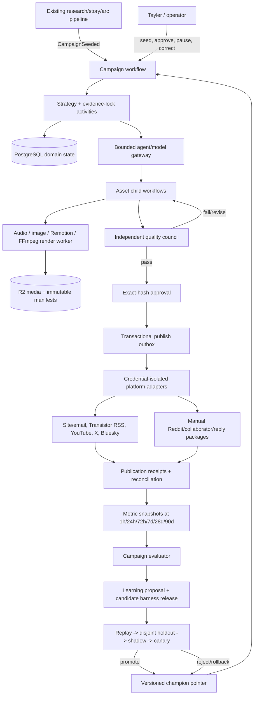

# Spec: MindPattern CampaignOS — agentic media, distribution, engagement, and learning harness

- **Status:** **REJECTED on 2026-07-11; do not implement**
- **Superseded by:** `docs/specs/2026-07-11-campaignos-four-campaign-pilot-spec.md`
- **Scale-only concepts retained in:** `docs/specs/2026-07-11-campaignos-deferred-architecture.md`
- **Date:** 2026-07-10
- **Primary repository:** `mindpattern-v3`
- **Companion site repository reviewed:** `../mindpattern-rabbit-hole`
- **Scope:** architecture, product behavior, safety boundaries, contracts, evaluation, and acceptance criteria
- **Related narrower specification:** `docs/specs/2026-07-10-social-growth-harness-spec.md`

The owner-supplied adversarial review rejected this revision for contradicting the required Claude CLI subscription boundary, assuming an impossible one-person labor/staffing model, deadlocking campaign-1 gates, omitting material costs, and prematurely specifying statistically underpowered learning and dual-runtime infrastructure. This file remains as an audit artifact only. Its original “independent adversarial review” claim is not evidence of approval.

This rejected revision originally expanded the narrower social-growth document into a complete campaign system. It no longer controls any CampaignOS product or architecture decision. The 2026-07-11 pilot specification is the only candidate controlling document, and it remains unapproved.

## Evidence legend

- **Confirmed:** directly observed in repository code, tests, logs, Git history, deployment configuration, or the public site.
- **External:** supported by a linked primary source or clearly identified research paper.
- **Inference:** a conclusion drawn from confirmed/external evidence, but not implemented or owner-approved.
- **Proposed:** target behavior in this specification.
- **Unknown:** requires credentials, production data, account access, cost approval, or an owner decision.

## Progress checkpoint

- [x] Inspected the existing research, story, social, approval, receipt, media-contract, analytics, memory, evaluation, deployment, and public-site paths.
- [x] Traced the daily runtime and established where a campaign handoff can safely occur.
- [x] Safely exercised the relevant local audio, video-package, social, approval, analytics, and analyzer tests.
- [x] Researched official YouTube, podcast, X, Reddit, Bluesky, email, media-provider, workflow, and agent-evaluation guidance.
- [x] Defined the cold-start growth strategy, weekly campaign model, media stack, agent roles, durable workflow, contracts, safety model, and learning loops.
- [x] Defined measurable quality, reliability, policy, cost, and business acceptance criteria.
- [x] Completed independent adversarial architecture/spec review and corrected cross-system consistency, publication-slot, status-model, release-builder, privacy-measurement, media-art, experiment, runtime, and acceptance gaps.
- [ ] Owner reviews the assumptions and resolves the open decisions.
- [ ] Owner explicitly approves this Phase 1 specification before an implementation plan is created.

## Executive decision

MindPattern should build an **AI-operated, evidence-first media company around one campaign at a time**, not a high-volume cross-posting bot.

Each campaign begins with one costly audience question or falsifiable thesis and one canonical, source-grounded MindPattern dossier. From the same locked evidence—not copied prose—the system creates an 8–15 minute video/audio master, a podcast episode, a source-rich web experience, three Shorts, an email, channel-native X and Bluesky posts, a Reddit contribution package, collaborator assets, and follow-up material. It then measures discovery, consumption, conversion, retention, trust, and cost at 7-, 28-, and 90-day windows. The next campaign uses those observations through a controlled champion/challenger process.

```text
audience question -> evidence dossier -> campaign thesis -> asset graph
       -> quality/rights/policy gates -> approval -> staged publication
       -> useful participation and collaborator distribution
       -> site/email conversion -> 7/28/90-day measurement
       -> learning proposal -> replay/holdout/shadow/canary
       -> promoted playbook or rollback -> next campaign
```

The system will feel human because it has a stable editorial point of view, remembers campaign context, credits people, answers the actual question, adapts to each community, acknowledges uncertainty, and follows stories over time. It must never claim to be human, manufacture social proof, impersonate a person, or automate unsolicited attention at scale.

### What makes this agentic

CampaignOS is agentic because it can:

1. inspect evidence, audience demand, prior campaigns, and constraints;
2. propose a campaign thesis and asset graph;
3. delegate bounded evidence, narrative, channel, media, quality, and analysis work;
4. revise artifacts against typed critic findings;
5. pause for missing evidence, rights, budget, policy, or human judgment;
6. resume across hours or days after approvals and external processing;
7. reconcile ambiguous platform outcomes instead of blindly retrying;
8. observe performance and generate falsifiable improvement proposals; and
9. promote only changes that survive predetermined evaluation gates.

The LLM does **not** choose arbitrary tools, mutate production prompts, change permissions, authorize spending, or publish directly. Those powers remain in deterministic code and explicit policy.

## Assumptions for owner review

1. **Audience.** The initial wedge is AI builders, technical founders, researchers, and operators who need to understand what changed, what the evidence supports, and what action to take.
2. **Editorial source of truth.** MindPattern stories, findings, narrative arcs, sources, and claim evidence remain the upstream truth. Campaign agents cannot invent a separate factual record.
3. **One campaign weekly.** The pilot optimizes one excellent campaign per week before increasing volume.
4. **Channels.** Initial surfaces are the MindPattern site, email, podcast RSS, YouTube, YouTube Shorts, X, Bluesky, and a manual Reddit contribution package. LinkedIn remains outside automated scope and may receive a manual asset package only.
5. **Approval posture.** Campaign launch, consequential claims, voice identity, realistic synthetic media, community participation, partner outreach, corrections, and all new outbound modes begin human-controlled.
6. **Voice.** The pilot uses one disclosed narrator. A Tayler voice clone is permitted only after explicit recorded consent and provider verification; otherwise use a licensed stock voice.
7. **Buy versus build.** Buy foundation models, TTS, podcast hosting, object storage, and platform APIs. Build MindPattern's evidence adaptation, campaign orchestration, quality gates, asset lineage, memory, experimentation, and analytics.
8. **Workflow runtime.** A durable workflow engine is required. Temporal is the recommended target, behind a `WorkflowRuntime` interface and subject to owner approval; a leased PostgreSQL queue is the fallback, not an in-memory loop.
9. **Infrastructure.** Media rendering runs on a separate worker, not the current Fly machine. PostgreSQL is proposed for shared CampaignOS state; R2 or an equivalent object store holds binaries.
10. **Learning.** “Self-improving” means controlled proposals, evaluation, canaries, and rollback. It never means unconstrained production self-rewriting.
11. **Site readiness.** The first traffic campaign does not launch until the canonical destination, source presentation, contextual subscription flow, analytics, and visible freshness indicators pass readiness checks.
12. **Phase gate.** This turn produces the specification only. A technical plan, task list, dependency additions, migrations, implementation, live tests, and platform actions require subsequent explicit approval.

## Objective

Build a durable operating harness that turns MindPattern's strongest source-backed investigations into coordinated, channel-native campaigns; earns attention without an existing follower base; converts that attention into an owned audience; and improves campaign strategy and production quality without sacrificing truth, safety, or platform integrity.

### Primary users

- **Audience member:** discovers a useful answer, watches/listens/reads it, verifies sources, and optionally subscribes for updates.
- **Tayler as editor/operator:** reviews the campaign thesis, consequential claims, sensitive media, high-risk outbound actions, corrections, and learning proposals without manually coordinating every artifact.
- **Campaign operator/agent:** sees a truthful state, bounded tools, exact evidence, budgets, approval status, and recovery instructions.
- **Collaborator or guest:** receives a clear, accurate, rights-safe package tailored to an agreed distribution action.

### User stories

- As Tayler, I can select an existing story or arc and receive a source-locked campaign proposal showing audience, thesis, assets, schedule, risks, cost, and success hypothesis.
- As Tayler, I can approve or reject exact artifact hashes and see which downstream assets become invalid after an edit.
- As an audience member, I can choose watch, listen, or read while seeing the same claim provenance and corrections across formats.
- As an operator, I can stop all outbound actions, pause one platform or campaign, resume after a crash, and reconcile unknown publication outcomes without duplication.
- As Tayler, I can see why the system believes a campaign worked, what evidence is weak, what it proposes changing, and how to roll back.
- As a community member, I receive a useful, native contribution with transparent affiliation—not generic promotion or automated imitation of human attention.

### North-star outcome

The north-star metric is **new 30-day engaged owned subscribers per campaign**.

An engaged new subscriber is a newly confirmed, consented subscriber who, within 30 days, performs at least one meaningful follow-on action: clicks a cited source, returns through an identified campaign/email link, replies, completes a preference/survey action, or consumes a second artifact above its engagement threshold. Raw followers, impressions, email opens, and model-generated “engagement scores” are not north-star metrics.

### Supporting outcomes

- non-follower and non-branded discovery;
- YouTube click-through, first-30-second retention, average percentage viewed, watch time, returning viewers, and subscribers per episode;
- podcast starts/downloads, completion proxy where available, follows, and episode-to-site actions;
- source clicks, engaged story sessions, subscribe conversion, second-session rate, and 30-/90-day compounding traffic;
- meaningful replies, saves/bookmarks, shares, qualified profile visits, and collaborator actions;
- corrections, removals, spam complaints, blocks/mutes, unsubscribes, and negative feedback;
- dollars, model tokens, render minutes, and human review minutes per campaign and engaged subscriber.

## Scope and non-goals

### In scope

- campaign selection, strategy, evidence lock, asset planning, production, QA, staging, approvals, publishing, reconciliation, measurement, and learning;
- one long-form audio/video master, podcast syndication, captions, chapters, thumbnails, three Shorts, site/email, X/Bluesky originals, and Reddit/collaborator manual packages;
- durable workflows, typed contracts, isolated artifacts, deterministic outbound gateway, exact-hash approvals, budgets, observability, and recovery;
- contextual, read-only audience/community scouting using approved data paths;
- campaign continuity through existing stories, arcs, graph relationships, corrections, and past performance;
- controlled champion/challenger evolution of prompts, context recipes, models, rubrics, and low-risk playbooks.

### Explicit non-goals

- purchased followers, artificial views, engagement pods, vote exchanges, `sub4sub`, sockpuppets, ban evasion, or coordinated inauthentic activity;
- bulk likes, follows, reposts, DMs, mentions, replies, or comments;
- proactive keyword-triggered reply bots or AI accounts pretending to be Tayler;
- automatic Reddit posts/comments or partner outreach in the initial system;
- generic AI news summaries, mass-generated SEO pages, or many near-identical videos;
- fake two-host podcast banter, fabricated interviews, or synthetic real people;
- allowing generated B-roll to serve as documentary evidence;
- replacing the existing daily research/newsletter pipeline;
- implementing recommendations from `docs/ai-pipeline-evaluation.md` as part of this specification;
- self-modifying code, credentials, budgets, permissions, retention rules, or safety policies.

## Confirmed current state

### Existing runtime and deployment

**Confirmed:** `orchestrator/pipeline.py:Phase` defines the fixed daily sequence `TREND_SCAN -> RESEARCH -> SYNTHESIS -> DELIVER -> SITE_CONTENT -> LEARN -> SOCIAL -> ENGAGEMENT -> IDENTITY -> MIRROR -> SYNC`. Python, not an LLM, owns transitions.

**Confirmed:** `deploy/com.mindpattern.pipeline.plist` starts `run-launchd.sh` on the local Mac during a morning window. `run-launchd.sh` defaults `MP_LAUNCHD_SKIP_SOCIAL=1`. The 2026-07-10 runtime log records both social and engagement as skipped and contains no audio or video production phase.

**Confirmed:** Fly runs the FastAPI dashboard and Slack bot together on one `shared-cpu-2x`, 2 GB machine (`fly.toml`, `start.sh`).

**Inference:** adding concurrent Remotion/FFmpeg rendering to that shared process boundary would create unacceptable CPU, memory, restart, and failure coupling; CampaignOS therefore proposes a separate render worker.

**Confirmed:** the public Next.js/Vercel site lives in `../mindpattern-rabbit-hole` and reads Fly APIs. A direct public fetch on 2026-07-10 confirmed the current title/positioning as “MindPattern - AI Research Intelligence,” plus Wire, Briefings, Search, and Subscribe navigation.

### Reusable campaign foundations

| Capability | Confirmed evidence | CampaignOS use |
|---|---|---|
| Source-backed public stories | `orchestrator/site_content.py`, `orchestrator/site_content_engine.py:run_site_content_for_date`, `/api/stories` | Campaign seed and canonical destination |
| Narrative continuity | story relationships, arcs, entities, findings, knowledge graph | Sequels, related episodes, and context retrieval |
| Safe public media metadata | `orchestrator/media_contracts.py:EvidenceReference`, `PublicArtifactMetadata`, path validation, redaction | Extend into versioned campaign contracts |
| Audio artifact/API/UI path | `orchestrator/audio_briefing.py`, `/api/audio-briefings`, site `audio-briefing-player.tsx` | Preserve delivery surface; replace newsletter-only producer path |
| Video script scaffold | `orchestrator/video_scripts.py:VideoScriptPackage` | Input fixture/compatibility path, not final production contract |
| Editorial lint and voice | `orchestrator/site_copy_lint.py`, `data/ramsay/mindpattern/voice.md`, `agents/humanizer.md`, corrections/exemplars | Quality and style gates |
| Approval | `social/approval.py:ApprovalGateway` | Adapt into durable, hash-bound approval records |
| Outbound receipts | `core/receipts.py` | Replace one-bit semantics with outbox/attempt/reconciliation |
| Social memory | `memory/social.py` | Import observations; do not use as shared mutable campaign state |
| Traces and monitor | `orchestrator/traces_db.py`, pipeline logging/monitoring | Extend with campaign/asset/activity/model/tool spans |
| Site analytics | `memory/events_db.py`, `dashboard/routes/site_analytics.py`, site `src/lib/analytics.ts` | Extend with campaign/asset/variant dimensions and lifecycle windows |

### Confirmed media gap

**Confirmed:** `orchestrator/audio_briefing.py` deterministically converts a newsletter to at most roughly 700 words of spoken prose. `build_tts_audio()` is dry-run by default and live mode requires an injected adapter; no concrete production provider call site was found. The backend exposes audio metadata/files/transcripts, and the site player explicitly renders “Audio file pending” when the binary is absent.

**Confirmed:** `orchestrator/video_scripts.py` creates source-backed 30/45/60-second packages and explicitly states that it does not call a renderer, provider, social API, or uploader. Tests enforce those separation boundaries.

**Confirmed:** no current Remotion package, FFmpeg production pipeline, YouTube uploader, podcast feed publisher, caption pipeline, media object store, render queue, or production audio/video artifact corpus was found. Git history contains an older removed Remotion/GIF prototype; it is historical evidence, not a current dependency.

**Confirmed:** `orchestrator/sync.py:create_bundle` does not package the proposed campaign/audio/video asset graph or large binaries.

### Confirmed distribution, analytics, and reliability gap

- The active social configuration supports Bluesky and LinkedIn, while `social/posting.py:XClient` exists but is not wired into the pipeline. Commit `827d1a9` removed active X after stale shared-draft contamination; per-campaign artifact isolation is a prerequisite to re-entry.
- Reddit code is research-only. No production Reddit publishing adapter was found.
- The existing Bluesky engagement path can draft/post replies and follow users, but those actions do not have the required durable attempt/reconciliation semantics. CampaignOS must not inherit automatic follows or unsolicited reply behavior.
- Current writers commonly route to the generic homepage instead of a campaign-specific canonical story.
- `memory/events_db:ALLOWED_EVENTS` omits the `share` event emitted by the site's `ShareButton`; that first-party signal is currently dropped.
- Current event contracts cannot join a visit or subscription to `campaign_id`, `asset_id`, `variant_id`, `publication_id`, or platform.
- Current receipts are not sufficient for a write accepted by a platform whose response is lost. Generic retry logic can repeat non-idempotent create requests.
- A sampled public story contained multiple factual assertions but only one `claim_evidence` item. Media adaptation must atomize consequential claims before producing narration or visuals.
- Current identity/analyzer code and the older self-optimization spec contain direct-file mutation ideas. The current runtime does not have an `ANALYZE` phase, and CampaignOS must use proposals and promotion gates instead of resurrecting direct mutation.

### Safe validation performed

No credentials, production data, model call, media provider, or platform write was used.

```text
.venv/bin/python3 -m pytest -q tests/test_audio_briefing.py tests/test_video_scripts.py tests/test_media_feature_safety.py tests/test_social.py tests/test_posting.py tests/test_approval.py tests/test_events_api.py tests/test_site_analytics.py tests/test_analyzer.py --tb=short

193 passed, 1 Starlette/httpx deprecation warning in 0.62s
```

This proves the selected current behavior is locally green under mocks and fixtures. It does not prove live TTS, rendering, RSS validation, YouTube upload, X eligibility, Reddit permission, Bluesky publication recovery, or production analytics correctness.

## External research conclusions

### Cold-start growth

**External:** YouTube explains that search and recommendation depend on relevance, appeal, engagement, satisfaction, and viewer history—not an existing follower count or a posting-time trick. It recommends accurate packaging, sustainable quality, series, playlists, and experimentation. Google warns against scaled, low-value AI content and favors original, useful, expert-led material.

**Inference:** MindPattern's best cold-start surfaces are searchable investigations and YouTube, followed by borrowed trust through relevant communities and collaborators. Email turns temporary discovery into an owned relationship. Podcast, X, and Bluesky expand discovery and continuity; referral mechanics come after a genuinely engaged base exists.

**External:** Reddit's own organic playbook advises businesses to listen first, comment before posting, communicate as a person, comment frequently, post sparingly, and consult moderators. Bluesky custom feeds and starter packs provide topic/community discovery. X can recommend out-of-network posts and evaluates useful engagement as well as negative feedback.

### Media production

**External:** Apple requires public RSS 2.0, stable GUID/enclosure behavior, reachable media with HTTP HEAD/range support, and compliant audio. Its audio guidance targets 44.1/48 kHz and loudness around -16 LKFS for stereo with a true-peak ceiling. YouTube recommends MP4/H.264, AAC at 48 kHz, progressive scan, and standard aspect ratios.

**Proposed:** use a single 8–15 minute evidence-rich master designed to work both as a YouTube video and as audio. Produce the podcast from the approved narration/master; do not publish duplicate YouTube episodes through both video upload and RSS ingestion.

**External:** YouTube policies reject mass-produced/repetitive inauthentic content and require disclosure for realistic altered/synthetic content. AI narration is disclosed in the asset and description. Generated footage is illustrative only and is never labeled or edited as source evidence.

### Automation integrity

**External:** X's April 2026 automation rules permit useful informational original posts through approved APIs but restrict duplicate automation, trend automation, aggressive following, automated likes, and unsolicited keyword-triggered replies; AI reply bots require explicit written approval. Reddit's current developer and Devvit rules require narrowly approved uses, transparency, and explicit manual user action for user posts/comments. Bluesky treats automated/bulk notifying interactions such as follows, likes, replies, and messages as spam risk.

**Decision:** automate production support, original one-to-many publication where the registered use case permits it, measurement, and reconciliation. Do not automate manufactured attention. Reddit contributions, partner outreach, corrections, and social replies remain human actions during the pilot. Owned-inbound reply automation can be considered only in a later platform-specific specification after written permission, opt-in semantics, and a canary.

### Self-improvement

**External:** recent self-improving-agent research consistently shows that unguarded evolution is high variance. Stronger systems separate weakness discovery, proposal, validation, and promotion; evaluate on disjoint held-out cases; and keep the previous champion when the candidate does not clearly improve without regressions.

**Decision:** CampaignOS observes, proposes, replays, evaluates, shadows, canaries, promotes, or rolls back. A candidate cannot edit the active release pointer that governs it.

## Campaign product strategy

### Editorial promise

Provisional positioning for owner approval:

> MindPattern follows important AI stories as evolving systems. It shows what changed, what the evidence supports, where sources disagree, and what builders and operators should do next.

The campaign format should not lead with “an autonomous pipeline made this.” It should lead with a costly audience question and a useful answer. Automation and methodology remain transparent in the trust/provenance layer.

### Campaign definition

A campaign is a versioned bundle with:

- one target audience segment and decision/problem;
- one question or tension;
- one falsifiable thesis and explicit uncertainty;
- a locked source pack and atomized claim map;
- one canonical dossier with watch/listen/read modes;
- an asset graph in which each channel adapts the evidence natively;
- one conversion object, normally annotated sources plus future updates;
- a distribution and collaborator plan;
- one predeclared primary experiment;
- budgets, safety mode, approval requirements, and stop conditions;
- performance windows and a closing learning record.

### Weekly campaign operating model

The following are ceilings for the pilot, not posting quotas:

| Day | Human/agent operating outcome |
|---|---|
| Monday | Review mature 7-/28-day evidence, mine audience questions, select one audience/decision/thesis, and reject weak destinations. |
| Tuesday | Build the claim ledger: primary sources, dates, exact quotes, counterevidence, confidence, rights, pronunciation, and unresolved questions. |
| Wednesday | Produce the canonical dossier, original chart/table, approved narration, long video/audio, transcript, chapters, thumbnails, Shorts, email, and platform-native drafts. |
| Thursday | Private-stage and approve; publish the site page, YouTube episode/podcast playlist entry, podcast RSS episode, and email with one aligned CTA. |
| Friday | Publish approved X/Bluesky originals; prepare a complete native Reddit contribution only where a real community question exists; deliver agreed collaborator packages. |
| Weekend | Tayler answers substantive interactions, records corrections and useful contributors, and adds unresolved questions to the campaign/arc backlog. |
| Day 7/28/90 | Evaluate launch, discovery, and compounding effects; produce a learning proposal or explicitly record “insufficient evidence.” |

### Initial show and asset graph

**Proposed show:** **MindPattern Field Note** — one disclosed narrator, 8–15 minutes, one investigation, one thesis, one counterpoint/uncertainty section, episode-specific evidence cards, and an annotated source trail. An optional short real Tayler introduction/outro can strengthen accountability. A longer 15–25 minute “Rabbit Hole” format is deferred until the evidence and retention data support it.

For each campaign:

- 1 canonical dossier with watch/listen/read, sources, methodology/corrections, related arc, and contextual subscribe;
- 1 8–15 minute 16:9 YouTube episode that also produces the podcast audio master;
- 1 podcast episode plus transcript, chapters, notes, cover, and stable RSS identity;
- 3 complete 20–60 second 9:16 Shorts, each making one supported point rather than teasing without value;
- up to 3 X originals: a finding, evidence graphic, and caveat/question;
- up to 2 Bluesky originals shaped for relevant legitimate feeds/hashtags;
- 1 email with the evidence-backed decision and one CTA;
- 0 or 1 manual Reddit package, only when it answers a real community need;
- up to 3 targeted collaborator packages, with one co-distributed campaign every two weeks as an initial ambition;
- follow-up replies, corrections, and sequels only when actual audience/evidence signals justify them.

Cross-platform reuse shares claim and scene IDs, not identical copy.

## Target architecture

### Architectural decision

The existing daily research pipeline remains upstream. After it publishes a campaign-ready story or arc, it emits a `CampaignSeeded` event or an operator seeds a campaign manually. The campaign runtime is independent: a media failure, approval wait, or week-long timer cannot block research, newsletter delivery, or site synchronization.

Temporal is the recommended durable workflow spine because campaigns contain long timers, human signals, child workflows, expensive activities, external processing, and crash recovery. Campaign domain records, approvals, outbox state, metrics, and learning records live in PostgreSQL; Temporal history is not the business database. If Temporal is rejected, the fallback must preserve the same semantics with leased, fenced PostgreSQL jobs and deterministic transitions.



### Physical deployment boundaries

| Boundary | Responsibility | Constraint |
|---|---|---|
| Existing Mac daily runner | research/newsletter/site generation and campaign seed emission | Does not render or wait on campaigns |
| Campaign API/control service | operator UI/API, domain reads, approvals/signals, status | No provider secrets exposed to agents or browser |
| Temporal service/worker or equivalent | durable workflow decisions, timers, child workflows, retries | Workflow code must be deterministic |
| General campaign worker | context construction, model calls, validation, packaging, metrics | Bounded concurrency, budgets, and tool capabilities |
| Dedicated render worker | TTS download, FFmpeg mastering, Remotion render, ffprobe QA, upload | Separate CPU/memory from Fly and daily research |
| PostgreSQL | campaign aggregates, versions, approvals, jobs, attempts, metrics, releases | Migrations, constraints, transactions, backups required |
| R2/object storage + CDN | media binaries, captions, artwork, immutable render manifests | Private staging prefix and public promoted prefix |
| Current Fly service | metadata APIs, Slack approval/status bridge, campaign dashboard API | Must not perform heavy renders |
| Vercel site | canonical campaign presentation, consented conversion, first-party events | No provider credentials; privacy-safe closed event schema |

### Trust and control boundary

```text
untrusted sources/platform content
        -> sanitize + classify + provenance
        -> context manifest (data, never instructions)
        -> bounded agent with no credentials
        -> typed candidate artifact
        -> deterministic evidence/policy/rights/duplicate gates
        -> independent quality evaluation
        -> exact-hash human/policy approval
        -> credentialed outbox adapter
```

No agent process receives platform credentials, shell access, an unrestricted URL fetcher, or a generic `publish()` tool. Tool capabilities are issued per activity and limited by host, method, record type, byte/token/cost budget, deadline, and expected output schema.

## Workflow and state model

### Campaign lifecycle and orthogonal status

A campaign does not have one overloaded `state` enum. It carries four independently versioned dimensions so it can truthfully be measuring, partially live, and under correction review at the same time.

`lifecycle_phase`:

```text
SEED
  -> STRATEGY
  -> EVIDENCE_LOCK
  -> ASSET_PLAN
  -> PRODUCING
  -> QUALITY_GATED
  -> AWAITING_APPROVAL
  -> STAGED
  -> PUBLISHING
  -> LIVE
  -> MEASURING
  -> LEARNING
  -> CLOSED
```

Terminal lifecycle alternatives are `CANCELLED` and `FAILED`.

- `health`: `HEALTHY`, `DEGRADED`, or `FAILED`, with typed affected components/reasons.
- `publication_summary`: derived as `NOT_LIVE`, `PARTIALLY_LIVE`, `LIVE`, or `PUBLICATION_UNCERTAIN` from the asset/publication ledger; an agent cannot set it.
- `intervention_status`: `NONE`, `BLOCKED`, `PAUSED`, `MANUAL_INTERVENTION`, `CORRECTION_REQUIRED`, or `TAKEDOWN_REVIEW`, with owner, deadline, and resolution condition.

`DEGRADED` never silently weakens an evidence, rights, policy, approval, or publication invariant. Every dimension has an explicit transition table, timestamp, reason code, and aggregate version.

The workflow may wait days for an approval or metric window without holding a process. The authoritative business transition is committed by deterministic PostgreSQL domain code; the workflow orchestrates only from that committed aggregate version. Agents return proposed outputs; they cannot assign lifecycle state.

### Asset lifecycle and publication status

`asset_phase`:

```text
PLANNED -> DRAFTING -> VALIDATING -> REVISING -> RENDERING -> MEDIA_QA
        -> AWAITING_APPROVAL -> APPROVED -> STAGED -> PUBLISHING
        -> PUBLISHED -> MEASURING -> COMPLETE
```

Terminal phase alternatives are `REJECTED`, `SUPERSEDED`, and `CANCELLED`. Separate fields carry:

- `quality_status`: `NOT_EVALUATED`, `PASS`, `FAIL`, or `WAIVER_REQUIRED`;
- `publication_status`: `NOT_PLANNED`, `STAGED`, `SENDING`, `PUBLISHED`, `UNCERTAIN`, `DEFINITE_FAILURE`, or `DEAD_LETTER`;
- `intervention_status`: `NONE`, `BLOCKED`, `CORRECTION_REQUIRED`, `TAKEDOWN_REVIEW`, or `MANUAL_INTERVENTION`.

Asset publication status is derived from its stable logical slot and attempts. It is never inferred from the workflow phase or a provider timeout.

### Publication attempt lifecycle

The desired `PublishAction` may be scheduled. Each concrete attempt follows:

```text
PLANNED -> RESERVED -> SENDING
  -> CONFIRMED
  -> DEFINITE_NOT_SENT -> RETRY_WAIT -> new PLANNED attempt | DEAD_LETTER
  -> UNCERTAIN -> RECONCILING
       -> CONFIRMED
       -> RECONCILED_ABSENT -> new PLANNED attempt
       -> MANUAL_INVESTIGATION
```

Rules:

- A non-idempotent create is never blindly retried after a timeout, connection reset, process crash after `SENDING`, or ambiguous 5xx.
- `SENDING` found during worker recovery is conservatively converted to `UNCERTAIN` before reconciliation; it is never treated as not sent.
- Each attempt has a stable idempotency key when the provider supports one and an internal uniqueness slot even when it does not.
- A changed title or body hash cannot bypass an unresolved earlier attempt for the same asset/platform slot.
- Reconciliation uses provider IDs, upload status, account timeline/search, or a human decision as allowed; it never asks an LLM to guess whether a post exists.
- External media processing is polled with bounded backoff and terminal deadline. A failed child asset does not corrupt already approved siblings.
- Campaign cancellation stops unclaimed work and future timers but does not automatically delete published content.

### Workflow concurrency and quotas

- One active campaign workflow per `campaign_id`.
- One active asset child workflow per `(campaign_id, asset_id, render_revision)`.
- One logical publication slot per `(account_id, platform, action_kind, campaign_id, asset_id, placement)`. Every edit/revision/attempt inherits the same `publication_slot_id`; creating a new `publication_id` cannot evade an unresolved slot.
- Separate task queues and concurrency caps for model, TTS, render, upload, publish, metric, and reconciliation work.
- Weighted per-campaign and monthly budgets for model tokens, TTS characters, image generations, generated video seconds, render minutes, storage, API calls, and human review minutes.
- Global, campaign, provider, platform, action, and account kill switches.
- Priority classes: correction/security > stuck reconciliation > approved launch > scheduled derivative > experimental candidate.
- Leases carry fencing tokens. An expired worker cannot reserve new work or commit a result after a newer worker owns the fence. A provider request already in flight cannot be revoked by an internal fence; it becomes `UNCERTAIN`, blocks the logical slot, and must reconcile.

## Agent responsibilities and separation of concerns

These are logical roles. The implementation may combine low-risk roles in one model call when contracts and evaluation show a benefit; it must not create many agents merely to appear agentic.

### 1. Campaign Director

- **Reads:** campaign seed, audience hypotheses, past campaign summaries, channel constraints, budgets, arc context, and site readiness.
- **Produces:** typed `CampaignBrief` and `AssetPlan` with audience, decision, thesis, counterpoint, CTA, schedule, experiment, risk, and cost estimate.
- **Cannot:** lock evidence, approve itself, publish, or change policy.

### 2. Audience and Community Scout

- **Reads:** approved search/query data, first-party search/analytics aggregates, public community metadata, and operator-curated questions.
- **Produces:** `AudienceDemandSignal` records with query, source, timestamp, confidence, trust class, community context, and expiry.
- **Cannot:** reply, message, follow, post, scrape through prohibited paths, or turn platform text into instructions.

### 3. Evidence Editor

- **Reads:** existing MindPattern findings/stories/arcs and allowlisted primary sources.
- **Produces:** `StorySourcePack`, atomized `ClaimMap`, exact-quote checks, counterevidence, confidence, pronunciation notes, and unresolved questions.
- **Cannot:** permit a consequential unsupported claim or manufacture certainty.

### 4. Narrative and Script Studio

- **Reads:** only the locked source pack, campaign brief, format rubric, voice manifest, and approved past exemplars.
- **Produces:** long-form `ScriptPackage`, segments, scene purposes, claim/scene references, source callouts, disclosure, CTA, chapters, and short-form adaptations.
- **Cannot:** add factual claims not represented in the `ClaimMap`.

### 5. Visual and Channel Studio

- **Reads:** approved script/scene plan, visual-rights policy, platform contract, and brand templates.
- **Produces:** deterministic evidence cards, charts, thumbnail candidates, B-roll requests, channel-native drafts, email, notes, and collaborator packages.
- **Cannot:** depict real events or people synthetically as evidence, reuse identical cross-platform copy, or publish.

### 6. Independent Quality Council

This is a manager-run set of bounded checks, not one self-grading prompt:

- evidence/quote/temporal checker;
- editorial usefulness and voice critic;
- rights/provenance and synthetic-media checker;
- platform/policy/disclosure validator;
- media QA and accessibility checker;
- similarity/repetition/inauthentic-content checker.

It returns typed findings with severity, evidence pointer, affected artifact span/scene, fixability, and gate result. Hard deterministic failures override model opinion. The creator cannot be the sole grader.

### 7. Engagement Assistant

- **Reads:** owned inbound interactions, manually approved community opportunities, published evidence, and conversation history under data-handling policy.
- **Produces:** priority/reason, supporting evidence, and optionally a response draft for Tayler.
- **Cannot:** proactively search keywords and auto-reply, post Reddit comments, follow/like, mass mention, DM, argue after a correction, or conceal automation.

During the pilot, Tayler performs every social reply in the native UI. The system records the resulting URL/status when available and treats the action as best-effort manual attribution.

### 8. Experiment and Learning Scientist

- **Reads:** immutable observations, experiment assignments, mature metric windows, human labels, costs, corrections, and negative outcomes.
- **Produces:** a falsifiable `LearningHypothesis`, diagnostic classification, and typed `LearningProposal` containing an allowlisted component patch request. It never produces an effective release manifest.
- **Cannot:** write the observation it is judged on, choose its hidden holdout, change active files/pointers, approve, publish, or access credentials.

### Orchestration pattern

Use a **manager-as-tools** pattern: the campaign workflow invokes specialists as bounded activities and retains the canonical state. Use parallel agent work only for independent candidate generation or evaluation. Ordered steps that share mutable state remain workflow-controlled. Any provider's experimental multi-agent runtime may be used inside a bounded activity after evaluation, but it is not the CampaignOS control plane.

## Versioned domain contracts

All records use strict Pydantic models, explicit schema versions, UTC timestamps, opaque typed IDs, enums instead of free strings, content hashes, provenance, and forward migration functions. Unknown fields are rejected at security/outbound boundaries. Stored records are immutable or use optimistic versions; mutation history is retained.

Every campaign artifact carries at least:

```json
{
  "schema_version": 1,
  "campaign_id": "cmp_01...",
  "asset_id": "ast_01...",
  "artifact_revision": 3,
  "harness_release_id": "rel_01...",
  "content_hash": "sha256:...",
  "created_at": "2026-07-10T16:00:00Z",
  "provenance": []
}
```

### `CampaignManifest`

Required fields:

- source seed/story/arc IDs and artifact hashes;
- target audience, problem/decision, awareness stage, and exclusions;
- question/tension, thesis, counterpoint, uncertainty, promise, and CTA;
- planned asset graph and dependency edges;
- channel, account, publication, and measurement modes;
- primary experiment and frozen decision windows;
- model/media/platform/human budgets;
- policy, approval, disclosure, and data-handling snapshot IDs;
- site/destination readiness record;
- active harness release, state, row version, and audit trail.

### `StorySourcePack` and `ClaimMap`

`StorySourcePack` freezes the story revision, findings, source snapshots/URLs, narrative arc, entity relationships, correction state, retrieval time, and source-access rights. It includes a context manifest showing what was included, omitted, truncated, and why.

Every consequential `ClaimRecord` includes:

- exact claim text and semantic fingerprint;
- claim kind: fact, exact quote, paraphrase, inference, opinion, prediction, or uncertainty;
- primary supporting source spans and date;
- counterevidence/limitations;
- confidence and materiality;
- permitted formats and required onscreen/source-note treatment;
- quote verification and named-entity pronunciation status;
- status: supported, partially supported, disputed, unsupported, stale, or corrected.

Facts, quotes, temporal statements, statistics, and depictions cannot reach an approved public script unless their required claim status passes. Inference and opinion must be labeled in narration/copy where a reasonable audience could confuse them with fact.

### `CampaignBrief` and `AssetSpec`

`CampaignBrief` records the audience insight, value promise, distinct thesis, uncertainty, desired action, format rationale, and predeclared success hypothesis. `AssetSpec` records platform/format, dimensions/duration, narrative job, claim IDs, scene types, CTA, disclosure, accessibility, rights profile, cost ceiling, dependency hashes, and approval tier.

### `ScriptPackage`

The long script is a list of typed segments rather than one opaque string:

```json
{
  "segment_id": "seg_01...",
  "purpose": "counterpoint",
  "spoken_text": "...",
  "claim_ids": ["clm_01..."],
  "scene_ids": ["scn_01..."],
  "source_callout": "...",
  "pronunciation_ids": [],
  "estimated_seconds": 42.5
}
```

It also carries hook, promise delivery point, chapter plan, CTA, disclosure, exact transcript expectation, and derived short candidates. Any post-approval script edit invalidates downstream TTS, timings, captions, render, QA, and approval hashes.

### `VisualAssetRecord` and `RenderManifest`

`VisualAssetRecord` contains origin (`repo`, `licensed`, `public_domain`, `generated`, `chart`, `screenshot`), source/license/consent, creator/provider/model, generation prompt when applicable, synthetic/realism classification, expiry, allowed uses, file hash, and claim/scene links.

`RenderManifest` contains composition/template version, input hashes, dimensions, frame rate, codecs, audio settings, timing map, captions/chapters, visual records, renderer/runtime versions, output hashes, QA results, and storage URLs. It is sufficient to reproduce or explain a render.

### `ValidationRecord` and `ApprovalRecord`

`ValidationRecord` binds the exact campaign/source/script/render/policy/release hashes to deterministic and model-evaluated findings. `ApprovalRecord` binds exact hashes, approver identity, decision, timestamp, expiry, allowed destinations/actions, conditions, and the validation record. Editing approved content creates a new revision and invalidates dependent approval.

### `PublishAction`, `PublicationAttempt`, and `PublicationReceipt`

`PublishAction` is the immutable desired mutation: platform/account, action kind, asset/revision, stable `publication_slot_id`, placement, content/media hashes, schedule, idempotency lineage, approval, policy snapshot, budget, disclosure, and reconciliation strategy. The slot is deterministically derived from `(account_id, platform, action_kind, campaign_id, asset_id, placement)` and cannot be replaced by creating an edited publication record.

`PublicationAttempt` records a new `attempt_id` for each permitted network try while retaining the same logical slot/idempotency lineage, lease/fence, transition to `SENDING`, request fingerprint, provider request ID where known, result class, error fingerprint, cost, and reconciliation state. `PublicationReceipt` records confirmed external ID/URL, observed content hash, publication time, provider metadata, and verification method. An unknown result is never represented as false.

### `MetricSnapshot`

Required dimensions are `campaign_id`, `asset_id`, `publication_slot_id`, `publication_id`, `variant_id`, `harness_release_id`, platform/account, observation window, captured time, cohort maturity, definition version, denominators, values, null/unavailable reasons, source, and revision. Snapshots are append-only; corrections/sync changes create higher revisions.

### `CampaignLearning`

Contains mature observations, diagnostic pattern, supported and rejected hypotheses, confidence, segments, costs, editor time, reusable playbook candidates, explicit non-learnings, next questions, and links to any `LearningHypothesis`. It cannot directly update a prompt, policy, memory instruction, model route, or active release.

## Context and memory architecture

### Memory classes

| Class | Examples | Mutability and authority |
|---|---|---|
| Immutable observations | source snapshot, render result, receipt, correction, metric snapshot, human label | Append-only; may be superseded, never overwritten |
| Untrusted interaction data | comments, posts, community rules text, search snippets | Sanitized/quarantined data; never instructions or policy |
| Hypotheses | audience need, hook theory, channel theory, diagnostic, learning proposal | Versioned, expiring, non-authoritative |
| Approved playbooks | voice guide, evidence floor, platform policy, disclosure, format recipe | Immutable version with approver/effective dates; selected by release manifest |
| Runtime working state | workflow checkpoint, lease, timer, asset dependency | Durable but operational; cannot become editorial memory automatically |

The current `memory.db` may remain an upstream/read-only source during migration. Shared multi-worker CampaignOS state belongs in PostgreSQL. Binary media does not belong in SQL or Git.

This explicitly supersedes the narrower social specification's provisional use of `memory.db` as canonical campaign state. `memory/events_db.py` documents a daily synced deployment, and the current Fly restart/sync path can replace local state. CampaignOS must have one transactional PostgreSQL authority that is not shipped as a daily file bundle. Read models may be projected into SQLite for local/offline inspection, but writes never flow back from that projection.

### Context manifest

Every model activity receives a generated `ContextManifest` containing:

- task purpose and allowed output schema;
- exact source/claim/playbook/release IDs and hashes;
- trust class and provenance per section;
- token budget by category;
- selected, summarized, truncated, and omitted items with reason codes;
- freshness/expiry and data-handling permissions;
- prompt/provider/model/settings/tool-capability versions.

Context construction favors claim-relevant primary evidence, campaign continuity, corrections, counterevidence, and approved voice examples. Raw archives and full social threads are not dumped into prompts. Retrieval must be reproducible from the manifest.

### Prompt injection controls

- Source, community, comment, transcript, and tool output are delimited and tagged as untrusted data.
- Untrusted text cannot define tools, destinations, policies, memory writes, system prompts, or outbound actions.
- Fetch tools use host/method/content-type/size/time allowlists and store source provenance.
- Model-safe DTOs exclude credentials, private email, raw analytics identifiers, and platform text unless a current data-handling review explicitly permits the field.
- Suspected injection creates a security observation and blocks the affected activity; it is not forwarded into a repair prompt verbatim.

## Media production system

### Buy/build decision

| Layer | Decision | Rationale |
|---|---|---|
| Story adaptation, claim/scene mapping, evidence cards, quality gates | Build | This is MindPattern's differentiated trust and editorial layer. |
| Foundation models | Buy behind a model gateway | Preserve provider/model portability, budgets, tracing, and fallbacks. |
| TTS | ElevenLabs as proposed primary, provider interface required | Timed output and long-form/voice options; avoid provider lock-in and current OpenAI TTS catalog ambiguity. |
| Audio mastering | FFmpeg/ffprobe | Deterministic, inspectable, automatable loudness/codec QA. |
| Podcast hosting/RSS | Transistor proposed for pilot | API, draft/scheduling workflow, analytics, multiple shows, and directory-compatible RSS without building hosting operations first. |
| Video composition | Remotion plus FFmpeg | Deterministic React/TypeScript templates, captions, charts, source cards, and reproducible 16:9/9:16 renders. |
| YouTube | Official YouTube Data API | Upload, processing, metadata, captions, thumbnails, playlists/podcast designation, scheduling, and receipts. |
| Artwork | Deterministic branded templates; optional image model for background art | Text/evidence remains controlled; generated art is replaceable and provenance-tagged. |
| Generative B-roll | Optional Runway/Veo-class adapter, never core | Expense, policy, realism, and reproducibility make it an accent only. |
| Binary storage/CDN | Cloudflare R2 or equivalent | Cheap object storage, ranged reads, private staging, public CDN, and no Git/Fly-volume binary sync. |

Provider names are recommended defaults, not hardcoded domain behavior. Every adapter must pass the same contracts and fixtures. Current product access, terms, pricing, retention, and region support are rechecked before procurement.

### End-to-end media flow

```text
approved CampaignBrief + locked StorySourcePack/ClaimMap
  -> long ScriptPackage + scene plan
  -> evidence/quote/voice/rights/policy validation
  -> script approval
  -> timed TTS render
  -> narration alignment + pronunciation review
  -> FFmpeg loudness master
  -> transcript + SRT + VTT + chapters
  -> deterministic scene/evidence-card render
  -> Remotion 16:9 episode + 9:16 Shorts + thumbnails/cover
  -> ffprobe/visual/accessibility/similarity QA
  -> complete publish-bundle hash + final approval
  -> private platform staging
  -> process/upload verification
  -> scheduled public promotion
  -> receipts and metric windows
```

### Narration and voice

- Use a stable `VoiceProvider` interface that accepts an approved script, pronunciation dictionary, voice manifest, format, and cost ceiling and returns audio, timing/alignment, provider request ID, model/voice version, and usage.
- The script is segmented at semantic boundaries. The provider never receives platform credentials or unrelated context.
- Tayler's voice requires explicit recorded consent, provider verification, an approved voice manifest, revocation path, and separate approval record. A stock voice is the default until then.
- Every episode and description says, in substance, “Narrated with an AI voice from an original MindPattern script.” Do not imply a synthetic narrator attended events or interviewed people.
- TTS provider output is compared with the approved text. Differences beyond pronunciation/normalization tolerances block mastering.
- Provider fallback changes the voice/model identity and requires a new audio/render revision. It cannot silently replace an approved voice.

### Audio mastering and podcast

Pilot audio target:

- MP3 master suitable for podcast delivery, 44.1 or 48 kHz;
- stereo integrated loudness target `-16 LKFS ±1`, true peak no higher than `-1 dBFS`;
- no clipping, truncated segments, extended silence, duplicated segment, missing disclosure, or audible source-card text;
- transcript and chapter coverage for all substantive narration;
- stable episode GUID and enclosure URL after publication;
- show notes contain canonical dossier, primary sources, disclosure, corrections link, and one CTA.

Podcast host workflow:

1. upload the approved audio to a private/staging object;
2. create a **draft** Transistor episode through its API with exact title, description, transcript, artwork, season/episode, and scheduled time;
3. reconcile the returned episode ID and verify the draft;
4. publish only after final approval and destination readiness;
5. validate the public RSS entry, enclosure reachability, MIME type, byte length, GUID, artwork, and transcript/chapters where supported;
6. store host/platform IDs and directory status in receipts;
7. never mutate GUID/enclosure identity for an ordinary correction; create versioned notes or an explicitly governed replacement.

Submit the feed to Apple Podcasts, Spotify, and other selected directories through their normal ownership/verification process. Directory submission is an owner action and launch prerequisite, not an agent-created account.

### Long-form YouTube episode

Pilot render target:

- 1920x1080, 16:9, 30 fps, H.264 progressive video, AAC 48 kHz audio, BT.709 color;
- 8–15 minutes with no filler added to hit a duration;
- opening promise delivered immediately, with evidence visible early;
- at least one counterpoint, limitation, or unresolved question;
- episode-specific timelines, charts, comparisons, source cards, product/code imagery, or diagrams;
- at least 70% of scene time uses episode-specific visual treatment, not a generic looping template;
- readable captions and source callouts on mobile-sized playback;
- end screen/next-rabbit-hole recommendation and the aligned source-pack CTA.

YouTube publication workflow:

1. upload the exact approved video as `private` using OAuth and the official API;
2. persist upload ID and poll processing status without re-uploading on ordinary timeout;
3. upload captions and the approved thumbnail;
4. set title, description, tags/categories, audience designation, license, language, schedule, and `containsSyntheticMedia` when required;
5. add the episode to the show playlist and designate the playlist as a podcast where the current API/account supports it;
6. verify the private watch page, captions, thumbnail, disclosures, description links, chapters, and claims;
7. schedule/publicize only after the final publication approval;
8. record the video/playlist/caption/thumbnail IDs and subsequent processing state.

The Google project/account approval status is a real dependency: uploads from some unverified projects may remain private until a compliance audit. CampaignOS must represent that as `BLOCKED`, not work around it.

### Shorts and derivative video

- Default duration is 20–60 seconds, vertical 1080x1920. The contract permits up to the current YouTube Shorts limit but the pilot does not use length as a target.
- Each Short makes one complete, supported point and identifies its claim IDs. The first one to two seconds deliver the question or tension without deceptive bait.
- Captions cover all narration. Source/provenance remains legible and the description points to the canonical dossier/full episode.
- A Short may use a different hook or example but cannot change factual meaning.
- Generate at most three Shorts per campaign. More requires evidence that the series is not repetitive and an explicit new asset plan.
- Do not rely on an uploaded custom thumbnail being displayed consistently for Shorts.

### Visuals, artwork, and synthetic media

- Prefer repository screenshots, original charts/timelines, licensed/public-domain media, source cards, and deterministic brand components.
- All visuals require a `VisualAssetRecord` before rendering. “Found on the web” is not a rights status.
- Generated imagery may illustrate an abstract idea. It cannot depict a real person making a claim or a real event as if recorded.
- Realistic altered/synthetic scenes are disclosed in-platform and in the dossier provenance; the YouTube synthetic-media field is set when applicable.
- Thumbnail/cover text is generated from approved title candidates, checked for accuracy and safe margins, and rendered deterministically. Optional generated backgrounds never contain unverified text.
- The required podcast **show cover master** is 3000x3000 PNG or JPEG, RGB, with no alpha channel, satisfying Apple's current 1400x1400–3000x3000 RSS range. Optional episode art uses its own current host/directory contract and never replaces the required show cover. YouTube thumbnails use a separate approved template within current upload constraints and are tested for small-size legibility.

### Media quality gates

The asset cannot be approved unless:

1. 100% of consequential spoken/on-screen claims resolve to passing claim IDs.
2. Exact quotes match the cited source and are clearly attributed.
3. Narration-to-approved-script word difference is below 1%, excluding an allowlisted pronunciation/normalization map.
4. Every named entity marked review-required has an approved pronunciation.
5. Audio meets declared loudness, peak, format, duration, silence, and clipping checks.
6. SRT/VTT timestamps cover all narration and have no negative/overlapping/out-of-range intervals.
7. Chapters monotonically cover the episode and match rendered content.
8. Every visual has a rights/provenance record and every realistic synthetic visual has disclosure treatment.
9. Long video and every Short pass resolution, codec, frame-rate, color, audio, and duration checks through ffprobe.
10. Visual comparison catches blank frames, missing fonts, overflow, illegible source text, repeated scenes, and broken safe areas.
11. Similarity evaluation rejects a substantially templated duplicate of recent episodes.
12. The complete publish bundle passes a human watch/listen/read review during the supervised pilot.
13. A blind audio-only comprehension review finds no unexplained “as you can see,” silent chart, visual-dependent evidence, or missing attribution. Any essential visual evidence is narrated accurately or omitted from the podcast master.

The final approval hash is a full SHA-256 Merkle-style bundle over script, audio, video, thumbnail, title, description, captions, chapters, disclosures, schedule, visual-rights records, policy snapshots, and destination. The shortened hashes currently used in portions of `audio_briefing.py` are not sufficient for approval/security identity. Any changed dependency invalidates the bundle approval.

## Distribution and engagement system

### Channel jobs

| Channel | Discovery job | Campaign treatment | Pilot automation |
|---|---|---|---|
| MindPattern dossier | Search, proof, conversion, compounding archive | Watch/listen/read, public evidence, methodology, corrections, related arc, contextual subscribe | Publish through existing site pipeline after readiness gate |
| Email | Owned retention and activation | Concise decision, evidence, episode/dossier, reply-friendly question, one CTA | Approved send; consent/unsubscribe mandatory |
| YouTube | Follower-independent search/recommendation and repeat viewing | Query-specific standalone episode, series/playlist, Shorts, end screens | Private API staging; human-approved public release |
| Podcast RSS | Habit, directory discovery, cross-promotion | Same approved master as audio; specific episode title and metadata | Draft/API staging; human-approved release |
| X | Out-of-network discovery and expert relationships | Native finding, evidence card, caveat/question; useful without click | Approved originals only; no proactive automated replies/likes/follows |
| Bluesky | Technical neighborhood, custom feeds, scholarly discussion | Native source-rich observations aligned to legitimate feed conventions | Approved originals; canary later; no auto notifying interactions |
| Reddit | Community search, voting, trusted native answers | Complete text-first answer for one community, transparent affiliation, optional source link | Manual research/rules/evidence package; Tayler writes/posts |
| Collaborators | Borrowed trust and precise audience overlap | Agreed clip, thumbnail, copy, transcript timestamps, landing page, positioning | Agent packages; human outreach and relationship |
| LinkedIn | Founder/operator narrative | Manual copy/media package only | No CampaignOS API publishing or engagement |

### Site and conversion prerequisites

Before campaign traffic is sent to a page:

- the canonical page returns 200 and its canonical/OG/schema metadata resolve to the approved campaign asset;
- watch, listen, and read use the same campaign/source identity;
- important evidence is public; convenience (downloadable source pack or update alerts) may be gated, not the truth itself;
- claim sources, automation/AI narration disclosure, methodology, corrections, update time, and related rabbit hole are visible;
- a contextual subscription form states value/frequency and confirms a newly created consented subscription;
- campaign attribution is privacy-safe and includes campaign/publication/variant/platform IDs without email or raw platform identity;
- `share` is accepted in the backend event schema and clean share URLs strip acquisition, opt-out, and irrelevant query parameters;
- the page has Bluesky/Reddit/X/native/copy share behavior appropriate to the content;
- visible freshness/corpus counters do not contradict one another;
- desktop/mobile browser checks and performance/accessibility budgets pass.

### Cold-start participation loop

The system does not wait for followers. It finds places where the problem already exists:

1. mine non-branded search, YouTube queries, existing MindPattern search, manual Reddit questions, X discussions, Bluesky feeds, email replies, and collaborator conversations;
2. score an opportunity for audience fit, evidence match, conversation value, freshness, destination quality, relationship, policy, and duplication;
3. produce the complete useful answer natively, with affiliation disclosure and optional supporting link;
4. route every reply/community/collaborator action to Tayler during the pilot;
5. attribute resulting qualified visits and subscriptions where possible;
6. remember unresolved questions, corrections, credited contributors, and relationship context as observations—not instructions;
7. create a sequel only when evidence or audience response warrants it.

### Interaction classification

Owned inbound items are classified without granting action authority:

- substantive question;
- correction or source challenge;
- expert counterevidence;
- clarification request;
- collaborator/guest opportunity;
- praise/low-information reaction;
- abuse/spam/manipulation;
- legal/privacy/security concern.

Corrections, source challenges, legal/privacy/security, and realistic-media concerns route to high-priority human review. The assistant may retrieve supporting MindPattern evidence and draft a response, but it cannot suppress, argue away, or auto-close a valid correction.

### Human-like quality definition

An interaction or campaign feels human when it:

- answers the actual person/community question before asking for attention;
- refers to the correct prior story, source, uncertainty, or conversation;
- varies structure because the channel and context differ, not through random synonym replacement;
- credits contributors and acknowledges corrections;
- maintains a recognizable voice without pretending one individual typed every line;
- knows when not to reply;
- uses timing for operational safety and real availability, not simulated human deception.

Random delays, fake typing, persona fabrication, or deliberately hiding automation do not count as human-like behavior.

### Platform hard boundaries

- **X:** official API only; useful original posts only at launch. No trend-triggered auto-posts, keyword auto-replies, automated likes, aggressive following, duplicate posts, bulk reposts, or DMs. Automated owned-inbound responses remain disabled unless X grants written explicit approval for the exact AI use and a later spec establishes opt-in/canary controls.
- **Reddit:** no API collector/publisher until written approval covers the exact use. Every post/comment remains a distinct manual action by Tayler, follows the current community rules, gives a complete native answer, and discloses affiliation when relevant. No coordinated voting or multi-account behavior.
- **Bluesky:** original approved posts can progress to a narrow canary. Automated/bulk follows, likes, replies, messages, or artificial amplification remain prohibited. Account/bot disclosure and rate limits are policy snapshots, not assumptions.
- **YouTube:** no artificial views, comments, likes, subscribers, repetitive mass templates, misleading titles/thumbnails, or duplicate RSS/video episodes.
- **Email:** confirmed permission, authenticated sender, accurate subject/from identity, postal/legal requirements, easy unsubscribe, suppression enforcement, and low complaint rate. No purchased/scraped list; do not optimize around privacy-inflated opens.
- **All channels:** platform user content is not sent to a model unless a recorded data-handling review covers the platform, provider retention/training, purpose, deletion, and permitted fields.

## Nested loops and controlled self-improvement

CampaignOS has five loops with different authority. Combining them into one “autonomous agent” would make failures difficult to attribute and unsafe to recover.

### L0 — operational recovery loop

- **Timescale:** seconds to days.
- **Purpose:** retry safe reads/activities, renew leases, wait for processing, reconcile unknown writes, resume from checkpoints, and alert on exhausted deadlines.
- **Authority:** deterministic workflow only.
- **Learning:** none; an incident becomes an immutable observation.

### L1 — pre-publication quality loop

- **Timescale:** minutes.
- **Purpose:** draft -> validate/criticize -> targeted revision -> revalidate.
- **Authority:** bounded agents may propose revisions; hard gates and attempt limits are code.
- **Stop:** maximum revision/cost/time cap, critical unsupported claim, missing rights, or no improvement. Human receives the best passing candidate plus unresolved findings; the system does not revise forever.

### L2 — within-campaign packaging loop

- **Timescale:** hours to 28 days.
- **Purpose:** test one declared title, thumbnail, hook, CTA, or distribution treatment without altering locked claims.
- **Authority:** a frozen `ExperimentSpec` assigns variants. Native YouTube Test & Compare is preferred for thumbnail tests because it evaluates up to three public long-form variants using watch-time share; Shorts use other bounded experiments.
- **Stop:** fixed window/sample/stopping rule, guardrail breach, budget breach, or inconclusive result.

### L3 — campaign-over-campaign strategy loop

- **Timescale:** 7–90 days.
- **Purpose:** improve topic selection, audience wedge, format, series, collaborator choice, CTA, release sequence, and channel investment using independent campaigns as the unit.
- **Authority:** produces a `CampaignLearning` and proposes playbook changes. Strategy changes remain human-approved while samples are small.

### L4 — harness release-engineering loop

- **Timescale:** weeks/months.
- **Purpose:** improve prompts, context recipes, models, tools, rubrics, templates, and middleware through governed releases.
- **Authority:** proposal, evaluation, shadow, canary, and promotion roles are separated. The proposer cannot mutate the active release.

```text
immutable observations
  -> weakness mining
  -> LearningHypothesis with predicted effect and guardrails
  -> immutable challenger HarnessReleaseManifest
  -> paired offline replay
  -> hidden disjoint holdout
  -> live shadow with zero writes
  -> prospective canary
  -> promotion decision or rejection
  -> monitoring
  -> stable or atomic rollback to champion
```

### Required learning records

#### `ObservationEvent`

Records campaign/asset/action/release/experiment IDs, source, occurred and observed times, metric/value/unit/denominator, window, trust/privacy class, evidence/receipt reference, content hash, and optional superseded record. Observations are append-only. Raw audience text remains untrusted.

#### `LearningHypothesis`

Records problem, exact supporting observation IDs, target component, causal explanation, proposed delta, predicted effect, primary metric, guardrails, affected segments, independent experiment unit, minimum sample, stopping rule, cost ceiling, risk tier, expiry, and proposer release.

#### `LearningProposal` and trusted release builder

An agent may propose changes only to an allowlisted experimental component and must declare every requested field/path. A deterministic trusted release builder—not an agent—starts from the immutable champion, validates the patch schema, computes a complete field-level diff, assigns the **maximum** risk tier touched, rejects undeclared changes, recomputes all hashes, and emits the challenger `HarnessReleaseManifest`.

Tier A patches are limited to separately versioned creative fields such as a candidate title/hook/layout treatment. They cannot alter schemas, tools, destinations, evidence floors, validators, privacy/retention, data handling, platform policy, disclosure, budgets, credentials, model permissions, approval rules, or release/promotion authority. References to those protected records are copied from the champion by the builder, not supplied by the proposal. Tier B/C use separately approved patch schemas and human decisions. Tier D has no patch schema and is rejected.

#### `HarnessReleaseManifest`

An immutable manifest of:

- release/parent IDs and source/build identity;
- full prompt component and rendered-template hashes;
- model/provider/settings versions;
- schemas and context policy;
- tool capabilities and permission snapshot;
- media templates and provider adapters;
- evaluation-suite and corpus versions;
- approved policy/disclosure/budget versions;
- creator, approvals, scope, and rollback target.

`champion` and `challenger` are roles assigned to immutable releases. There is one active champion pointer per bounded scope such as `(component, task_type, channel, format, audience_policy)`. A YouTube-title result cannot silently become Reddit or evidence policy. Only the trusted release/promotion service can write the pointer after a valid decision record.

#### `EvaluationRun`, `PromotionDecision`, and `RollbackRecord`

`EvaluationRun` stores champion/challenger, split/corpus/scorer hashes, repeated generations, deterministic scores, blinded human ratings, uncertainty, cost, latency, hard-gate failures, and verdict. `PromotionDecision` stores every predeclared gate and exact pointer change. `RollbackRecord` stores trigger, affected scope, prior/new champion, timing, affected artifacts, and follow-up.

### Evaluation sequence

1. **Weakness mining:** the current analyzer concept may inspect normalized traces, reviewer labels, corrections, costs, and mature outcomes, but it only emits a typed hypothesis.
2. **Offline replay:** champion and challenger receive identical archived `StorySourcePack`/context manifests. Compare pairs and repeat nondeterministic generations.
3. **Disjoint holdout:** split by story family, narrative arc, and time—not derivative asset—to prevent article/video leakage. The proposing agent cannot read holdout cases/labels.
4. **Shadow:** challenger processes eligible live inputs but cannot publish, email, upload, mutate runtime state, or create an external-action receipt.
5. **Canary:** stable prospective assignment, fixed scope/count/cost/duration/approvals, hard stop conditions, complete outcome window, and named rollback target.
6. **Promotion/rollback:** promote only if all hard floors pass, the primary effect reaches its predeclared rule, guardrails remain within tolerance, the result is sufficiently powered, and required humans approve. A critical policy/evidence/security violation stops immediately and restores the champion.

`orchestrator/analyzer.py:apply_analyzer_changes` is explicitly outside CampaignOS authority. `PromptTracker` can supply hashes/observations but cannot be the release mechanism. Active prompts/config are selected from immutable manifests, never edited in place by the candidate evaluating itself.

### Risk tiers

| Tier | Examples | Maximum automated authority |
|---|---|---|
| A — bounded creative | title, thumbnail, hook, layout variant that cannot alter facts or permissions | Replay/shadow; supervised canary at first, later policy-approved auto-canary/promotion |
| B — behavioral | prompt, model, context recipe, script structure, channel strategy, voice treatment | Human approval before canary and promotion |
| C — authority/safety | tool access, publisher behavior, evidence floor, synthetic-media rules, platform policy, approval rule | Security/product review before live test and explicit owner promotion |
| D — protected | credentials, spending ceilings, privacy/retention, account identity, legal rules, prohibited engagement actions | Never proposed or promoted by the learning subsystem |

Cloned voice, realistic synthetic depiction, sensitive claim handling, automatic reply behavior, or a new outbound platform always requires explicit approval independent of tier.

### Small-sample and anti-gaming rules

- One campaign is one independent unit; ten assets from one story are not ten campaign samples.
- The first four campaigns establish baselines and operating quality. They may reject unsafe behavior but do not prove a growth strategy.
- Eight independent campaigns and 500 eligible exposures **per arm are minimum floors, not proof of adequate power**. Exposures inside a campaign are not independent campaign samples and cannot overcome a campaign-level sample deficit. A live result remains `INCONCLUSIVE` below either floor, when its preregistered cluster-level/hierarchical power or uncertainty rule is unmet, or when outcome windows are immature. A power analysis may set a higher requirement but cannot silently lower a frozen floor after results appear. The owner may continue an underpowered experiment but cannot write “winner” into an approved playbook.
- Offline harness releases start with at least 200 representative paired cases plus 50 adversarial cases before production canary. Dataset size can increase; lowering it requires explicit review.
- Development and holdout share no story family or narrative arc. Repeated probing of a holdout is capped; suspected leakage retires the split.
- Do not inspect and stop whenever a graph looks favorable. Windows and sequential rules freeze before launch.
- Missing, unavailable, deleted, censored, or immature metrics remain null—not zero.
- The proposer cannot write observations, select holdout examples, change the grader, see hidden labels, grant tools, approve itself, or change assignment after outcomes appear.
- Report by topic/channel/format/audience as well as aggregate to expose segment harm.
- Preserve rejected, null, and inconclusive hypotheses so the system cannot selectively remember only winners.
- Prevent oscillation with one primary campaign experiment, bounded concurrent harness experiments, and a monitoring/cooldown period after promotion.

### Multi-objective promotion scorecard

There is no single reward the model can game. Every decision shows:

- evidence/claim correctness and correction rate;
- rights, privacy, platform, disclosure, and security violations;
- audience usefulness and human editorial rubric;
- qualified consumption, conversion, retention, and compounding;
- negative feedback/removals/unsubscribes/spam reports;
- model/media/platform dollars and latency;
- Tayler review minutes and operational incidents;
- similarity/repetition and content volume.

Impressions, views, follower count, publication volume, or an LLM judge score can never be the sole winning metric. Hard evidence, rights, policy, privacy, and security failures cannot be averaged away by style or growth.

## Analytics, experiments, and evaluation

### Identity and attribution

The stable join chain is:

```text
campaign_id
  -> asset_id
  -> publication_slot_id
  -> publication_id
  -> variant_id
  -> platform_post_or_episode_id
  -> campaign attribution token
  -> privacy-safe site/email aggregate
```

External IDs are never overloaded as internal IDs. URLs use allowlisted opaque campaign/publication/variant/platform fields; the site retains valid attribution for a bounded, documented window and respects the existing opt-out. Email and platform user identities never enter the campaign event store. A subscription counts only after the provider confirms a newly created, consented contact.

### `EngagedSubscriberMeasurementV1`

The north-star join is computed **inside a dedicated first-party consent/measurement privacy boundary**, not in CampaignOS PostgreSQL and not by exporting email or raw anonymous site IDs.

1. Before signup, the browser may retain only the last valid non-direct campaign touch for seven days, subject to the existing analytics opt-out. V1 assigns at most one acquisition campaign: the last eligible touch before confirmation. Direct/dark-social cases without a valid token remain unattributed; they are not guessed.
2. When the subscription provider confirms a **new** consented contact, the subscription service generates a random `engagement_subject_id` and stores its mapping to the provider contact plus consent/version inside a restricted measurement vault. The event store and CampaignOS receive only the conversion aggregate dimensions. An existing contact is not counted as new.
3. Welcome/newsletter links use signed, rotating, opaque tokens resolved inside that privacy boundary. A resolved source click, identified return, second qualifying asset consumption, survey/preference action, or provider-confirmed/manual reply marker within 30 days marks activation once.
4. Multi-device engagement is joined only through a consented email link or explicit survey/reply. No probabilistic identity, fingerprinting, IP matching, or raw-email hashing is used.
5. The privacy service freezes cohort membership, eligible engagement definitions, and window timestamps at confirmation. It exports only versioned per-campaign counts/denominators, cohort maturity, and revision—never the subject ID, provider contact ID, email, link token, IP, or event rows.
6. Opt-out immediately stops measurement and removes/revokes the measurement mapping as policy requires. Unsubscribe and deletion requests propagate to the provider/vault. Operational consent/suppression records may follow their approved legal retention, but the 30-day engagement linkage is deleted or irreversibly aggregated after a proposed 35-day reconciliation buffer.
7. Replies without a reliable provider/manual mapping, anonymous cross-device returns, and interactions after deletion remain unjoined/null. They are not counted through self-report alone; “where did you hear about us?” remains a separate directional metric.

The exact consent language, vault owner, seven-/35-day retention, activation thresholds, reply integration, and deletion behavior are blocking owner/privacy decisions before live measurement. Until this contract is implemented and approved, report confirmed subscriptions and downstream engagement separately; do not claim the north star is measured.

### First-party site events

Closed, versioned events include:

- campaign/dossier view and engaged session;
- read depth/active time thresholds;
- source, methodology, correction, related-story, and collaborator clicks;
- audio start, 25/50/90%, complete, speed, and transcript action;
- video play/deep-link and watch-on-YouTube action where measurable;
- share network/action;
- subscribe submitted, confirmed new, existing contact, and failure;
- source-pack request/download;
- return visit through identified email/campaign;
- privacy opt-out and consent state transition.

Event dimensions are closed enums/opaque IDs, size-capped and sanitized in browser and backend. Raw email, comment text, source query, IP, user agent, and platform identity are excluded. Campaign aggregates are computed where raw anonymous IDs live and exported without those IDs.

### Platform metric windows

Capture immutable/revisioned snapshots at applicable `1h`, `24h`, `72h`, `7d`, `28d`, and `90d` windows. A metric collector must record API definition/version, denominator, partial/mature status, source, observed time, and null reason.

| Surface | Core measures |
|---|---|
| YouTube | impressions, CTR, traffic source, first-30s retention, retention curve, average view duration/percentage, watch time, new/returning viewers, subscribers attributed, end-screen actions, removals/claims |
| Podcast | downloads/starts under host definition, completion proxy where available, follows, directory/source, episode-to-site actions |
| Site | non-branded landing, engaged read, source use, watch/listen/read choice, subscribe confirmation, return, related-story continuation |
| Email | delivered, bounced, complaint, unsubscribe, click, reply/response marker, confirmed downstream action; opens are secondary only |
| X/Bluesky | non-follower reach where available, meaningful replies, saves/bookmarks, repost/share, profile visit, qualified click, blocks/mutes/reports/removals where available |
| Reddit/manual | post URL/status, upvote ratio, substantive comments, removal/moderator feedback, qualified visit; unavailable API fields remain null |
| Collaborator | agreed share completion, campaign visit, confirmed subscriber, engaged subscriber, human hours |

### Campaign diagnostic sequence

- High impressions, low starts/clicks: packaging or audience mismatch.
- Starts/clicks with poor early retention: promise-content mismatch.
- Good consumption with weak site/source action: CTA or destination mismatch.
- Good qualified traffic with weak confirmation: offer, trust, or form friction.
- Good signup with weak 30-day engagement: onboarding/value mismatch.
- Strong activation with weak referral/collaboration: timing, audience size, or relationship issue.
- Growth with corrections/removals/negative feedback: unsafe false win; stop or revise.

The evaluator returns evidence and uncertainty, not an unsupported causal story.

### Initial experiment backlog

Begin with a two-to-four-campaign **exploratory wave** to verify treatment delivery, metrics, and obvious harm; it cannot declare a winner or promote a playbook. Keep assignment and the experiment spec frozen across subsequent waves until the independent-campaign floors and preregistered cluster-level inference rule pass:

1. search-led versus community-led question selection;
2. question-led versus finding-led YouTube title;
3. evidence card versus concise native text;
4. direct primary-source link versus annotated MindPattern dossier;
5. “Get the annotated sources and updates” versus “Get the weekly briefing” CTA;
6. complete guest asset package versus simple collaborator share request;
7. active human response versus publish-only on matched X/Bluesky originals;
8. feed-aligned Bluesky post versus general post;
9. native YouTube thumbnail Test & Compare;
10. listener trailer/cross-promo versus social distribution alone after the show has enough episodes.

Every experiment names independent unit, eligibility, allocation, primary metric, guardrails, minimum sample, fixed windows, cost ceiling, owner, and stop/rollback rule before the first assignment.

### Human editorial evaluation

Blind paired evaluation uses a calibrated rubric:

- claim fidelity and epistemic labeling;
- usefulness to the target decision;
- distinct thesis versus generic summary;
- clarity and narrative progression;
- voice consistency without formulaic repetition;
- platform-native fit;
- source/visual legibility;
- disclosure and trust;
- unnecessary length/filler;
- likely reason to return or continue the rabbit hole.

Subjective automation remains advisory until reviewer agreement reaches an approved threshold, initially Cohen's kappa of at least `0.70`. Consequential claims and final pilot media still receive human review even after the rubric calibrates.

### Versioned acceptance definitions

The following policies make otherwise subjective acceptance criteria executable. Each policy is versioned and frozen in the campaign/release manifest before evaluation.

- **`ClaimMaterialityPolicyV1`:** a claim is automatically consequential if it contains an exact quote, number/statistic/price, date/temporal comparison, named entity action/attribution, product/model capability, causal assertion, legal/safety/privacy/security/financial assertion, prediction presented as likely, or any assertion necessary to the thesis/recommended action. A human may elevate another claim but cannot downgrade an automatic category without a recorded editorial waiver that still requires evidence review.
- **`EpisodeSpecificVisualPolicyV1`:** credited seconds require an asset/scene hash derived from this campaign's claim/source/chart/screenshot/timeline or an explicitly commissioned campaign visual. Generic brand backgrounds, captions, logos, waveform, stock/decorative B-roll, reused transitions, and generated atmosphere earn zero episode-specific seconds. Independent QA recomputes duration from scene timings and cross-checks asset lineage plus sampled frames; the producing agent's label is not authoritative.
- **`SimilarityPolicyV1`:** exact normalized non-boilerplate duplicate text is a hard fail. Near-text, semantic, audio, thumbnail, scene-sequence, and template similarity use numeric thresholds calibrated against recent accepted/rejected fixtures before canary. Any policy version without approved thresholds/fixtures is `NOT_READY`; a human cannot declare “different enough” without recording the measured scores and decision.
- **`ChannelNativeRubricV1`:** validates platform limits/disclosure and blindly scores complete native value, platform structure, audience/context fit, evidence legibility, non-duplication, and non-dependence on clicking. Pilot programmatic originals require every hard field plus a human score of at least 4/5; the scorer and rubric version are recorded.
- **`DestinationReadinessPolicyV1`:** within 30 minutes of staging/publication, the exact URL returns 200, canonical/OG/schema match the approved asset, artifact/source hashes and correction state are current, required evidence/method/disclosure/CTA are visible, subscribe/analytics checks pass, and no active site/freshness incident or contradictory public counter is recorded. “Fresh” refers to these explicit hashes/timestamps/incidents, not a model adjective.
- **`MetricPlanV1`:** freezes every eligible asset/publication, applicable provider/site metric, denominator, cohort, expected observation windows, attribution definition, and null/unavailable behavior at campaign launch. Later exclusions require a new revision and visible reason; they never silently reduce the denominator.
- **`MonitoringWindowPolicyV1`:** content launch/discovery checkpoints close at 7 and 28 days; compounding closes at 90 days. A promoted harness release must survive two complete **prospectively assigned** monitoring cohorts and both their predeclared primary windows (minimum 7 and 28 days) before `STABLE`. A correction, rights/policy/security violation, or account enforcement triggers immediate pause/review regardless of window.

Any account warning/removal/suspension is recorded and pauses the affected mode for review. The safety criterion is zero enforcement attributable to a confirmed policy violation by CampaignOS—not the impossible promise that a platform will never make an erroneous enforcement decision.

## Technology and operating model

### Proposed stack

| Concern | Proposed choice | Status/constraint |
|---|---|---|
| Domain/API/workers | Python, FastAPI, Pydantic | Repository/CI require Python 3.14; current Docker uses 3.11. Resolve upgrade-versus-dual-support before pinning dependencies. |
| Durable workflow | Temporal Cloud + Python SDK behind `WorkflowRuntime` | Owner-approved dependency; leased PostgreSQL runtime is fallback |
| Campaign persistence | Managed PostgreSQL, SQL migrations, transaction/constraint-first repository layer | Sole campaign-domain source of truth |
| Object/media storage | Cloudflare R2-compatible object interface | Private staging, content-addressed public promotion, range/CORS checks |
| Render | Separate pinned container with Node LTS, Remotion, Chromium, FFmpeg/ffprobe, fonts | Never current 2 GB Fly machine |
| Podcast | Transistor API/RSS | Proposed pilot host and feed authority; R2 remains source/staging store |
| TTS | ElevenLabs primary through `VoiceProvider`; approved fallback adapter | No hardcoded provider/model in contracts |
| Images | Deterministic templates plus optional image-provider adapter | Text/charts deterministic; generated assets provenance-tagged |
| Video upload | YouTube Data API/OAuth | Private staging and account/audit prerequisites |
| Social | Official X/Bluesky APIs through one action gateway; Reddit/LinkedIn manual | Registered use case, policy snapshot, budget, and approvals required |
| Analytics | Provider metric adapters + privacy-safe site aggregates in PostgreSQL | Raw anonymous site rows remain in the production event boundary |
| Observability | Structured logs, traces, workflow/activity IDs, cost/quality events, alerting | No secrets, raw audience text, or binary payloads in traces |

Dependency versions are pinned during the later implementation plan against current official compatibility matrices. **Confirmed drift:** `AGENTS.md` and CI require Python 3.14, while the current Docker runtime uses Python 3.11. The owner must choose either (a) upgrade production to 3.14 after dependency/container validation—the preferred convergence if supported—or (b) explicitly support and test a 3.11+3.14 matrix through cutover. CampaignOS cannot select SDK versions or be declared deployable while that decision is unresolved. The selected runtime, Python dependencies, worker images, Node/Remotion/Chromium/FFmpeg/fonts, and image digests require reproducible locks.

### Workflow runtime rules

- Temporal workflow code contains no model, database, filesystem, random, wall-clock, or network call. All such work is in versioned activities.
- Workflow histories contain bounded IDs, hashes, enums, reason codes, and small results—not prompts, articles, comments, PII, credentials, or media bytes.
- Use deterministic workflow IDs and `Signal-With-Start`/equivalent semantics to heal start-response ambiguity.
- The seed bridge first upserts a unique immutable source revision and transactional seed-outbox row keyed by `(source_system, source_id, artifact_hash, campaign_kind)`. A reconciler heals “database committed/workflow not started” and “workflow started/response lost.”
- Continue-as-new or the equivalent occurs before history growth exceeds an operating threshold; worker build/version compatibility is replay-tested.
- An approval is a durable record plus asynchronous workflow signal. Waiting 30 days consumes no worker execution slot.
- Temporal owns execution history/timers/retries/signals. PostgreSQL owns business truth. R2 owns bytes. Remote platforms own whether the external object exists.

### Cross-system domain-command protocol

Every control event—not only campaign seeding—uses one idempotent command/result/outbox protocol. This applies to approval, rejection, edit, correction, pause, resume, cancel, takedown, budget decision, release promotion/rollback, platform-mode change, and metric-window scheduling.

1. The command origin calls one trusted `commit_domain_command` transaction. For a human/API command, the authenticated API executes it; for a timer/workflow-origin command, a versioned activity executes the same domain function with a deterministic command ID.
2. The transaction validates actor/authorization/expiry/payload hash/expected aggregate version, inserts the immutable `DomainCommand` if absent, applies the authoritative aggregate transition exactly once, writes the immutable `DomainCommandResult`, and inserts a `WorkflowSignalOutbox` row. The records carry `command_id`, aggregate/workflow IDs, previous/resulting versions, type, canonical payload hash, decision/reason, and timestamps.
3. A duplicate command returns the stored result. A stale or out-of-order command is atomically rejected/no-op with a typed result; it cannot overwrite a newer version. Safety commands such as pause, correction, takedown, cancellation, or mode-off therefore become business truth before any Temporal signal is attempted.
4. A dispatcher leases the committed outbox row and sends a `DomainVersionCommitted` Temporal signal carrying only command/result IDs, aggregate ID/resulting version, type, and payload hash. Duplicate delivery and response loss are expected.
5. The workflow receives the signal, calls a read-only/version-check activity when necessary, records only the committed command/result ID and aggregate version in history, and continues from that canonical version. It never independently applies or marks the PostgreSQL transition complete.
6. The dispatcher/reconciler retries unacknowledged outbox rows and compares the latest committed aggregate version with the workflow's observed version. It heals database-commit/signal-fail, signal-delivered/response-lost, duplicate signal, worker outage, and reordered delivery without inventing a second transition.
7. Timer activities use deterministic IDs and expected versions. A late timer becomes a recorded stale/no-op result and cannot override a newer pause, correction, cancellation, approval, or release decision.
8. Immediately before an external call, the action gateway reads the current central kill switch, intervention hold, logical-slot state, aggregate version, and fence in one authoritative check/transaction. A committed safety command blocks the call even when the workflow has not observed its signal yet.

PostgreSQL decides the business transition. Temporal decides when to wait, schedule, or request the idempotent command activity and mirrors committed versions for orchestration. The API, dispatcher, workflow, activity, and reconciler all use `command_id` as the deduplication key.

### Side-effect ownership

There is exactly one publisher path. A Temporal publisher activity (or the fallback runtime's equivalent) calls a PostgreSQL-backed side-effect ledger and the credential-isolated adapter. There is no second independent scheduler that can also publish.

On activity retry:

- `PLANNED`/`RESERVED` before the network boundary may safely resume according to the attempt protocol;
- `SENDING`/`UNCERTAIN` can only reconcile;
- `CONFIRMED` returns the stored receipt;
- `DEFINITE_NOT_SENT` may create a new scheduled attempt under policy;
- no state lets an LLM or generic HTTP retry helper issue another create.

Use the same reservation/request-ID/uncertain-outcome pattern for billable TTS, image, and generated-video calls. A provider may bill/accept work before a response is lost even when nothing is publicly posted.

### Media object lifecycle

- Inputs/outputs use content-addressed keys with full SHA-256.
- Private staging objects require signed, expiring review URLs and reject anonymous reads.
- Promotion copies/references an immutable passing object into a public delivery namespace; the public object hash must match the approved manifest.
- The render worker downloads and verifies every input, renders in an isolated scratch directory, heartbeats progress, enforces CPU/memory/disk/time limits, kills process groups on cancellation, uploads only after QA, and deletes scratch under a declared retention policy.
- Rights withdrawal, takedown, or privacy deletion follows an audited lifecycle across public object, host/platform copy, derivative, and cache. It does not erase the audit record.
- The existing `/api/audio-briefings` contract is preserved during migration by returning or redirecting to the canonical object/host URL. Do not store large binaries in PostgreSQL, Temporal history, Git, or the daily Fly sync bundle.
- If Transistor is selected, Transistor is the canonical podcast feed/enclosure authority. Do not simultaneously expose a competing self-hosted feed with different GUIDs/enclosures.

### Legacy cutover

CampaignOS cannot claim control while old paths remain able to write the same action.

1. Define ownership per `(platform, account, action_kind)` with a monotonically increasing fence epoch.
2. Begin with CampaignOS in `OFF`/`SHADOW` and legacy behavior unchanged.
3. Before cutover, move the ownership record to `DRAINING`; deny new legacy and new CampaignOS sends.
4. Reconcile every legacy `sending`/pending/unknown action. Never expire an ambiguous send to force progress.
5. Disable/remove callable automatic follow, like, vote, DM, Reddit publish, LinkedIn publish, and unsolicited-reply capabilities from the target gateway.
6. Transfer the fence to CampaignOS only when the action class is clear and a signed mode decision exists.
7. Rollback is another drain/fence transfer, not two publishers running concurrently.

The environment `MP_DISABLE_OUTBOUND` remains the last-resort fail-safe. Add a central, versioned kill switch checked immediately before every external call so revocation reaches distributed workers without a redeploy. Approved/queued work remains intact but blocked and auditable.

### Partial publication and corrections

The orthogonal campaign dimensions can simultaneously report `publication_summary=PARTIALLY_LIVE`, `health=DEGRADED`, and `intervention_status=CORRECTION_REQUIRED`/`TAKEDOWN_REVIEW`/`MANUAL_INTERVENTION`. Email cannot be recalled, podcast propagation is delayed, YouTube may accept then fail processing, and social networks can diverge. Never compensate automatically by deleting already-published work.

A corrected source, claim, rights record, voice, render, caption, thumbnail, disclosure, destination, or material policy invalidates the dependency graph downstream. Unpublished dependents return to validation/approval. Published dependents produce a correction/takedown impact plan for human approval.

### Incident ownership and escalation

Roles are specified below; named people/contact routes and availability windows must be assigned before `live`. If no authorized backup exists, CampaignOS fails closed rather than asking an agent to assume authority.

| Incident class | Primary role | Automated first action | Provisional response target | Live prerequisite |
|---|---|---|---|---|
| Workflow/database/queue outage | Technical operator | Pause affected starts/sends; preserve/reconcile state | Triage within 60 minutes during declared operating hours | Named primary/backup, provider status/runbook |
| Render/storage/media corruption | Media operator | Stop promotion, quarantine hash, retain manifest | Triage before next release; critical public corruption within 60 minutes | Storage/render recovery runbook |
| Provider/OAuth/account failure | Platform operator | Pause affected account/action; no alternate-account workaround | Triage within 60 minutes during launch window | Account owner and credential rotation path |
| Evidence correction/editorial challenge | Accountable editor | Mark `CORRECTION_REQUIRED`, pause unpublished dependents | Acknowledge within 4 hours; decision/update target within 24 hours | Named editor/delegate and correction policy |
| Rights/takedown/legal request | Rights/legal owner | Freeze affected assets and distribution; preserve audit | Immediate pause; human/legal triage same day | Named authority/contact and takedown runbook |
| Security/privacy/credential incident | Security/data owner | Global or scoped kill switch, revoke token/session, preserve evidence | Automatic block within 5 seconds; human triage as soon as alert is received | Named owner/backup, notification and breach/deletion runbook |
| Platform enforcement/community removal | Account/community owner | Pause mode; capture notice; no evasion/repost | Review before any further action on that surface | Account owner and appeal/moderator protocol |
| Billing/budget overage | Budget owner | Reservation hard-block; disable auto-recharge unless approved | Before any additional paid work | Named cap authority and alerts |
| Backup/restore failure | Data owner/technical operator | Freeze risky writes if durability is uncertain | Restore drill target RTO/RPO or escalate vendor | Verified backup/restore ownership |

Alerts must name campaign/asset/action, severity, first safe action, current truth, missing evidence, owner, acknowledgement deadline, and runbook. Unacknowledged critical incidents keep the affected/global mode off; there is no LLM “best judgment” fallback.

### Directional pilot cost envelope

At four campaigns and no more than 60 narrated minutes per month, the reproducible directional calculation is:

| Service/assumption | Current research input | Directional monthly amount |
|---|---|---:|
| Transistor Starter | One show/feed; current listed starter price | $19.00 |
| ElevenLabs Creator | Up to 60 narrated minutes expected to fit the current 121k-credit tier for the selected model; must be verified with actual script characters/credit multiplier | $22.00 |
| R2 | Under current 10 GB free storage/operation allowances; range/operation usage still metered and measured | $0.00 estimated |
| Optional generated background art | Minimal campaign backgrounds, not text/evidence | about $0.50 |
| Optional generated B-roll | Maximum 20 seconds per campaign at the researched ~$0.05/second example | up to $4.00 |
| **Directional subtotal** | Before variable items below | **about $41.50–$45.50** |

Round the planning envelope to **$42–$50/month** for these media services only. This excludes foundation-model tokens, render hardware/electricity, YouTube/account setup, X/API reads/writes, taxes, overages, retries, and owner time and is not a quote. If actual TTS credits, object operations, or generated-media seconds do not fit the assumptions, the estimator must block/reserve the real amount rather than reuse this total.

Every provider and campaign has configurable reservations and hard caps. The owner must set:

- total monthly campaign budget;
- maximum per campaign and per asset;
- model/token, TTS character, image, generated-video-second, storage/egress, platform/API, and retry/reconciliation subcaps;
- whether any provider may auto-recharge;
- alert thresholds and who can raise a cap.

Default behavior when a reservation would exceed a cap is `BLOCKED_BUDGET`. An agent cannot reduce quality/safety requirements or choose a cheaper unapproved provider to continue.

## Commands

### Commands verified during specification

```bash
cd /Users/taylerramsay/Projects/mindpattern-v3
.venv/bin/python3 -m pytest -q tests/test_audio_briefing.py tests/test_video_scripts.py tests/test_media_feature_safety.py tests/test_social.py tests/test_posting.py tests/test_approval.py tests/test_events_api.py tests/test_site_analytics.py tests/test_analyzer.py --tb=short
```

Expected observed result on the final 2026-07-10 verification: `193 passed, 1 warning in 0.62s`.

### Specified future local interface

These commands are requirements for the eventual implementation; they do **not** exist yet.

```bash
# Start local durable services.
temporal server start-dev --db-filename .local/temporal.db
docker compose -f deploy/campaigns/docker-compose.dev.yml up -d postgres

# Start workers with explicit queues and no outbound mutations.
.venv/bin/python3 -m campaigns.worker --task-queue campaign-general --mode shadow
.venv/bin/python3 -m campaigns.worker --task-queue campaign-publisher --mode shadow
pnpm --dir media-renderer worker -- --task-queue campaign-render --mode shadow

# Seed and inspect one campaign from an already-published story revision.
.venv/bin/python3 -m campaigns.cli seed --source-kind story --source-id 2026-07-10-example --mode shadow --json
.venv/bin/python3 -m campaigns.cli status --campaign-id cmp_01example --include-assets --json
.venv/bin/python3 -m campaigns.cli history --campaign-id cmp_01example --redacted --json

# Validate/evaluate without external writes.
.venv/bin/python3 -m campaigns.cli validate --campaign-id cmp_01example --all-gates --json
.venv/bin/python3 -m campaigns.cli evaluate --campaign-id cmp_01example --window 7d --json
.venv/bin/python3 -m campaigns.cli replay --challenger rel_01challenger --suite campaign-release-v1 --mode offline --json

# Reconcile an ambiguous action; this command does not force a retry.
.venv/bin/python3 -m campaigns.cli reconcile --attempt-id att_01example --json

# Exercise the central safety control.
.venv/bin/python3 -m campaigns.cli outbound set --scope global --mode off --reason "operator drill" --json
.venv/bin/python3 -m campaigns.cli outbound status --json

# Render one immutable manifest locally.
pnpm --dir media-renderer install --frozen-lockfile
pnpm --dir media-renderer test
pnpm --dir media-renderer render -- --manifest /tmp/campaign-render-manifest.json --out /tmp/campaign-render-output

# Target repository checks.
.venv/bin/python3 -m pytest -q tests/campaigns tests/evals --cov=campaigns --cov-branch
.venv/bin/python3 -m ruff check campaigns tests/campaigns tests/evals
.venv/bin/python3 -m mypy campaigns

# Mandatory existing repository pre-merge checks.
.venv/bin/python3 -m pytest tests/ -x -q
.venv/bin/python3 -m pytest tests/ -q --tb=short --ignore=tests/test_cors.py --ignore=tests/test_memory_cli.py --ignore=tests/test_runner.py
.venv/bin/python3 -m pytest -q --tb=short tests/test_runner.py::TestPhaseTrendScan tests/test_runner.py::TestPhaseResearch tests/test_runner.py::TestPhaseSynthesis tests/test_runner.py::TestPhaseSocial
.venv/bin/python3 -m pytest -q --tb=short tests/test_backfill_claims.py tests/test_backfill_cli.py tests/test_backfill_prompt_contract.py tests/test_site_writer.py tests/test_site_critic.py
graphify update .
graphify check-update .
git diff --check
git status --short
```

`pytest-cov`, Ruff, and mypy are proposed quality dependencies, not current repository guarantees; adding them requires owner approval. Run `graphify update .` and `graphify check-update .` after Python code changes, not for a documentation-only edit. The CI split above is checked against `.github/workflows/test.yml` during Phase 2 because exclusions/test groups may change.

Companion site target checks:

```bash
cd /Users/taylerramsay/Projects/mindpattern-rabbit-hole
pnpm install
pnpm lint
pnpm exec tsc --noEmit --incremental false
pnpm build
pnpm test:browser
```

The companion site currently has no automated `test`/browser script. `pnpm test:browser` is a specified future interface and requires an owner-approved Playwright/equivalent setup; lint, TypeScript checking, and build are the current required commands.

No future command defaults to live outbound mode. A public publish command is deliberately absent: approved workflows, policy, schedules, and the action gateway own publication.

## Proposed project structure

No directories below are created by this specification.

```text
mindpattern-v3/
  campaigns/
    api/                      # authenticated operator/status/approval endpoints
    cli.py                    # safe seed/status/validate/reconcile/evaluate controls
    config.py                 # typed environment and policy loading
    domain/
      contracts/             # versioned Pydantic records and migrations
      enums.py                # closed state/reason/action enums
      transitions.py          # pure state-transition and invariant functions
      repositories.py         # interfaces; no model/provider dependencies
    workflows/
      runtime.py              # WorkflowRuntime abstraction
      campaign.py             # campaign coordinator; IDs/hashes only
      assets.py               # child workflow definitions
      learning.py             # replay/shadow/canary orchestration
    activities/
      strategy.py
      evidence.py
      scripting.py
      quality.py
      media.py
      publishing.py
      reconciliation.py
      metrics.py
      learning.py
    agents/                   # role prompts/schemas; no credentials/state authority
    context/                  # trust-aware context manifest and retrieval
    evidence/                 # claim/quote/temporal/scene checks
    media/
      providers/              # TTS/image/video/object/podcast interfaces/adapters
      manifests.py
      qa.py
    publishing/
      gateway.py              # only callable external-action boundary
      ledger.py               # reservations/attempts/receipts/reconciliation
      adapters/               # official API clients; credentials stay here
    analytics/
      collectors/
      attribution.py
      aggregates.py
      definitions.py
    experiments/
      assignment.py
      replay.py
      evaluation.py
      promotion.py
    observability/            # traces, costs, redaction, alerts
    security/                 # capabilities, sanitization, data-use/policy snapshots
  migrations/campaigns/       # forward/rollback SQL migrations
  media-renderer/
    package.json
    Dockerfile
    src/
      compositions/           # 16:9, 9:16, evidence cards, covers, thumbnails
      contracts/              # generated/shared manifest types
      render.ts
      qa.ts
    tests/
  tests/
    campaigns/
      unit/
      contract/
      state/
      integration/
      failure_injection/
      security/
      fixtures/
    evals/
      datasets/
      graders/
      replay/
      adversarial/
  deploy/campaigns/           # dev compose, worker definitions, deployment templates
  docs/runbooks/campaigns/    # pause, reconcile, rollback, correction, restore, provider outage

mindpattern-rabbit-hole/
  src/app/(app)/s/[slug]/     # watch/listen/read campaign experience
  src/components/campaign/    # player, source pack, CTA, provenance, corrections
  src/lib/campaign-attribution.ts
  tests/browser/campaigns/    # tagged visit -> engagement -> confirmed signup
```

Boundaries enforced in dependency checks:

```text
domain <- workflows <- activities <- provider adapters
domain <- api/cli
agents -> typed candidate contracts only
publisher adapters -> credentials, but never import agents
workflows -> IDs/hashes, never provider SDKs or database/network I/O
media-renderer -> render manifest and object client, never campaign credentials
```

## Code style

Use explicit domain names, immutable input records, closed enums, full hashes, UTC-aware timestamps, pure transition functions, dependency injection at provider boundaries, and typed failure reasons. Avoid magic dictionaries, shared filenames, boolean “success” for ambiguous work, provider objects in domain records, and functions that both generate and publish.

Representative style:

```python
from datetime import datetime
from enum import StrEnum
from typing import Annotated

from pydantic import BaseModel, ConfigDict, Field


class AttemptState(StrEnum):
    PLANNED = "planned"
    RESERVED = "reserved"
    SENDING = "sending"
    CONFIRMED = "confirmed"
    DEFINITE_NOT_SENT = "definite_not_sent"
    RETRY_WAIT = "retry_wait"
    UNCERTAIN = "uncertain"
    RECONCILING = "reconciling"
    RECONCILED_ABSENT = "reconciled_absent"
    MANUAL_INVESTIGATION = "manual_investigation"
    DEAD_LETTER = "dead_letter"


Sha256 = Annotated[str, Field(pattern=r"^sha256:[0-9a-f]{64}$")]


class PublicationAttempt(BaseModel):
    model_config = ConfigDict(frozen=True, extra="forbid")

    schema_version: int = 1
    attempt_id: str
    publication_id: str
    publication_slot_id: str
    bundle_sha256: Sha256
    state: AttemptState
    fence_token: int | None = Field(default=None, ge=1)
    planned_at: datetime
    reserved_at: datetime | None = None
    prior_attempt_id: str | None = None
    provider_request_id: str | None = None


def may_issue_create(attempt: PublicationAttempt) -> bool:
    """Only a reserved attempt may cross the non-idempotent boundary."""
    return attempt.state is AttemptState.RESERVED and attempt.fence_token is not None
```

State-specific model validators require `fence_token`/`reserved_at` for `RESERVED` and later network-bound states, forbid provider IDs before they exist, and enforce the canonical transition table.

Additional conventions:

- type IDs use a prefix (`cmp_`, `ast_`, `pub_`, `att_`, `rel_`) and never contain user-provided path text;
- `None` means unavailable/unknown; zero is a measured value;
- exceptions are converted into typed domain failure records at activity boundaries;
- logs use structured fields and stable error fingerprints, not interpolated secrets/content;
- network/provider calls accept explicit timeouts, budgets, and injected clients;
- deterministic functions have no hidden environment, time, random, filesystem, or network reads;
- public DTOs are allowlists assembled from domain records, never `model_dump()` of private state without a view model;
- full SHA-256 is used for identity/security. Short display hashes are derived only in UI.

## Testing and evaluation strategy

### Unit and contract tests

- every Pydantic contract, enum, schema migration, redaction, ID, and full-hash validator;
- every allowed and forbidden state transition;
- every command/result/outbox record, expected-version rule, duplicate/stale/out-of-order decision, and deterministic timer command;
- dependency invalidation from source through approved publish bundle;
- evidence/quote/temporal/pronunciation/disclosure/rights/platform hard gates;
- context selection, token budgets, trust tags, data-use serializers, and injection quarantine;
- scoring math, budget reservation, experiment assignment, sample floors, and null handling;
- tracked/canonical/share URL construction and attribution expiry;
- provider adapter request/response normalization using recorded fixtures with secrets removed;
- exact structural tests proving agents cannot import credentials, publisher adapters, active release mutation, or unrestricted tools;
- trusted release-builder property tests proving a Tier A proposal cannot alter schemas, tools, destinations, evidence floors, validators, privacy/retention, data handling, policy, disclosure, budget, credentials, model permissions, approvals, or promotion authority.

Core domain, transition, budget, and external-action modules target at least 90% branch coverage, but the binding requirement is 100% enumeration of documented states/invariants and every outbound action kind.

### Workflow and persistence tests

- Temporal replay tests for current and previous worker builds with no nondeterminism;
- time-skipping tests for approvals, schedules, metric windows, deadlines, and continue-as-new;
- starting the same source revision concurrently 100 times creates one campaign/workflow;
- transactional seed-outbox recovery for commit/start/response-loss permutations;
- domain-command/signal recovery for database-commit/signal-fail, signal-delivered/response-lost, duplicate delivery, stale expected version, and every meaningful ordering of approval/correction/pause/cancel/promotion/timer commands;
- PostgreSQL constraints under multiple workers, stale fences, lease expiry, and worker restart;
- database migration forward/rollback on production-like sanitized snapshots;
- backup and point-in-time restore drill; recommended pilot objectives are RPO no worse than five minutes and RTO no worse than 60 minutes, subject to owner/vendor decision;
- exported workflow-history scan proves no secret, raw platform content, PII, binary, or oversized payload.

### Failure injection and external-action tests

For TTS, image/video generation, podcast, YouTube, email, X, and Bluesky adapters, inject:

- 400/401/403/404/409/413/429/5xx;
- DNS failure, timeout, TLS error, connection reset, malformed/partial JSON;
- crash before reservation, after reservation, before request, after request/before response, after response/before commit;
- OAuth expiry, quota exhaustion, provider processing failure, duplicate callback/webhook, out-of-order status, and missing remote object;
- global/platform/account/action kill switch changes during an active workflow.

Acceptance: no second non-idempotent request is issued while an outcome is `SENDING`/`UNCERTAIN`; all edited/new publication records for the same stable logical slot stay blocked; a request already in flight at fence expiry becomes uncertain rather than “prevented”; reconciliation evidence is recorded; safe read/poll retries remain bounded; a provider that cannot prove absence routes to manual investigation.

### Media tests

- deterministic render fixtures and golden frames for each aspect ratio/template;
- font/layout/safe-area tests across long titles, source names, dates, captions, and missing optional fields;
- ffprobe assertions for resolution, fps, codecs, sample rate, duration, color, and streams;
- EBU/R128 loudness, true peak, silence, clipping, duplicate/truncated segment, and transcript alignment checks;
- caption/chapters interval and full-coverage tests;
- blind audio-only comprehension fixture/review catches visual-only references, silent charts, and unspoken source attribution;
- rights/disclosure fixtures including generated abstract art, realistic synthetic scene, licensed screenshot, and rejected unknown-rights asset;
- visual regression for blank frames, overflow, contrast, source legibility, and repeated generic scene use;
- cancellation mid-render leaves no promoted object and cleans scratch within the declared retention window;
- private object access, checksum, byte-range, CORS, cache, promotion, and deletion lifecycle tests;
- RSS/feed validation, stable GUID/enclosure fixtures, and podcast draft/publish reconciliation;
- podcast show-cover/episode-art tests enforce current square dimension ranges, RGB/no-alpha, PNG/JPEG MIME, byte limits, and required-versus-optional role;
- private YouTube upload fixture validates processing, captions, thumbnail, playlist, disclosures, schedule, and receipts before public eligibility.

### Agent/evaluation tests

- at least 200 representative paired replay cases and 50 adversarial cases before a harness release canary;
- hidden split has zero shared story family/arc with proposer-visible data;
- repeated generation measures variance;
- blinded champion/challenger ordering for subjective graders;
- unsupported claims, quote drift, source laundering, stale temporal claims, prompt injection, policy evasion, fake human behavior, rights ambiguity, correction handling, and metric-gaming adversarial cases;
- a candidate with a better style score but one hard evidence/policy/security failure is rejected;
- low-sample fixtures always return `INCONCLUSIVE`;
- shadow executions create zero external-action receipts/provider calls;
- promotion/rollback pointer tests preserve immutable releases and restore champion without repository file edits.

### Integration and end-to-end tests

- published story revision -> campaign seed -> locked evidence -> approved script -> synthetic fixture render -> private staging -> approval -> mocked publication -> receipt -> metric windows -> learning proposal;
- correction after script approval invalidates audio/video/captions/approval and produces a dependency impact plan;
- one asset/channel failure yields truthful `PARTIALLY_LIVE` while unrelated approved assets continue;
- central kill switch blocks every new external call within five seconds while preserving queue/history;
- legacy/CampaignOS fenced cutover proves only one owner can send for a platform/action;
- campaign IDs/variants join provider metrics and privacy-safe site aggregates reproducibly;
- campaign cost reservation prevents work from starting above cap and reports actual cost/operator minutes.

### Browser and human tests

Using a local site plus fixture backend on desktop/mobile:

- exact campaign link opens the expected canonical dossier;
- watch/listen/read, transcript, chapters, evidence, methodology, correction, and related arc work;
- acquisition parameters never leak into shared URLs;
- campaign attribution persists only for the specified window and respects opt-out;
- contextual signup distinguishes newly confirmed, existing, and failure without storing email in analytics;
- share controls emit accepted events for X, Bluesky, Reddit, native, and copy;
- keyboard, screen-reader labels, captions, contrast, reduced-motion, and responsive layouts pass;
- Core Web Vitals budgets and media lazy-loading prevent the campaign experience from degrading the site;
- Tayler listens to/watches/reads the complete pilot publish bundle and records a structured approval.

### Operational drills

- 24-hour workflow/worker outage and recovery;
- render worker sleep/network loss/disk pressure;
- provider outage and OAuth expiry;
- database restore, R2 object loss/corruption, and late metric revisions;
- account/platform kill switch, partial publication, correction, takedown, and campaign cancellation;
- champion rollback within five minutes after a seeded critical canary violation;
- stale worker/build replay and drain during deployment.

## Boundaries

### Always do

- preserve immutable source, claim, artifact, release, approval, and receipt lineage;
- atomize and validate consequential claims before public adaptation;
- use official APIs and registered account use cases;
- stage audio/video/platform objects privately before public release;
- bind approval to the exact complete publish bundle and reapprove every material change;
- disclose AI narration and realistic synthetic media as required;
- treat community/audience text as untrusted data;
- keep credentials in deterministic adapters, never model context;
- enforce budgets, deadlines, concurrency caps, idempotency slots, kill switches, and reconciliation;
- keep raw first-party anonymous event data inside its privacy boundary and export aggregates only;
- preserve null/inconclusive/negative results and corrections;
- run the relevant local tests, replay, failure injection, private staging, and human QA before each mode transition.

### Ask first

- add Temporal, PostgreSQL, Remotion, Playwright, provider SDKs, or any dependency;
- create/migrate production databases, buckets, queues, OAuth apps, podcast feeds, or accounts;
- approve cloud region, retention, backup/RPO/RTO, privacy/data-processing, or vendor contracts;
- incur model/media/platform spend or enable auto-recharge;
- clone/use Tayler's voice or likeness;
- use realistic synthetic people/events or sensitive/high-risk claims;
- send platform user content to an external model;
- publish, schedule, email, reply, follow, message, contact a collaborator, or request moderator/platform approval;
- move a platform/action from `shadow` to `approval`, `canary`, or `live`;
- change evidence floors, permissions, disclosure, policy, budget, account identity, or learning risk tier;
- alter the companion site or deploy/restart production infrastructure.

### Never do

- fabricate evidence, quotes, audience activity, attribution, analytics, testimonials, or human identity;
- buy followers/views, use engagement pods, coordinate votes, run sockpuppets, or evade enforcement;
- automate likes/follows/votes/DMs, bulk unsolicited replies, keyword-triggered replies, or repetitive cross-posts;
- use browser scripting to bypass X/Reddit APIs, quotas, account review, or rate limits;
- publish a Reddit post/comment or partner outreach automatically during this scope;
- expose a generic agent publish/shell/credential tool;
- blind-retry non-idempotent or billable actions after an ambiguous outcome;
- mark missing data as zero, infer success from a timeout, or erase a failed/negative experiment;
- let a candidate choose its holdout, approve itself, mutate the champion, or change protected policy;
- store media bytes/credentials/PII/raw social content in Temporal history, Git, prompts, or public logs;
- silently regenerate or delete published content after a correction, rights change, or partial failure;
- weaken truth, rights, privacy, platform, or security gates to satisfy cadence or budget.

## Acceptance criteria

### Architecture and reliability

1. Concurrently seeding one identical published source revision 100 times creates exactly one campaign and workflow.
2. PostgreSQL is the sole writable campaign-domain truth; daily sync cannot overwrite campaign state.
3. A worker crash at every documented activity/write boundary loses no approved artifact and creates no uncontrolled duplicate.
4. A 24-hour workflow/worker outage resumes with truthful overdue states and no manual database repair.
5. `UNCERTAIN` blocks its publication/billable-action slot and edited variants until reconciliation proves absence or the owner decides.
6. Every external mutation and billable generation uses reservation, full request fingerprint, attempt state, budget, and receipt/reconciliation.
7. Changing any source, claim, copy, media, caption, thumbnail, disclosure, rights, policy, destination, or schedule hash invalidates every dependent validation/approval.
8. The central kill switch prevents every new external call within five seconds without deleting queued work.
9. No model process can import credentials, construct a platform adapter, mutate workflow/domain state, or call an outbound method.
10. One channel failure produces truthful `PARTIALLY_LIVE`/`DEGRADED` state and does not corrupt unrelated approved assets.

Additionally, architecture acceptance requires:

- 100% of duplicate/stale/out-of-order approval, correction, pause, cancel, promotion, and timer command fixtures commit at most one valid aggregate transition and converge Temporal to the committed PostgreSQL version;
- database-commit/signal-fail and signal-delivered/response-lost fault injection lose no command and apply no command twice;
- 100 concurrently created edited/new `publication_id` records for the same logical slot cannot issue another create while any earlier attempt is unresolved;
- a request in flight when its fence expires is recorded `UNCERTAIN` and reconciled—it is never represented as internally prevented;
- the trusted release builder rejects every Tier A property-test patch that touches a protected field and emits no challenger release.

### Evidence, media, and accessibility

11. 100% of claims selected by `ClaimMaterialityPolicyV1` in narration, visible text, titles, descriptions, and social copy resolve to passing claim IDs; human elevations are included and automatic categories cannot be silently downgraded.
12. Exact quotes match sources; inference/opinion/uncertainty is labeled; seeded temporal/claim failures block publication.
13. Narration differs from the approved script by less than 1% outside an allowlisted pronunciation map.
14. Every released audio master meets `-16 LKFS ±1`, true peak `<= -1 dBFS`, declared codec/sample rate, and silence/clipping checks.
15. Every video/Short passes ffprobe, caption coverage, chapter, responsive legibility, safe-area, rights, disclosure, and the fixture-calibrated numeric `SimilarityPolicyV1` gates; a blind audio-only review also passes.
16. At least 70% of long-video scene time passes independent `EpisodeSpecificVisualPolicyV1` lineage/frame verification; generic backgrounds, captions, logos, waveform, stock/decorative footage, and reused transitions count as zero.
17. Every visual and voice has verifiable rights/consent/provenance; unknown rights are a hard fail.
18. Private media staging rejects anonymous access; public promoted bytes match the full approved SHA-256 and support range delivery.
19. Podcast feed validation passes and GUID/enclosure identity remains stable after publication.
20. YouTube assets remain private until processing, captions, thumbnail, metadata, disclosure, playlist, destination, QA, and final approval pass.

### Distribution, trust, and analytics

21. The initial gateway exposes no follow, like, vote, DM, Reddit publish, LinkedIn publish, or unsolicited-reply method.
22. Every programmatic original post passes the versioned `ChannelNativeRubricV1`, duplicate/similarity/policy checks, and binds to a current registered-use/policy snapshot.
23. Every Reddit/community/collaborator/reply action remains an expiring human package/manual record in the pilot.
24. Every campaign destination passes every timestamped/hash-bound field in `DestinationReadinessPolicyV1`; an undefined freshness/health value is a failure.
25. Every publication and metric carries campaign, asset, stable publication-slot, publication, variant, release, platform, revision, and window identifiers.
26. Missing metrics remain null and late/changed metrics produce higher immutable revisions.
27. At least 95% of the assets/metrics frozen as eligible/applicable in `MetricPlanV1` receive all scheduled snapshots; every later exclusion is a higher visible revision and the original denominator remains reportable.
28. `EngagedSubscriberMeasurementV1` distinguishes a newly confirmed contact and 30-day activation inside the approved privacy boundary, exports aggregates only, passes opt-out/deletion/multi-device/unattributed fixtures, and never exports email/raw anonymous/subject IDs into CampaignOS.
29. Campaign reports show discovery, consumption, conversion, activation, retention, negative feedback, corrections, cost, and editor time—not followers alone.
30. Shared URLs contain no acquisition/opt-out parameters, and `share` events are accepted and attributable without PII.

### Learning and product outcome

31. Every model span and public asset identifies an immutable harness release.
32. Development/hidden holdout contain zero shared story families/arcs; shadow creates zero outbound calls/receipts.
33. Low-sample or cluster-underpowered results resolve to `INCONCLUSIVE`; exposure counts cannot substitute for campaign units; Tier B/C/D changes cannot self-promote; Tier A cannot alter a protected field.
34. Every promotion records frozen metrics, guardrails, sample rule, evidence, approver/policy, monitoring horizon, and exact rollback target.
35. A seeded critical violation stops a canary and restores the previous champion pointer within five minutes without editing repository prompt files.
36. The first four pilot campaigns run privately/shadowed with complete audit histories, zero uncontrolled outbound actions, zero duplicate creates, and zero approval-hash violations.
37. The first four approved public campaigns ship no more than one per week and each includes canonical dossier, long video/audio, podcast episode, email, up to three Shorts, approved originals, and truthful manual-package status.
38. No public pilot campaign has an unsupported material claim, unresolved rights failure, undisclosed AI narration/realistic synthetic media, confirmed policy-attributable account enforcement, or unplanned spend; any enforcement—correct or erroneous—automatically pauses and triggers review.
39. By campaign 12, the system can calculate mature 30-day engaged-subscriber outcomes, cost, and human time for at least 90% of campaigns and identify at least one repeated result or explicitly conclude insufficient evidence.
40. Increasing campaign volume remains blocked until quality, duplicate, correction, negative-feedback, cost, and operator-time guardrails pass the two prospective cohorts and complete 7-/28-day windows defined by `MonitoringWindowPolicyV1`.

## Validation stages after implementation exists

These are release gates, not an implementation task plan.

1. **Offline foundation:** contracts, state, persistence, replay, provider fixtures, render fixtures, security boundaries, and recovery drills pass with no credentials or external writes.
2. **Private production:** four real story campaigns render privately, create podcast/YouTube drafts where approved, and receive complete human QA; nothing public or social is sent.
3. **Approval launch:** one campaign per week can publish only exact approved bundles to explicitly approved owned channels. Reddit/replies/collaborators remain manual.
4. **Platform canary:** one action/platform/evergreen format at a time receives a signed cap/window/rollback decision after current policy and account eligibility are rechecked.
5. **Learning canary:** Tier A only after replay/holdout/shadow pass; Tier B/C remain owner-promoted. Strategy is not auto-promoted from small samples.
6. **Scale review:** volume, new channels, automated inbound responses, longer show formats, generated B-roll, or referral mechanics require new evidence and a spec update.

## Owner decisions required before Phase 2 planning

1. Is the initial audience wedge specifically AI-agent builders/operators, or should the first 12 campaigns target a narrower decision/job?
2. Does “MindPattern Field Note” fit the brand, and should `The Ramsay Research Report` remain a separate email name?
3. Can Tayler commit to one campaign per week and roughly 30–45 minutes on launch/community days for approvals and real replies?
4. Should the narrator use a licensed stock voice, an approved generic custom voice, or a verified Tayler clone? A stock voice is the recommended initial default.
5. Is a short real Tayler intro/outro desirable, or should the pilot remain fully disclosed AI narration?
6. Is Temporal Cloud approved in principle, or should Phase 2 plan the PostgreSQL leased-runtime fallback first?
7. Which managed PostgreSQL and object-storage regions/vendors satisfy cost, privacy, backup, and availability preferences?
8. Is Transistor the approved podcast host/feed authority, and what show title/category/owner identity should be registered?
9. What monthly and per-campaign caps apply to models, TTS, image/video generation, podcast, storage, YouTube, X, and human time? May any provider auto-recharge?
10. Does the existing Google/YouTube project have OAuth credentials, upload eligibility, and the required audit/verification status?
11. Which X and Bluesky accounts will publish: Tayler, MindPattern, or a declared mix? Does the X developer registration cover this exact original-post use?
12. Does Tayler want to request written Reddit permission for read/API use? Until approved, all Reddit discovery beyond manually supplied/public research remains limited and all posting remains native/manual.
13. Which 3–5 Reddit communities and 2–4 Bluesky feeds already have authentic audience fit and owner familiarity?
14. Is LinkedIn limited to a manual asset package as specified, with no CampaignOS publishing or engagement?
15. Which providers, if any, may receive platform user content, and under what retention/training/deletion settings? Default is none.
16. Is the cross-repository site scope approved in principle: campaign experience, attribution, contextual signup, shares, methodology/corrections, and browser tests?
17. What raw/aggregate analytics retention, consent, RPO/RTO, data region, and deletion policy is acceptable?
18. Where will the production render worker run after local development, and what availability level is acceptable for a one-person operation?
19. Which media, screenshot, logo, voice, guest, and collaborator rights policy should the quality gate enforce?
20. Who can approve consequential claims, voice/synthetic media, corrections/takedowns, platform mode changes, budget changes, and harness promotions when Tayler is unavailable?
21. What are the current site, email, YouTube, podcast, X, and Bluesky baselines? Production analytics were intentionally not accessed.
22. What qualifies as a “meaningful reply” and 30-day engaged subscriber for the first measurement-definition version?
23. Is the proposed initial rule—four private campaigns, four approved public campaigns, then one narrow canary—appropriately conservative?
24. Should important evidence remain fully public while source-pack convenience/update alerts are the subscription offer? This is the recommended trust model.
25. Should production upgrade from Python 3.11 to the repository/CI-required 3.14, or must CampaignOS support a tested 3.11+3.14 matrix through cutover?
26. Which named people/contact routes fill every incident role and backup in the escalation matrix, and what operating-hours/on-call expectations are realistic?
27. Is the proposed `EngagedSubscriberMeasurementV1` consented pseudonymous join, seven-day attribution, 30-day activation, 35-day reconciliation/deletion buffer, and last-non-direct attribution rule approved by the data/privacy owner?

## Evidence gaps and assumptions

- No production analytics, subscriber records, private messages, platform account analytics, credentials, quotas, API balances, provider billing, or moderation history were accessed.
- No live model, TTS, image, video, podcast, YouTube, email, X, Bluesky, Reddit, storage, or workflow service was called during validation.
- The full repository suite was not rerun for this documentation-only specification; the 193 focused tests listed above were the safe, relevant validation. Full-suite/CI splits become mandatory when implementation changes Python behavior.
- The configured Agent Reach backend reported X, YouTube, RSS, web, and Exa available. Reddit remained warning-only because the OpenCLI browser extension/login path is not configured; current Reddit conclusions rely on official policy/business material rather than a fresh private-community sample.
- Jina's anonymous reader rejected one public-site retry because of network reputation. A direct public fetch succeeded and confirmed the site shell/metadata/navigation; the earlier audit's dynamic counter/freshness observation could not be independently reproduced from server HTML during this pass.
- The public site is client/server-streamed, so a shell fetch does not prove the final hydrated data or browser behavior. That requires the later browser suite and live fixture/backend checks.
- Current provider features, access tiers, pricing, model availability/deprecation, API quotas, and platform rules can change. This is why adapters, expiring policy snapshots, configured budgets, and mode-transition reviews are requirements.
- The base monthly media estimate is directional and excludes significant variable costs. It must not be used as purchasing authority.
- YouTube, Apple, Spotify, X, Reddit, Bluesky, email providers, voice providers, and collaborators can impose account-specific terms not visible from public documentation.
- The target audience, show name, cadence, CTA, voice, communities, and 30-day engagement definition are reasoned proposals, not confirmed owner decisions.
- The repository has not demonstrated an independent, labeled corpus of 200 representative paired cases plus 50 adversarial cases. Those numbers are a proposed minimum release gate; dataset creation, independence, labeling quality, rights, and feasibility must be validated before promising harness canaries.
- Named backups, incident availability, correction/takedown SLAs, privacy ownership, and production Python convergence are unresolved live-mode blockers.
- Growth outcomes cannot be promised. The spec guarantees controlled experiments and truthful measurement, not follower/subscriber counts.
- Temporal is a proposed dependency, not an implementation fact. The domain/runtime interface must keep the fallback viable.

## Repository evidence index

### Current research and orchestration

- `orchestrator/pipeline.py:Phase`, `PHASE_ORDER`, and `PipelineRun`
- `orchestrator/runner.py:ResearchPipeline`
- `run-launchd.sh`
- `deploy/com.mindpattern.pipeline.plist`
- `reports/pipeline-2026-07-10.jsonl`
- `fly.toml`
- `start.sh`

### Stories, evidence, memory, and learning

- `orchestrator/site_content.py`
- `orchestrator/site_content_engine.py:run_site_content_for_date`
- `orchestrator/media_contracts.py:EvidenceReference`, `PublicArtifactMetadata`
- `orchestrator/site_copy_lint.py`
- `orchestrator/story_related.py`
- `orchestrator/analyzer.py:build_analyzer_prompt`, `parse_analyzer_output`, `apply_analyzer_changes`
- `orchestrator/prompt_tracker.py:PromptTracker`
- `docs/superpowers/specs/2026-03-16-self-optimization-loop.md`
- `docs/ai-pipeline-evaluation.md`, especially I-08, I-09, I-12, I-13, I-14, and I-15

### Media

- `orchestrator/audio_briefing.py:build_audio_script`, `build_tts_audio`, `audio_artifact_paths`
- `orchestrator/video_scripts.py:VideoScriptPackage`, `generate_video_script_package`
- `orchestrator/social_angles.py`
- `orchestrator/sync.py:create_bundle`
- `dashboard/routes/api.py` audio-briefing endpoints
- `tests/test_audio_briefing.py`
- `tests/test_video_scripts.py`
- `tests/test_media_feature_safety.py`

### Social, approval, outbound, and analytics

- `social/pipeline.py:SocialPipeline`
- `social/posting.py:_api_call_with_retry`, `XClient`, `BlueskyClient`
- `social/engagement.py:EngagementPipeline`
- `social/approval.py:ApprovalGateway`
- `core/receipts.py`
- `memory/social.py`
- `memory/events_db.py:ALLOWED_EVENTS`
- `dashboard/routes/site_analytics.py`
- `policies/social.json`
- `social-config.json` where locally present/configured
- Git commit `827d1a9` removing active X after stale shared-draft contamination

### Companion site

- `../mindpattern-rabbit-hole/PRODUCT.md`
- `../mindpattern-rabbit-hole/src/app/(app)/s/[slug]/page.tsx`
- `../mindpattern-rabbit-hole/src/app/(app)/briefings/[date]/page.tsx`
- `../mindpattern-rabbit-hole/src/components/briefing/audio-briefing-player.tsx`
- `../mindpattern-rabbit-hole/src/components/story/share-button.tsx`
- `../mindpattern-rabbit-hole/src/components/subscribe/subscribe-band.tsx`
- `../mindpattern-rabbit-hole/src/lib/analytics.ts`
- `../mindpattern-rabbit-hole/src/app/api/subscribe/route.ts`

## Primary external sources

### Growth, search, and discovery

- Google, [AI features and your website](https://developers.google.com/search/docs/fundamentals/ai-optimization-guide)
- Google, [Creating helpful, reliable, people-first content](https://developers.google.com/search/docs/fundamentals/creating-helpful-content)
- Google, [Spam policies, including scaled content abuse](https://developers.google.com/search/docs/essentials/spam-policies)
- YouTube, [How YouTube recommendations work](https://support.google.com/youtube/answer/16533387)
- YouTube, [YouTube Search and discovery](https://support.google.com/youtube/answer/9962575)
- YouTube, [Discovery optimization tips](https://support.google.com/youtube/answer/11914225)
- YouTube, [Test and compare thumbnails](https://support.google.com/youtube/answer/13861714)
- Apple Podcasts, [Search on Apple Podcasts](https://podcasters.apple.com/support/3686-search-on-apple-podcasts)
- Spotify for Creators, [Growth features](https://creators.spotify.com/features/growth)
- Reddit, [Organic playbook for businesses](https://redditinc.com/hubfs/Reddit%20Inc/Content/Reddit%20Pros%20organic%20playbook.pdf)
- Bluesky, [Custom feeds](https://bsky.social/about/blog/7-27-2023-custom-feeds)
- Bluesky, [Starter packs](https://bsky.social/about/blog/06-26-2024-starter-packs)

### Media, podcast, and storage

- Apple Podcasts, [Podcast requirements](https://podcasters.apple.com/support/823-podcast-requirements)
- Apple Podcasts, [Audio requirements](https://podcasters.apple.com/support/893-audio-requirements)
- Apple Podcasts, [Show cover template and requirements](https://podcasters.apple.com/support/5514-show-cover-template)
- Apple Podcasts, [Episode art template and requirements](https://podcasters.apple.com/support/5516-episode-art-template)
- Apple Podcasts, [Submit a show](https://podcasters.apple.com/support/897-submit-a-show)
- YouTube, [Recommended upload encoding settings](https://support.google.com/youtube/answer/1722171)
- YouTube Data API, [`videos.insert`](https://developers.google.com/youtube/v3/docs/videos/insert)
- YouTube, [Deliver podcasts using an RSS feed](https://support.google.com/youtube/answer/13525207)
- YouTube, [Create a podcast in YouTube Studio](https://support.google.com/youtube/answer/12751636)
- YouTube, [Disclosing altered or synthetic content](https://support.google.com/youtube/answer/14328491)
- YouTube, [Channel monetization and inauthentic content](https://support.google.com/youtube/answer/1311392)
- Transistor, [API documentation](https://developers.transistor.fm/)
- Transistor, [Pricing](https://transistor.fm/pricing/)
- ElevenLabs, [Text to speech](https://elevenlabs.io/docs/overview/capabilities/text-to-speech)
- ElevenLabs, [TTS with timestamps](https://elevenlabs.io/docs/api-reference/text-to-speech/convert-with-timestamps)
- ElevenLabs, [Voice cloning concepts and consent](https://elevenlabs.io/docs/eleven-api/concepts/voice-cloning)
- ElevenLabs, [Pricing](https://elevenlabs.io/pricing)
- Remotion, [`renderMedia()`](https://www.remotion.dev/docs/renderer/render-media)
- Cloudflare, [R2 pricing](https://developers.cloudflare.com/r2/pricing/)
- OpenAI, [Text-to-speech guide](https://developers.openai.com/api/docs/guides/text-to-speech)
- OpenAI, [Model catalog](https://developers.openai.com/api/docs/models/all)

### Platform integrity and permission

- X, [Automation rules (updated April 2026)](https://help.x.com/en/rules-and-policies/x-automation)
- X, [Authenticity and platform manipulation](https://help.x.com/en/rules-and-policies/authenticity)
- X, [Recommendations](https://help.x.com/en/rules-and-policies/recommendations)
- Reddit, [Developer Terms](https://redditinc.com/policies/developer-terms)
- Reddit, [Devvit rules](https://developers.reddit.com/docs/devvit_rules)
- Reddit, [Spam policy](https://support.reddithelp.com/hc/en-us/articles/360043504051-Spam)
- Bluesky, [Developer guidelines](https://docs.bsky.app/docs/support/developer-guidelines)
- Bluesky, [Community guidelines](https://bsky.social/about/support/community-guidelines)
- Gmail, [Email sender guidelines](https://support.google.com/mail/answer/81126)
- FTC, [CAN-SPAM compliance guide](https://www.ftc.gov/business-guidance/resources/can-spam-act-compliance-guide-business)

### Agent orchestration, workflow, and evaluation

- OpenAI, [Agent orchestration](https://developers.openai.com/api/docs/guides/agents/orchestration)
- OpenAI, [Multi-agent tool](https://developers.openai.com/api/docs/guides/tools-multi-agent)
- OpenAI, [Agent evals](https://developers.openai.com/api/docs/guides/agent-evals)
- OpenAI, [Agent observability integrations](https://developers.openai.com/api/docs/guides/agents/integrations-observability)
- Temporal, [Documentation](https://docs.temporal.io/)
- LangGraph, [Persistence](https://docs.langchain.com/oss/python/langgraph/persistence)
- LangGraph, [Functional API and durable execution constraints](https://docs.langchain.com/oss/python/langgraph/functional-api)
- RSEA, [Reliable Self-Evolving Agents](https://arxiv.org/abs/2606.28374)
- Self-Harness, [Building Agent Evaluators by Experience](https://arxiv.org/abs/2606.09498)
- Agentic Harness Engineering, [A Practical Science of Building Reliable Agents](https://arxiv.org/abs/2604.25850)
- Meta-Harness, [Learning to Build Agent Harnesses](https://arxiv.org/abs/2603.28052)

## Final specification review

- [x] Objective, target users, north star, scope, and non-goals are explicit.
- [x] Confirmed behavior is separated from inference, proposal, and unknowns.
- [x] Existing audio/video/social/site capabilities and gaps are repository-grounded.
- [x] Cold-start strategy does not depend on existing follower count.
- [x] Campaign-over-campaign product, weekly cadence, asset graph, and conversion loop are defined.
- [x] Durable workflow, state ownership, queues, failure recovery, exact approvals, and partial publication are defined.
- [x] PostgreSQL/Temporal command delivery, stable logical publication slots, in-flight uncertainty, orthogonal status dimensions, and legacy cutover have one non-contradictory protocol.
- [x] Agent roles are bounded and separated from state, credentials, policy, approval, and publishing.
- [x] Podcast, audio, long video, Shorts, art, captions, uploads, RSS, disclosures, and provider choices are specified.
- [x] X, Reddit, Bluesky, YouTube, email, collaborator, and LinkedIn boundaries are explicit.
- [x] Context trust, memory classes, data-handling, prompt injection, secrets, rights, and privacy are addressed.
- [x] The 30-day subscriber north star has a versioned consent/privacy-boundary measurement contract and remains explicitly blocked pending owner approval.
- [x] Operational, editorial, campaign, and harness learning loops are distinct.
- [x] Champion/challenger, holdout, shadow, canary, promotion, rollback, small-sample, and anti-gaming rules are measurable.
- [x] Commands, project structure, code style, testing strategy, and Always/Ask/Never boundaries satisfy the requested spec method.
- [x] Acceptance criteria cover reliability, evidence, media, accessibility, distribution, analytics, learning, cost, and product outcomes.
- [x] Evidence gaps, open owner decisions, sources, and the human approval gate are explicit.

## Approval gate

This document completes **Phase 1: Specify** only.

Implementation planning must not begin until Tayler reviews the assumptions and owner decisions, requests any changes, and explicitly says the specification is approved. After approval, Phase 2 will produce a dependency-ordered technical plan with risks and verification checkpoints. Phase 3 will then produce session-sized tasks. Only after separate approval of those phases may implementation begin.
