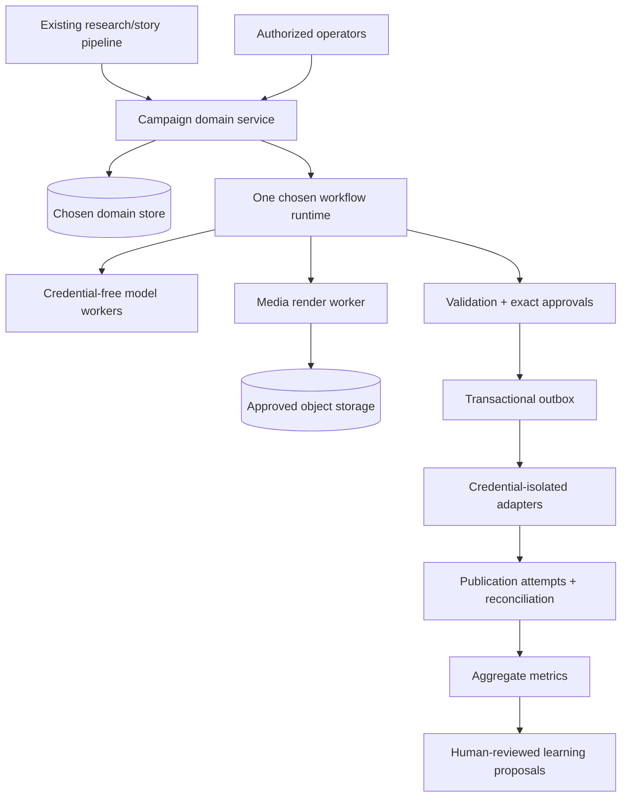

# CampaignOS deferred architecture — non-authoritative scale appendix

- **Status:** deferred options only; not approved for planning or implementation
- **Date:** 2026-07-11
- **Controlling pilot spec:** `2026-07-11-campaignos-four-campaign-pilot-spec.md`
- **Entry condition:** the four-campaign pilot records `SCALE_OPERABLE_SIGNAL`, and the owner separately approves a new scale spec/ADR

This appendix keeps useful scale ideas from the rejected 2026-07-10 CampaignOS document without pretending they are current requirements. It is not a backlog, shopping list, or permission to build. Every section has an evidence trigger. Until the trigger is observed, the correct architecture is the local pilot.

## 1. Principles that survive scale

Any future system should preserve:

- exact source revision and atomic claim provenance;
- typed, versioned contracts at every model/agent/tool boundary;
- Python/domain code—not a model—owning state, permissions, retries, and transitions;
- exact core/leaf approvals whose dependency invalidation is explicit;
- one unresolved publication/billable-action attempt per logical slot;
- `UNCERTAIN` blocking duplicate creates until reconciliation;
- transactional domain-command/outbox behavior for real API writes;
- untrusted-source and prompt-injection isolation;
- no credentials or unrestricted tools inside model processes;
- missing/unavailable metrics represented as null, never zero;
- learning proposals separated from authority to mutate or promote;
- conservative, platform-compliant engagement that never automates social proof.

Those are invariants. The rejected v1's specific vendors, dual runtime, staffing fiction, statistical gates, and cost headline are not.

## 2. Scale entry gate

No item in this appendix may enter planning unless all of these are true:

1. At least three of four pilot campaigns published safely.
2. The pilot recorded `SCALE_OPERABLE_SIGNAL`, not a pivot/stop classification.
3. Campaigns 3 and 4 each used no more than four active owner hours.
4. There were zero critical evidence, rights, privacy, duplicate-create, spend, or platform-policy incidents.
5. Actual cost, account eligibility, and qualified audience signals are recorded.
6. The proposed investment solves a measured bottleneck, with a cheaper/manual alternative compared.
7. The owner approves one bounded next objective and a program-level stop rule.

Passing this gate permits a new specification. It does not automatically permit any dependency, provider, credential, migration, cloud service, platform write, or public action.

## 3. Deferred decisions and evidence triggers

| Deferred capability | Why it is absent from campaigns 1–4 | Evidence that may justify a new spec | Mandatory decision before planning |
|---|---|---|---|
| Managed workflow runtime | One Mac, one operator, one active weekly campaign does not need a cloud workflow product. | Overlapping campaigns, a second operator/worker, durable waits longer than a week, or two missed/recovered deadlines caused by local runtime limits. | Choose **Temporal or a purpose-limited PostgreSQL job runner**, not both. Record an ADR and delete the losing option. |
| Managed PostgreSQL | Local SQLite is sufficient for single-writer state. | Multiple independent writers/services or a required remote control plane. | Vendor/region, data classification, backup/restore, RPO/RTO, migrations, and monthly cap. |
| Object storage/CDN | Pilot binaries can use local/existing site/YouTube/provider surfaces. | More than 10 GB of campaign media, range/egress pain, cross-worker transfer, or a measured delivery reliability issue. | Public/private bucket boundaries, retention, range delivery, signed URLs, cost/egress, deletion, and byte-integrity contract. |
| Cloud render workers | An M-series Mac is already available and idle outside the protected daily window. | Local p95 render exceeds the accepted launch window, interferes with two daily runs, or a second concurrent render is actually needed. | Provider/region/image, queue, concurrency, timeout, cache, retry, content security, spend cap, and local fallback. |
| Remotion | Pillow/FFmpeg evidence cards are enough to test the format. | Audiences respond but the visual grammar cannot be expressed maintainably in the deterministic renderer. | Confirm license eligibility/headcount; compare $0 eligible license with Automators' current $100/month minimum and a Python/FFmpeg alternative. |
| Podcast host/RSS automation | The pilot can produce MP3/metadata and manually add Transistor after the audio gate. | At least four credible episodes plus meaningful listening/subscriber demand and owner commitment to a show. | Feed authority, title/identity, stable GUID/enclosure rules, directory ownership, analytics, correction/deletion behavior, and host/API cost. |
| YouTube API upload | Four manual uploads expose metadata and processing behavior with little engineering. | At least eight approved manual uploads, zero hash/metadata errors, and upload time is a material owner bottleneck. | OAuth project/account, unverified-project private-upload restriction, compliance audit, quota, retry/reconciliation, privacy staging, and rollback. |
| X/Bluesky original-post API | The content hypothesis and account fit are unproven; manual publishing is cheap. | Twelve safe manual originals on a channel, zero ambiguous/duplicate outcomes, measurable owner-time benefit, current policy/account eligibility, and an approved spend cap. | One platform/action/format canary at a time; registered use, disclosure, OAuth, API price, reconciliation, daily cap, kill switch, and rollback. |
| Reddit API/publishing | Community trust and per-community rules require manual participation; permission may be account/use-specific. | Repeated community demand, moderator/platform permission for the exact use, and a manual history with no spam removals/warnings. | Written permission, data use/retention/deletion, rules snapshots, manual-vs-programmatic boundary, and immediate shutdown criteria. |
| Automated conversational engagement | It creates authenticity, platform, safety, and harassment risks; a human reply is the product. | No default trigger. Any future proposal needs explicit platform permission, evidence of inbound volume that one human cannot handle, red-team results, and a separate safety/product review. | Scope only opt-in owned-account support if ever considered. Unsolicited replies, likes, follows, votes, and DMs remain prohibited. |
| Shared control UI | CLI/local artifacts are enough for one operator. | A second authorized operator or repeated CLI errors consume material time. | Authentication, owner roles, default-deny routes, CSRF, audit, approval identity, secrets isolation, and companion-site boundary. |
| Legacy social cutover | Pilot has no live adapter to replace the current path. | One new platform adapter passes shadow/reconciliation and the owner decides to replace an active legacy owner. | Per-platform/action fencing, drain old leases, reconcile all `SENDING/UNCERTAIN`, transfer ownership once, and test rollback. |
| Privacy measurement vault | Four campaigns and a handful of conversions do not justify subject-level joins. | Aggregate attribution cannot answer a material decision, conversion volume is sufficient, and a privacy owner approves the necessity. | Data minimization, consent, identity boundaries, retention/deletion, processor terms, security, RPO/RTO, and an explicit benefit over aggregates. |
| L3 campaign experiments | Weekly campaigns cannot power a large experiment backlog quickly. | A preregistered power analysis based on real variance shows an actionable sample; campaign and exposure floors are attainable. | One primary experiment, independent unit, windows, allocation, guardrails, stopping rule, multiple-testing treatment, and “inconclusive” behavior. |
| L4 harness release engineering | No representative paired/adversarial corpus or demonstrated need exists. | A real corpus is rights-cleared, independently labeled, sufficiently large, and prompt/model changes occur often enough to justify release machinery. | Frozen development/holdout split, grader validity, leakage controls, protected properties, shadow/canary authority, monitoring horizon, and rollback. |
| Multi-person incident/SLA model | There is one human; fictional backup roles make live launch impossible. | Named people actually accept responsibilities and operating-hour coverage. | Real names/contact routes, primary/backup acknowledgements, training, severity, operating hours, achievable response targets, and drill results. |
| Partnerships/referrals/community product | A cold-start product should first earn trust in existing communities. | Repeated qualified audience response and explicit partner/community demand. | Value exchange, disclosure, consent, attribution, abuse controls, moderation, and success/stop metrics. |

## 4. Future runtime decision: one choice, not a dual abstraction

When the runtime trigger is reached, the scale spec must compare two mutually exclusive options.

### Option A — Temporal Cloud

Appropriate only if durable timers, signals, child workflows, replay history, and long-running external processing are materially used. Current official Essentials pricing is the greater of **$100/month or 5% of consumption**, before the rest of the stack.

If selected:

- Temporal owns workflow history and orchestration decisions.
- PostgreSQL, if separately justified, owns business/domain truth.
- Workflow/activity contracts may use Temporal semantics directly.
- There is no leased-PostgreSQL clone required to preserve every Temporal feature.

### Option B — purpose-limited PostgreSQL job runner

Appropriate only if the required semantics are a small queue with leases, retries, timers, and explicit state transitions.

If selected:

- Specify only the semantics the product needs.
- Do not advertise Temporal-compatible replay, child workflows, signals, or determinism.
- Test lease fencing, idempotency, crash recovery, visibility timeouts, and manual reconciliation directly.
- There is no hidden Temporal fallback or `WorkflowRuntime` lowest-common-denominator interface.

The ADR must price both, select one, explain the losing option, and define a reconsideration trigger.

## 5. Candidate scale architecture—not approved

This diagram is an option map. It does not select vendors or require every box. Each new boundary must earn its existence from a measured pilot bottleneck.

## 6. Publication reliability at scale

For any future programmatic create:

1. A domain command validates current state/version, exact approved content hash, permission/policy snapshot, slot ownership, and budget in one transaction.
2. The transaction writes an outbox action with a stable logical slot and request fingerprint.
3. The credential-isolated adapter records `SENDING` durably immediately before the network call.
4. Only an allowlisted definitive pre-acceptance rejection may become `DEFINITELY_NOT_SENT` and retry.
5. Success records the platform ID/URL and response fingerprint.
6. Timeout, connection loss, worker crash, or ambiguous provider response after `SENDING` becomes `UNCERTAIN`.
7. `UNCERTAIN` blocks the slot until provider lookup or a human proves present/absent.
8. Corrections create versioned actions and preserve the public audit trail.

The global kill switch blocks new calls after it is set. Automatic incident **detection** is a separate monitoring feature and may not be implied by a propagation target.

## 7. Learning maturity ladder

### Stage 0 — campaigns 1–4

Descriptive outcomes and human proposals only. No experiment winner, challenger, canary, or auto-mutation.

### Stage 1 — repeated manual playbook

After at least eight campaigns, identify repeated operational defects, audience questions, and editor choices. Automate deterministic work only. Preserve rejected and null observations.

### Stage 2 — powered campaign experiment

Only after a real power analysis says a decision can be learned in a useful timeframe. Use campaign/topic clusters as the independent unit where appropriate; asset impressions do not magically create independent campaigns.

### Stage 3 — offline harness evaluation

Only after a sufficiently large, rights-cleared, representative and adversarial corpus exists. Use disjoint families/arcs, protected safety properties, grader validation, and no candidate access to hidden labels.

### Stage 4 — supervised release canary

Only bounded creative changes that cannot alter facts, permissions, spend, privacy, credentials, or platform authority. Human approval, tiny traffic, explicit rollback, and complete monitoring windows are required.

Strategy, model, context, evidence, safety, permissions, identity, retention, and budget changes never auto-promote from campaign metrics.

## 8. Honest scale-cost worksheet

Current public prices checked 2026-07-11, before tax and account-specific usage:

| Item | Public basis | Planning treatment |
|---|---:|---|
| Existing Claude subscription | Account plan unknown; local CLI only | Existing allocated cost; cannot be token-reserved and cannot be assumed available to cloud workers |
| Temporal Essentials | greater of $100/month or 5% of consumption | Include only if Temporal wins the runtime ADR |
| Neon Launch example | approximately $15/month typical scenario; usage-based | Example only, not a guaranteed quote or required vendor |
| Resend Pro | $20/month for 50,000 emails | Include if current existing plan/quota is insufficient |
| ElevenLabs Creator | regular $22/month | Include actual characters/credits/retries |
| Transistor Starter | $19/month | Include only after podcast decision |
| X API | pay-per-use; e.g. $0.015 post create, $0.200 post with URL, reads separately metered | Estimate from exact read/write plan, prepaid credits, current prices, media, and reconciliation calls |
| Remotion Automators | $0.01/render with $100/month minimum when free eligibility does not apply | Prefer FFmpeg unless measured product need justifies it |
| Render compute | provider/region/workload unknown | Benchmark real manifests; include idle/minimum, retries, egress, cache, storage, and observability |
| Object storage/CDN | provider/region/workload unknown | Include storage, operations, range reads, egress, replication, and deletion |
| Owner/staff labor | measured pilot minutes | Price explicitly; never omit because it is not a vendor invoice |

An illustrative subtotal of Temporal $100 + Neon example $15 + Resend Pro $20 + ElevenLabs $22 + Transistor $19 is **$176/month before** X, rendering, storage, taxes, existing Claude subscription, and labor. Adding a non-free Remotion automation license would raise that illustrative subtotal by at least $100/month. This is a warning against incomplete subtotals, not a recommended architecture.

Every future spec must present:

- incremental cash;
- allocated existing subscriptions/services;
- owner/staff hours;
- provider minimums and prepaid credits;
- usage assumptions and retry/overage sensitivity;
- taxes, storage/egress, and compute;
- account-specific unknowns;
- program-level cost-per-qualified-signal and stop criteria.

## 9. Scale decisions that remain protected

The following always require explicit human approval and cannot be selected, waived, or promoted by an agent:

- credentials, account identity, registered platform use, OAuth scopes, and provider contracts;
- paid API/model migration, provider auto-recharge, budget ceilings, and purchasing;
- evidence minimums, materiality, corrections, takedowns, and rights/voice consent;
- public/publish/reply/follow/like/vote/DM authority;
- privacy, retention, consent, identity joining, and deletion;
- model/tool permissions, prompt-injection policy, and security boundaries;
- a new runtime, datastore, render worker, object store, public API, or legacy cutover;
- canary/promotion/rollback authority;
- staffing, incident coverage, and external SLA promises.

## 10. Program-level stop rules for future phases

Every future phase must predeclare a review date and stop/pivot criteria using at least:

- total and marginal cash;
- owner/staff hours per campaign;
- qualified exposure and high-intent signals;
- cost per high-intent signal/confirmed subscriber where meaningful;
- correction, rights, privacy, platform, duplicate, and security incidents;
- percentage of campaigns that pass evidence/quality without exceptional waivers;
- trend in cycle time and operator burden;
- whether the investment solved the bottleneck that justified it.

Sunk engineering cost is never a reason to continue. An underpowered result is a reason not to claim a winner; it is not automatic permission to keep funding the same architecture indefinitely.

## 11. Source index

- [Temporal Cloud pricing](https://docs.temporal.io/cloud/pricing)
- [Neon pricing](https://neon.com/pricing)
- [Resend pricing](https://resend.com/pricing)
- [ElevenLabs pricing](https://elevenlabs.io/pricing)
- [Transistor pricing](https://transistor.fm/pricing/)
- [X API pay-per-use pricing](https://docs.x.com/x-api/getting-started/pricing)
- [X create-post API](https://docs.x.com/x-api/posts/create-post)
- [X automation rules](https://help.x.com/en/rules-and-policies/x-automation?lang=browser)
- [YouTube quota](https://developers.google.com/youtube/v3/getting-started#quota)
- [YouTube `videos.insert`](https://developers.google.com/youtube/v3/docs/videos/insert)
- [Remotion license](https://github.com/remotion-dev/remotion/blob/main/LICENSE.md)
- [Remotion commercial license](https://www.remotion.pro/license)
- [FFmpeg legal information](https://ffmpeg.org/legal.html)

## 12. Approval boundary

Approving the pilot spec does **not** approve this appendix. A future owner response must name the exact section/capability, the pilot evidence that triggered it, the chosen architecture, cost cap, operating owner, risk/rollback rule, and new controlling spec/ADR.

Until then, every item here remains `DEFERRED_NOT_AUTHORIZED`.
