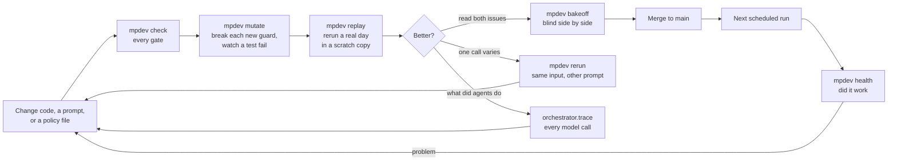
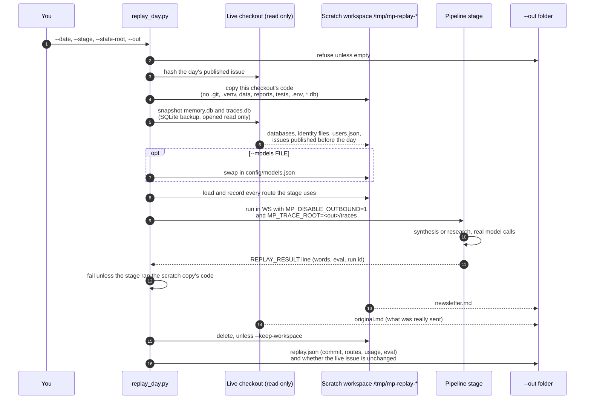
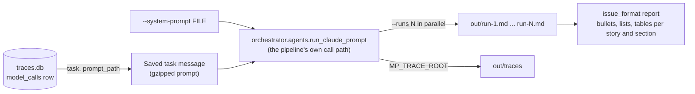
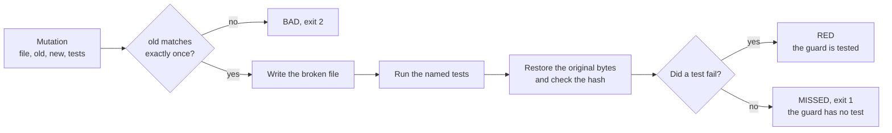

# Developer tools

Commands for changing the pipeline and proving the change, without touching the live run. Each one answers a question you would otherwise answer by reading logs or querying databases by hand.

Every tool runs through one command, `bin/mpdev`, from the repository root. `bin/mpdev help` lists them, and `bin/mpdev <command> --help` shows a command's flags. Their code lives in `devtools/`. `tools/` holds only the scripts the pipeline itself runs, such as the source fetchers.

Three of them make real model calls and spend plan usage: `mpdev replay`, `mpdev rerun`, and `mpdev site-backfill`. Everything else only reads files and databases.

## The working loop

A change to a prompt, a model route, or pipeline code goes through the same steps. The tools sit at each step.



## All tools at a glance

| Tool | Answers | Model calls | Writes |
|------|---------|-------------|--------|
| `mpdev replay` | What would a past day's issue look like with this code? | Yes, unless `--dry-run` | Only the `--out` folder |
| `mpdev rerun` | Does a different system prompt change one call's output? | Yes | Only the `--out` folder |
| `mpdev bakeoff` | Which of two issues reads better, judged blind? | No | Only the `--out` folder |
| `mpdev trace` | What did every agent do in a run, and what did it cost? | No | Nothing (`prune` deletes old raw traces) |
| `mpdev health` | How has the daily run gone, day by day? | No | Nothing |
| `mpdev mutate` | Does a test actually catch this guard breaking? | No | Restores the file byte for byte |
| `mpdev usage` | What did a day cost, by task and model, from Claude transcripts? | No | Nothing |
| `mpdev site-backfill` | Can past issues get the site stories they should have had? | Yes | Live `reports/<user>/site-stories/` |
| `bin/mp` | The research agents' own commands for storing and checking findings | No | The run's findings and evidence files |
| `mpdev check` | Does this change pass every gate CI will run? | No | Logs and a receipt in `.scratch/checks/` |
| `mpdev doctor` | Is this machine ready to work and run the checks? | No | Nothing |

## Replay a day: `mpdev replay`

Reruns one stage of the pipeline for a past day on that day's real data, with the code in your checkout, inside a throwaway copy. Use it to judge a model, prompt, or code change before it ships. The live checkout's databases, issues, and email list are never written to.

```bash
bin/mpdev replay --date 2026-10-10 --stage synthesis \
    --state-root ~/Projects/mindpattern-v3 \
    --out ~/Projects/mindpattern-v3/data/ramsay/replays/2026-10-10-my-change
```

### How it works



The pipeline finds every file relative to its own code, so running a copy of the code in a temporary folder sends every write to that folder. The snapshot is taken with SQLite's backup API on a read-only connection, which gives a consistent copy even while the live databases are open. Only issues published before the replayed day are copied, so the day's own sent issue doesn't count as "already published" against itself.

`MP_DISABLE_OUTBOUND=1` turns off email delivery, the Fly sync, and Slack alerts. `MP_TRACE_ROOT` sends every model call's trace to `<out>/traces` instead of the live `traces.db`.

### The two stages

| Stage | What runs | How faithful |
|-------|-----------|--------------|
| `synthesis` | The whole SYNTHESIS phase. Lead stories, the selector for any slot left, deep dives, the writer, the Codex editor, the prose gate, and the eval. The day's trends come from the original run's TREND_SCAN checkpoint. | Faithful. It reads the findings that were stored that day. |
| `research` | The trend scan and the research agents (`--agents` picks a subset, three at a time). `--no-trend-scan` skips the preflight fetch. | Not a true replay of the past. Preflight fetches today's sources, so agents see today's news under the old date. Good for judging agent behavior and output volume. |

### What you get

| File | Holds |
|------|-------|
| `newsletter.md` | The replayed issue (synthesis stage) |
| `original.md` | The issue that was actually published that day |
| `replay.json` | Code commit, branch and dirty flag; every route used; words; eval scores; calls, tokens and cost per task; `live_issue_unchanged` |
| `replay.log` | The stage's full stdout and stderr |
| `traces/` | `traces.db` and the raw event stream of every call. Read it with `python -m orchestrator.trace --db <out>/traces/traces.db` |

### Flags

| Flag | Default | Does |
|------|---------|------|
| `--date` | required | The day to replay |
| `--stage` | `synthesis` | `synthesis` or `research` |
| `--out` | required | A new, empty folder. One per replay. |
| `--state-root` | this checkout | The checkout whose data is replayed. Point it at the live checkout. |
| `--models FILE` | `config/models.json` | Another model table, for a model bakeoff |
| `--dry-run` | off | No model calls. Checks the wiring only. |
| `--agents a,b` | all thirteen | Research stage, a subset of agents |
| `--no-trend-scan` | off | Research stage, skip preflight and trends |
| `--keep-workspace` | off | Keep `/tmp/mp-replay-*` to read the run's files, such as `reports/<user>/threads/<date>.json` |
| `--timeout` | 3600 | Seconds before the stage is stopped |

### Cost and time

A synthesis replay on 2026-10-10 took 14 minutes and made 8 model calls: the thread finder, five deep dives, the writer, and the editor. That was $4.28 at API prices, which on the subscription is plan usage, not a bill. A `--dry-run` replay takes seconds and costs nothing.

### What proves it's safe

`tests/test_replay_day.py` hashes every file in a fake live checkout before and after a replay and requires them to match. It also checks that every call ran with outbound disabled and from the scratch copy, and that a dry run makes no model calls.

## Rerun one call: `mpdev rerun`

Takes one model call that a run or replay already traced, and runs its exact input again with a different system prompt. Use it to answer "was it the prompt, or chance?" for a single call, without rerunning the whole stage.

```bash
bin/mpdev rerun \
    --traces data/ramsay/replays/2026-10-10-synthesis-leads/traces --call 38d3cab90bfc4bfd \
    --system-prompt agents/synthesis-writer.md --out /tmp/rerun/writer-now --runs 2
```



It runs only that call. The editor and prose gate that follow the writer in a real run don't run here.

On 2026-10-10 this found that the writer's layout was chance, not the prompt. The same writer input gave 117 bullets in the replay, 10 on a rerun with the same prompt, and 60 with the writer prompt from before the change. That's why the layout is now held by a code check (`orchestrator/issue_format.py`) instead of a prompt line.

## Compare two issues blind: `mpdev bakeoff`

```bash
bin/mpdev bakeoff --a <out-a>/newsletter.md --b <out-b>/newsletter.md --out /tmp/bakeoff/day
open /tmp/bakeoff/day/compare.html
bin/mpdev bakeoff --reveal /tmp/bakeoff/day
```

The page shows "Version 1" and "Version 2" in random order, each with its writing-policy violation count, and never the file paths. The order stays in `answer-key.json` until `--reveal`, so you pick on the writing, not on which model you expected to win.

## Read what agents did: `mpdev trace`

Every model call, Claude or Codex, is recorded at call time by `core/trace_store.py` in `traces.db` (`model_calls`, `model_call_steps`) with its raw event stream gzipped on disk.

| Command | Shows |
|---------|-------|
| `runs --last 7` | Recent runs with call counts and cost |
| `show <run_id> [--steps]` | Every call in a run, and with `--steps` every tool call inside it |
| `call <call_id> [--full]` | One call's prompt, answer, usage, and error |
| `grep <run_id> "<text>"` | Which calls in a run mention the text |
| `usage --since 7 [--by task,model]` | Tokens and cost grouped |
| `prune --keep-days 90` | Deletes raw event streams past the retention in `policies/observability.json` |

Add `--db <out>/traces/traces.db` to read a replay's traces instead of the live ones. `mpdev trace` runs `python -m orchestrator.trace`.

## Check the daily run: `mpdev health`

```bash
bin/mpdev health --since 7
```

One row per day with the run, delivery, agents, findings, duplicates, eval, site stories, cost, Codex use, and failures, then per-agent output and a list of problems. It opens every database read-only. It exits 1 when any day has a problem, so a scheduler can alert on it. When a day has several runs, it reads the one with the most events, so a sync-only run doesn't hide the real one.

## Prove a test catches a break: `mpdev mutate`

```bash
bin/mpdev mutate --file orchestrator/threads.py \
    --old 'fid not in used]' --new ']' --test tests/test_threads.py
bin/mpdev mutate --plan mutations.json
```



A passing test proves nothing until you've seen it fail. This tool breaks the guard, runs its tests, and puts the file back exactly as it was. On 2026-10-10 it found that nothing tested the cap on how many lead stories run, which is now tested.

A plan file is a JSON list of `{"file", "old", "new", "tests": [...], "k": "optional -k filter"}`.

## Usage from transcripts: `mpdev usage`

```bash
bin/mpdev usage --date 2026-10-01 [--json]
```

Totals token use by task and model from the Claude Code transcripts every `claude -p` leaves under `~/.claude/projects/`, priced from `config/pricing.json`. It predates call-time usage in `traces.db`. For days after 2026-10-02, `python -m orchestrator.trace usage` reads the same numbers from the traces and also covers Codex.

## Backfill site stories: `mpdev site-backfill`

```bash
bin/mpdev site-backfill --dates 2026-10-03,2026-10-04 [--claude-critic]
```

Writes the site stories a past issue should have had, through the production writer and critic, up to `issue_stories_per_day` in `policies/editorial.json`. This one writes to the live `reports/<user>/site-stories/`, and the next sync publishes what it wrote. `--claude-critic` moves the critic to its Claude fallback so a large backfill doesn't use the Codex plan.

## The research agents' commands: `bin/mp`

The research and deep-dive agents call these through the `Bash(mp *)` grant instead of following prose rules. You can run them too.

| Command | Does |
|---------|------|
| `mp finding add <<'EOF' ... EOF` | Validates and stores findings. Turns away a repeat from this run, and records another agent's copy of the same story as corroboration. |
| `mp findings list` | What this agent has stored this run |
| `mp seen "<url or title>" ...` | Whether each lead was covered in the last 180 days |
| `mp fetch <url> [--max-chars N] [--offset N]` | Readable page text, a slice at a time |
| `mp evidence add --story S <<'EOF' ... EOF` | Evidence for a deep-dive story |
| `mp lint <file> [--surface S]` | Writing-policy violations in a draft |
| `mp tells [--since DAYS]` | Writing-policy rates across published issues |

Records go in as `field: value` lines in a quoted heredoc, with `---` between records. Claude Code's Bash check refuses inline JSON, and a quoted heredoc passes apostrophes, `$`, and backticks through untouched.

## Run every gate: `mpdev check`

```bash
bin/mpdev check                     # every check, in order
bin/mpdev check --only layers,tests
bin/mpdev check --list
```

Runs every check in `devtools/checks.json`, in order, and exits 1 if any fails. A failed check prints its last 25 lines. Each check's full output goes to `.scratch/checks/<commit>/<id>.log`, and a receipt at `.scratch/checks/<commit>.json` records the commit, whether the tree was dirty, and each check's outcome and time. Run it before every commit.

| Check | Fails when |
|-------|-----------|
| `doctor` | This machine is missing something the other checks need |
| `config` | A route in `config/models.json` doesn't load |
| `layers` | A package imports another that `layers.toml` doesn't allow |
| `knowledge` | A knowledge page has a broken link, is missing from the index, or opens a section with more than 250 characters |
| `tests` | Any test fails |

The checks are data, so the CLI, CI, and the skills read one list. To add a check, add a row to `devtools/checks.json` with an `id`, a `command` (`{python}` stands for the interpreter running mpdev), and an `about` line.

## Is this machine ready: `mpdev doctor`

```bash
bin/mpdev doctor          # every probe
bin/mpdev doctor --ci     # what CI can have: Python and packages
bin/mpdev doctor --json
```

Read-only. It checks the Python version, the installed packages from `requirements.txt` plus pytest, the `claude`, `codex` and `gh` CLIs, that `memory.db` and `traces.db` open read-only, and that the code graph in `graphify-out/` is newer than the last commit to Python code and kept out of `git status`. Every failed probe prints its fix. A stale graph is a warning, not a failure, because the hooks rebuild it in the background after each code commit. In a worktree it reads the databases from the main checkout. CI mode is also on when `CI=true`.

## Where outputs go

| Output | Path | Kept in git |
|--------|------|-------------|
| Replays | `data/<user>/replays/<date>-<label>/` in the live checkout, or any folder you pass | No |
| Rerun and bakeoff results | The `--out` folder you pass | No |
| Lead stories a run chose | `reports/<user>/threads/<date>.json` | No |
| Live traces | `data/<user>/traces.db` and `data/<user>/traces/` | No |
| Check receipts and logs | `.scratch/checks/` | No |
